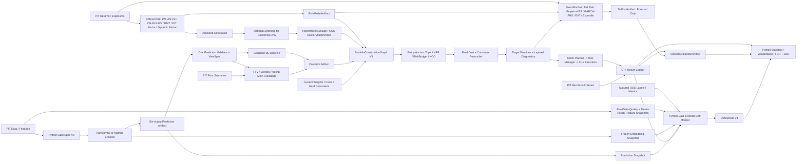

# Quant Math + Transformer V1.2/V1.3 Integration Roadmap

> 文档日期：2026-07-31  
> 决策状态：Phase 1B 已完成；`legacy correlation rank loss + fixed multitask weights` 冻结为冠军，ListMLE、LambdaLoss@20、Kendall 保留为未晋级研究基线；Phase 1C 为当前最高优先级，Phase 1D 新增 `Data & Model Drift Monitor V1`  
> 基线版本：TemporalTransformer V1.1 核心工程已实现，真实全 A 实验尚未完成  
> 适用仓库：`Transformer-Quant-Engine`  
> 适用边界：Python 负责训练与研究编排；组合、风险、订单、费用、T+1 和执行继续由 C++ 负责  
> 明确排除：Python demo 回测引擎、实盘自动下单、一次性同时上线全部候选算法

## 1. 执行结论

用户最新明确撤销的两项继续保持删除：不再规划跨多个调仓点的动态组合求解，也不再规划模型
预测头的贝叶斯化。单次调仓成本约束和后验式组合构建仍然保留，但组合架构从“寻找一个默认
优化器”升级为可审计的 `PortfolioConstructionGraph V1`。

新结论不是用 NCO、HRP 或 Fully Flexible Views 替换全部旧方案，而是把问题拆成四层：

```text
风险估计与结构发现
-> Transformer 多输出到 views 的后验集成
-> 明确命名的 portfolio policy family
-> 统一成本与硬约束协调
```

每次正式 Replay 仍只冻结并运行一个 `policy_id`，不存在看见当期结果后自动挑选“最佳优化器”。
多引擎表示研究期可以用相同输入公平比较不同职责的策略，并允许 NCO 包装已冻结的内外层目标；
不是把多个优化器的结果临时平均，也不是以 fallback 名义隐藏失败。

| 版本 | 目标 | 核心交付 |
|---|---|---|
| V1.2 | 数学基础、目标对齐和收益证据 | C++ `LW-LIN-CC` 基线、`LW-NLS-MV-QUEST` 主候选与风险预算；Return Analysis V1；LabelSpec V2；Phase 1B 冻结 `legacy + fixed`；ListMLE/LambdaLoss/Kendall 作为冻结研究基线；Data/Feature/Prediction/Label/Concept/Embedding Drift Artifact；共享梯度诊断、PCGrad/GradNorm 单变量 challenger；FDR 研究协议 |
| V1.3 | 结构化风险、多输出后验和组合策略图 | RMT spectral-denoising 独立候选；detoned clustering；ONC；HRP/Risk Budget/NCO 策略族；Gaussian BL baseline；FFV/Entropy Pooling 主候选；最终成本/硬约束协调；可解释 PIT factor baseline + dynamic-loading/regime-covariance 候选；Alpha 提纯；鲁棒训练与校准 |
| V2 Research | 表征与长序列 | InfoTS 时序对比预训练；Mamba |

这里的版本号表示施工和实验协议，不代表 V1.1 已经通过真实模型晋级。V1.1 的真实全 A
Walk-forward、基线、消融和 Promotion Review 仍需完成；新增方法必须与 V1.1 基线做逐项配对
消融，不能用新架构掩盖旧基线尚未验收的问题。

### 1.1 用户优先级与实际施工顺序

用户给出的业务优先级保留，但数学依赖决定了局部施工顺序必须调整：

| 用户优先级 | 用户方向 | 施工时的必要前置 |
|---:|---|---|
| C++ 1 | 后验组合、风险预算、多策略组合图 | 先有稳定风险合同、单期成本模型、硬约束、Replay 和失败关闭 |
| C++ 2 | LW 线性/非线性收缩、RMT/ONC、HRP/NCO、条件因子风险、条件尾部风险 | `LW-LIN-CC` 与 `LW-NLS-MV-QUEST` 先打通风险预算；经验 ES 保留审计基线，GARCH-FHS、POT-GPD 尾部和 Expectile 按独立消融进入；PIT factor baseline 通过后再进入 full-A factor-FHS |
| C++ 3 | 中性化、正交化、稀疏因子 | 先冻结 PIT exposure、权重矩阵和训练窗口 |
| C++ 4 | FDR、DSR 与有效试验数 | 完整功能排第四，但假设登记和策略试验登记必须在所有新实验之前建立 |
| Transformer 1 | 标签、LTR、多任务优化与漂移监控 | Phase 1B 已冻结 `legacy + fixed`；当前先完成 Phase 1C 经济闭环与 drift snapshot contract，Phase 1D 建立 Data & Model Drift Monitor，随后按 `diagnostics -> PCGrad -> GradNorm` 一次只改一个优化组件；新 ranking loss 暂停晋级 |
| Transformer 2 | 鲁棒损失、InfoTS 对比预训练、对抗训练 | 必须在干净基线和噪声压力集建立后实施 |
| Transformer 3 | Conformal、Isotonic | 必须在模型和超参数冻结后，仅用 calibration 数据拟合 |
| 最后 | Mamba | 先证明当前 Transformer 在长序列上受速度/内存限制，并使用 4090 做独立原型 |

### 1.2 本方案的关键判断

1. **首个 C++ 交付不是单独的优化器，而是 `LW-LIN-CC 对照 + LW-NLS-MV-QUEST 候选 -> 风险预算 -> TAIL-EMPIRICAL-ES 报告` 的纵向切片。**
   `honey.pdf` 的 constant-correlation 线性收缩保留为简单、可审计的独立 baseline；
   `1-s2.0-S0047259X21000749-main.pdf` 的损失感知旋转等变非线性收缩升为风险优化主候选。
   两者不做运行时平均或失败回退；每次 Replay 只能冻结一个 estimator id。论文仿真不能替代真实
   OOS 证据，非线性候选未通过 QuEST 数值门槛和相对线性基线的经济门槛前，不得成为 official risk。
2. **最终架构不押注单一优化器。** Top-K 等权是 control，HRP 是无收益观点的层次风险 baseline，
   Risk Budget/ERC 提供显式可审计风险贡献，NCO 是把全局病态问题拆成簇内/簇间子问题的 wrapper。
3. **Gaussian Black-Litterman 降为均值观点 baseline，FFV/Entropy Pooling 升为主后验候选。**
   FFV 通过重加权既有先验情景，可表达均值、相对排序、方向概率、波动率和分位数/尾部观点，
   更能消费 Transformer 的多输出；它仍需与无 view、低置信度和 Gaussian baseline 做极限对照。
4. **NCO 不是新的收益-风险目标。** 它先生成簇内权重，再在降维后的簇组合上求簇间权重；
   首个 book-faithful baseline 使用 MinVar，之后才分别包装 Risk Budget 和 FFV posterior objective。
5. **HRP 不替代 Risk Budget。** HRP 用于检验层次结构和避免协方差求逆的稳健性；Risk Budget
   继续承担用户指定风险份额、风险贡献误差和约束可解释性。
6. **detoned correlation 只用于 cluster discovery。** 正式风险、风险贡献、CVaR 和最终协调继续
   使用未 detone 的官方风险模型；否则会把系统性市场风险从组合风险报告中错误删除。
7. **Transformer heads 是相关 views，不是独立专家。** `confidence` 不能直接等同 FFV 的观点
   置信度；多个 heads 的一致性、依赖和可行性必须在 `ViewSpec` 中显式建模，不能重复计数证据。
8. **后验组合只做单次调仓的可重放更新。** 当前持仓到目标持仓的显式成本可以进入最终协调器，
   未来真实收益不得进入后验、聚类、策略 anchor 或约束求解。
9. **策略先产生 anchor，最终 reconciler 再统一处理成本和硬约束。** anchor 或 reconciler 任一失败，
   正式结果都是 `HOLD/current weights`；禁止静默退回 Top-K、HRP 或上一种成功策略。
10. **风险调整标签是辅助目标，原始经济收益标签必须保留。** 否则 C++ 无法解释输出单位，
   也无法和现有六输出协议比较。
11. **Phase 1B 已完成，当前不再把新 ranking loss 作为优化主线。** 三个 purged OOS fold 上，
    `legacy correlation rank loss + fixed multitask weights` 冻结为 `FROZEN_CHAMPION`。ListMLE、
    LambdaLoss@20 和 Kendall 不删除，统一保留为 `FROZEN_RESEARCH_BASELINE / REJECTED_CURRENT_DATA`；
    禁止在本次 OOS 上事后调整 K、temperature、gain、clamp 或标签后重新选优。下一条 Transformer
    **模型优化**主线仍是固定冠军下的共享梯度冲突诊断，随后分别测试 PCGrad 和 GradNorm；在此之前
    先补齐不改变模型输出的漂移可观测性层。
12. **Conformal 和 Isotonic 是后验校准，不参与模型训练或超参数选择。** 金融时序存在分布
   漂移，不能宣称标准 i.i.d. split conformal 的无条件覆盖保证。
13. **Mamba 首先只产生冻结预测 artifact，继续由 C++ 回放。** 在 ONNX/CPU 三方一致性通过前，
   不进入 C++ 在线推理热路径。
14. **Phase 1C 收益分析和多试验校正是当前 P0，也是所有候选的共同验收底座。** 在 period-return
    ledger、Perold implementation shortfall、毛净收益对账、归因和配对 stationary bootstrap 完成前，
    新模型只能报告预测指标，不能获得经济晋级。除现有 FDR/BH/BY/Storey 外，增加
    Deflated Sharpe Ratio 和基于策略收益聚类的有效试验数；最终 untouched period 只做一次确认，
    不用于选择 policy、cluster 参数或后验引擎。
15. **Dynamic Factor Loading + Regime-Aware Factor Covariance 不整体替换可解释因子骨架。** 现代
    Barra 类模型本身已包含 PIT 时变 exposures 和 volatility-regime adjustment；本项目保留 industry/
    style/specific-risk 语义作为 baseline，再把 filtered dynamic loading、VRA/HMM/RSDC factor covariance
    作为可独立归因的候选。两个动态组件分别通过后才允许组合，禁止直接把复杂度当作改进。
16. **Expected Shortfall 保持正式尾部口径，GARCH-FHS/EVT 是估计器，Expectile 是独立平滑风险候选。**
    `TAIL-EMPIRICAL-ES` 保留为最简单可审计 baseline；`TAIL-GARCH-FHS-ES` 先处理条件异方差，
    `TAIL-GARCH-FHS-EVT-ES` 只在 FHS 已通过且极端尾部样本门槛满足后拼接 POT-GPD。CVaR 本身
    已连续且凸，但经验目标含 hinge、不可微；Expectile 的非对称平方损失更平滑，却不能把
    `tau` 直接当作 ES 的 `alpha`。直接 Expectile 与 Taylor 映射 ES 使用不同 estimator id，正式报告
    始终保留 VaR/ES，禁止静默更换风险语义。
17. **漂移监控是可观测性与诊断层，不是自动重训器。** `Data & Model Drift Monitor V1` 必须区分
    Data Quality/Data Drift、Feature Drift、Prediction Drift、延迟 Label/Concept Drift 和 Embedding Drift。
    PSI、KS、Mean/Variance 是输入/输出分布侧信号；IC/RankIC/NDCG/utility 才是标签成熟后的性能衰减
    证据。任何单一指标或一次窗口异常都不得自动重训、切换模型、放宽约束或覆盖冻结冠军。

## 2. 当前工程基线与缺口

### 2.1 已有可复用能力

- `engine_common` 已有版本化市场、持仓、目标和策略运行时 POD 合同。
- `strategy_runtime` 已拆出 prediction validator、portfolio policy、order planner 和 risk manager。
- C++ 已有 `LongOnlyTopKPolicy`、换手上限、订单规划、费用、T+1 和持仓执行链。
- C++ `PnLTracker` 已有权益曲线、总/年化收益、Sharpe、最大回撤、胜率和逐笔/平仓轮次记录。
- Python 已有正确的 `NEXT_OPEN` 标签、持有期逐 Bar 波动率、Pinball、截面 rank loss、
  CrossSectionBatchSampler、Walk-forward、深度基线、Feature Ablation、Leakage Detection。
- Python 组合 benchmark 已读取 C++ 回放，报告净收益、Sharpe、回撤、换手、CVaR，并提供当前
  持仓口径的股票/行业贡献近似。
- TemporalTransformer 已输出收益、波动、方向概率、q10/q90 和 confidence，并支持 ONNX/C++。
- PIT 涨跌停和 lot 已降级为可选执行数据；缺失时研究回测不得成为 Promotion 证据。

### 2.2 与本方案相关的主要缺口

- C++ 没有矩阵/分解基础库、协方差估计器、QuEST 正/逆映射、损失感知非线性收缩、RMT 谱去噪、
  filtered dynamic factor loading、regime-aware factor covariance、聚类模型和通用组合策略接口。
- 当前 `LongOnlyTopKPolicy` 只做等权式目标和简单换手裁剪；没有 HRP、Risk Budget、NCO 或
  posterior-aware policy，也没有统一 anchor/reconciler 边界。
- 当前 `BasicRiskManager` 是逐订单硬约束，不是组合层风险预测器；两者不能混为同一模块。
- 没有可审计的 denoised risk、tail risk、cluster、posterior scenario、portfolio policy artifact；也没有把
  anchor 失败、后验失败、约束不可行和 KKT/视图残差分开报告的诊断。
- 没有场景先验、观点合同、相对熵投影、观点置信度映射、KL/ESS 门禁；现有 Bayesian 设想只覆盖
  posterior mean，不能直接消费波动、方向概率、q10/q90 和相对排序输出。
- 没有政策族试验登记、Deflated Sharpe Ratio 或按策略收益相关性估计的有效试验数；增加多个
  portfolio policies 后，仅做逐项 p-value/FDR 仍不足以控制“挑中最高 Sharpe”偏差。
- Phase 1B 已完成 legacy/ListMLE/LambdaLoss@20 固定权重配对和 Kendall 动态权重配对；当前缺口
  不再是“有没有新损失”，而是完整 PIT 股票池、可交易状态、公司行动/复权/费用、C++ 经济 Replay，
  以及固定冠军下的共享 backbone 梯度范数、cosine conflict、任务训练速度和支配度诊断。
- 固定多任务权重已冻结为冠军；Kendall 三个 fold 的 volatility effective weight 均触及 `403.43`
  clamp。尚未实现 `GradientConflictArtifact V1`、PCGrad 或 GradNorm，也未建立它们的独立经济门槛。
- 没有版本化的 Data/Feature/Prediction/Label/Concept/Embedding drift artifact；当前也未区分原始字段、
  模型就绪特征、预测输出、延迟标签和内部 embedding 的 reference/current window，无法判断指标退化
  来自数据管道、universe 变化、市场状态、特征关系变化还是模型本身。
- 没有鲁棒损失压力集、InfoTS 对比预训练、对抗训练、rolling conformal 或 isotonic。
- Attention Analysis 已有 V1.1 设计，但尚未实现和运行。
- 现有收益统计没有逐期、可加总的收益账本；股票/行业贡献依赖期末持仓和最后价格，不能完整
  解释已平仓路径，也没有毛收益到净收益、显式费用和执行滑点的对账桥。
- 没有与同一 PIT 可交易全 A universe 对齐的市场基准、主动收益、Tracking Error、Information
  Ratio、分组收益单调性或按市场状态拆分的收益证据；年化口径也尚未统一消费
  `frequency/calendar_id`。
- 本地论文现已补齐 Perold implementation shortfall、Brinson-Fachler、Newey-West、Stationary
  Bootstrap、Menchero linking、PCGrad、GradNorm、Hallin-Trucíos large-panel factor-FHS、McNeil-Frey
  GARCH-EVT、Rockafellar-Uryasev CVaR、Taylor/Bellini Expectile，以及 Ng-Engle-Rothschild 动态因子、
  Engle DCC、Guidolin-Timmermann regime allocation、Aramonte DFM-DCC VaR、Fissler-Ziegel 和 LambdaLoss。
  `Barra_US_Equity_Model_USE4.pdf` 仍只提供能力范围；本项目不宣称复刻商业 USE4/CNE5，也不把
  大样本美股结果直接当作当前 29-39 只股票截面的生产保证。

## 3. 总体架构与所有权



`RiskModelArtifact`、`TailRiskArtifact` 与 `ClusterModelArtifact` 是不同对象：允许用 denoised/detoned correlation
发现结构，但任何正式 predicted risk、risk contribution 和 reconciler 二次风险项都必须引用明确
标记的 official risk artifact。`TailRiskArtifact` 首版消费冻结组合权重做估计/报告，不回写 optimizer；
`PosteriorArtifact` 也不替代风险模型，它只改变场景概率或后验观点。

`DriftArtifact` 是旁路可观测性对象，不进入 prediction、risk、policy、order 或 fill 决策。Data Quality、
Feature 和 Prediction Drift 可以在标签尚未成熟时生成早期预警；Label/Concept/IC Drift 必须等待相应
horizon 的标签真正可用。Embedding Drift 仅作诊断，首版不构成自动 Promotion/No-Go 或重训动作。

### 3.1 新增 C++ 模块

建议新增三个顶层库，而不是把矩阵、聚类和后验求解塞入 `strategy_runtime`：

```text
cpp_engine/
├── quant_math/
│   ├── matrix views, decompositions, statistics, numerical guards
│   └── deterministic solver adapters
├── portfolio_math/
│   ├── covariance/
│   │   ├── linear_shrinkage/
│   │   ├── quest/
│   │   └── nonlinear_shrinkage/
│   ├── risk_preprocessing/
│   ├── risk_model/
│   ├── tail_risk/
│   ├── clustering/
│   ├── posterior/
│   ├── policy/
│   ├── reconciler/
│   ├── alpha_transform/
│   └── multiple_testing/
├── performance_analytics/
│   ├── return_ledger/
│   ├── cost_attribution/
│   ├── benchmark/
│   ├── drift_snapshot/
│   └── metrics/
├── engine_common/
│   └── versioned POD contracts only
└── strategy_runtime/
    └── portfolio graph adapter, rebalance orchestration and replay
```

Python 侧新增 `monitoring/drift/`，负责 reference/current window、PSI/KS/MMD、FDR、延迟标签对齐、
embedding diagnostics 和报告；C++/数据层只导出不可变的 PIT snapshot、ledger 与 hash，不在 C++
交易热路径中运行高维两样本检验。

所有模块都应由独立 CMake 选项控制：

```text
QBT_ENABLE_PORTFOLIO_MATH=OFF by default
QBT_ENABLE_CONVEX_SOLVER=OFF by default
QBT_ENABLE_PERFORMANCE_ANALYTICS=OFF by default
```

关闭时不得下载或查找 Eigen/OSQP，也不得影响当前默认 C++ 构建。

### 3.2 运行路径边界

- 风险估计与优化只在 rebalance cadence 运行，不在每个 Bar/订单回调中重复求解。
- C++ 优化器只消费在 `decision_at` 可知的数据，不读取未来 realized return。
- `policy_id`、covariance/tail estimator、EVT threshold/Expectile mapping spec、cluster spec、posterior
  engine 和 reconciler spec 在 Replay 开始前冻结；
  禁止根据同一 OOS 窗口的 realized Sharpe 动态切换。
- detoned correlation 只可进入 clustering 输入；若其 hash 出现在 official risk input，Replay 失败。
- Python 可以生成研究配置和高精度 oracle fixture，但不得代替 C++ 回测、成交或费用逻辑。
- 风险模型与 tail estimator 拟合可在 C++ 离线/rebalance 路径完成；正式回放加载的 artifact 必须带时间范围、
  schema hash、数据 fingerprint 和 `available_at`。
- prior scenarios、view calibration 和 cluster fit 同样必须满足 `available_at <= decision_at`。
- drift monitor 只能读取冻结 snapshot/artifact；raw-data、preprocessing、feature、prediction、label、
  embedding 和 ledger 各自保留 schema/version/hash，禁止从最终报告反向改写历史输入。
- reference window、rolling window、PSI bin edges、KS/MMD bootstrap、FDR family、alert persistence、
  model/layer/pooling id 在查看监控期结果前冻结。延迟标签指标必须记录 `label_available_at`。
- Drift Alert 只产生 `INFO/WARN/CRITICAL` 事件和 retraining-review 建议，不自动重训、切换 checkpoint、
  改变 policy/risk estimator 或触发运行时 fallback。
- anchor、posterior 或 reconciler 任一失败均默认 `HOLD/current weights` 并记录原始层级状态；不得
  静默退回 top-k、HRP、Risk Budget 或上一期 target 后继续生成正式报告。

### 3.3 推荐基础依赖

| 依赖 | 用途 | 决策 |
|---|---|---|
| Eigen 3.4.x | double 精度矩阵、QR/SVD/Eigen decomposition | 推荐，固定版本和 SHA256 |
| QuEST 数值规范/参考实现 | population spectrum 反演、边界 Stieltjes transform、eigenvector-angle weights | Phase 1A 必须冻结论文 [20]/[21]、源码/许可和独立 oracle；首版不把未核验黑盒库接入正式 Replay |
| OSQP | anchor reconciliation、均值-方差 baseline、线性约束和换手辅助变量的 QP | 需要时可选引入；不能用于冒充 KL/Entropy Pooling solver |
| Entropy solver adapter | FFV 的相对熵投影、等式/不等式 views | 首版优先确定性对偶 Newton/active-set；若引入 conic solver，固定版本/SHA 并隔离类型 |
| nlohmann_json | manifest/诊断 | 复用现有依赖 |

首个风险预算求解器不依赖 OSQP：使用确定性坐标下降或阻尼 Newton，并用 Eigen 完成线性代数。
OSQP 和 entropy solver 都必须通过 adapter 隔离，禁止其类型泄漏进 `engine_common`。Tail Risk 本版
只做固定组合估计/报告；经验 ES、GARCH QMLE、GPD fit 和 Expectile ALS 均使用确定性数值 adapter，
不为 CVaR/EVT/Expectile 单独引入 LP 或 conic solver。

## 4. C++ 数学合同

### 4.1 核心输入

```cpp
enum class CovarianceEstimator {
    SAMPLE,
    LEDOIT_WOLF_LINEAR_CONSTANT_CORRELATION,
    LEDOIT_WOLF_NONLINEAR_QUEST,
    RMT_CONSTANT_RESIDUAL,
    RMT_TARGETED_SHRINKAGE,
    FACTOR_MODEL_PIT_BASELINE,
    FACTOR_MODEL_DYNAMIC_CONDITIONAL,
};

enum class CovarianceLossProfile {
    NOT_APPLICABLE,
    FROBENIUS,
    MINIMUM_VARIANCE,
    STEIN,
    LOG_EUCLIDEAN,
};

enum class ClusterCorrelationSource {
    OFFICIAL_RISK_CORRELATION,
    DENOISED_CORRELATION,
    DENOISED_DETONED_CORRELATION,
};

struct RiskPreprocessorSpec {
    CovarianceEstimator official_estimator;
    CovarianceLossProfile covariance_loss;
    ClusterCorrelationSource cluster_source;
    uint32_t lookback_observations;
    bool demean_returns;
    bool uniform_observation_weights; // QuEST V1 必须为 true
    uint32_t detone_components;       // cluster_source only; V1 is 0 or 1
    double concentration_ratio_guard; // 禁止在 p/n 过近 1 时静默求解
    double eigenvalue_floor;
    uint64_t balanced_panel_policy_hash;
    uint64_t quest_solver_spec_hash;  // 非 QuEST estimator 为 0
    uint64_t config_hash;
};

enum class FactorLoadingModelKind {
    PIT_OBSERVED,
    KALMAN_FILTERED_TO_PIT_ANCHOR,
    LOCAL_PCA_TIME_VARYING,
    IPCA_CONDITIONAL,
};

enum class FactorCovarianceModelKind {
    SHRUNK_EWMA,
    VOLATILITY_REGIME_ADJUSTED,
    HMM_REGIME_MIXTURE,
    REGIME_SWITCHING_DYNAMIC_CORRELATION,
};

struct FactorRiskSpec {
    FactorLoadingModelKind loading_model;
    FactorCovarianceModelKind factor_covariance_model;
    uint32_t forecast_horizon_periods;
    uint32_t regime_count;                  // V1 is 1 or 2
    bool filtered_state_probabilities_only; // 正式 Replay 必须为 true
    bool include_regime_mean_dispersion;
    uint64_t factor_schema_hash;
    uint64_t loading_filter_spec_hash;
    uint64_t dynamic_loading_factor_mask_hash;
    uint64_t factor_covariance_spec_hash;
    uint64_t regime_model_spec_hash;
    uint64_t specific_risk_spec_hash;
    uint64_t config_hash;
};

enum class TailRiskEstimatorKind {
    EMPIRICAL_ROCKAFELLAR_URYASEV,
    GARCH_FILTERED_HISTORICAL_SIMULATION,
    GARCH_FHS_POT_GPD,
    EXPECTILE_DIRECT,
    EXPECTILE_TAYLOR_MAPPED_ES,
};

enum class TailScenarioModelKind {
    PORTFOLIO_RETURN_SERIES,
    ASSET_VECTOR_SYNCHRONIZED,
    FACTOR_SPECIFIC_SYNCHRONIZED,
};

struct TailRiskSpec {
    TailRiskEstimatorKind estimator;
    TailScenarioModelKind scenario_model;
    double confidence_level;                  // loss upper tail; V1 default alpha=0.95
    double expectile_level;                   // non-expectile estimator 必须为 0
    uint32_t forecast_horizon_periods;
    uint32_t residual_block_length;           // one-step V1 baseline is 1
    uint32_t evt_minimum_exceedances;
    double evt_threshold_quantile_min;
    double evt_threshold_quantile_max;
    double evt_shape_upper_guard;             // 必须严格小于 1
    bool synchronized_residual_rows;          // vector/factor FHS 正式 Replay 必须为 true
    bool filtered_volatility_state_only;
    bool training_only_tail_calibration;
    uint64_t mean_model_spec_hash;
    uint64_t volatility_model_spec_hash;
    uint64_t evt_threshold_spec_hash;
    uint64_t expectile_feature_spec_hash;
    uint64_t scenario_seed;
    uint64_t config_hash;
};

struct TailRiskProblemView {
    TimestampNs decision_at;
    std::span<const SymbolId> symbols;
    std::span<const TimestampNs> history_timestamps;
    std::span<const double> fixed_portfolio_weights;
    std::span<const double> portfolio_return_history;
    MatrixView asset_return_history;
    MatrixView factor_return_history;
    MatrixView specific_return_history;
    RiskModelView const* factor_risk_model; // factor-specific path only
    TailRiskSpec spec;
};

enum class ClusterModelKind {
    HRP_HIERARCHICAL_LINKAGE,
    ONC_PARTITION,
};

struct ClusterModelView {
    ClusterModelKind kind;
    std::span<const uint32_t> cluster_id_by_symbol;
    std::span<const uint32_t> quasi_diagonal_order;
    uint64_t linkage_tree_hash;
    uint32_t cluster_count;
    double stability_score;
    uint64_t cluster_hash;
};

struct PosteriorScenarioView {
    MatrixView scenario_returns;      // rows=scenarios, cols=symbols
    std::span<const double> prior_probabilities;
    std::span<const double> posterior_probabilities;
    std::span<const double> view_residuals;
    double relative_entropy;
    double effective_sample_size;
    uint64_t posterior_hash;
};

enum class PortfolioPolicyKind {
    TOPK_EQUAL_WEIGHT,
    HRP,
    RISK_BUDGET,
    POSTERIOR_DIRECT,
    NCO_MIN_VARIANCE,
    NCO_RISK_BUDGET,
    NCO_FFV,
};

enum class PosteriorEngineKind {
    NONE,
    GAUSSIAN_BLACK_LITTERMAN,
    FULLY_FLEXIBLE_VIEWS,
};

struct PortfolioPolicySpec {
    PortfolioPolicyKind policy;
    PosteriorEngineKind posterior_engine;
    uint32_t top_k;
    uint64_t intra_cluster_objective_hash;
    uint64_t inter_cluster_objective_hash;
    uint64_t reconciler_spec_hash;
    uint64_t policy_config_hash;
};

struct OptimizationProblemView {
    TimestampNs decision_at;
    std::span<const SymbolId> symbols;
    std::span<const double> expected_returns;
    std::span<const double> current_weights;
    RiskModelView official_risk_model; // dense covariance or factor form
    ClusterModelView const* cluster_model;
    PosteriorScenarioView const* posterior_scenarios;
    TransactionCostModelView costs;
    PortfolioConstraintView constraints;
    std::span<const double> risk_budgets;
    PortfolioPolicySpec policy_spec;
};
```

`cluster_model` 和 `posterior_scenarios` 只对需要它们的 policy 非空。调用者必须按 policy contract
校验依赖，不能在缺少 cluster/posterior 时由实现自行换成另一种策略。`TailRiskProblemView` 独立于
`OptimizationProblemView`：portfolio-series path 只消费冻结组合收益；asset-vector path 要求 returns
列与 symbols/weights 一致；factor-specific path 还要求同一 PIT `RiskModelView`、factor/specific history
和 exposure schema。非当前 path 的 view 必须为空，不能由实现自行猜测数据来源。

### 4.2 核心输出

```cpp
enum class OptimizationStatus {
    OK,
    INVALID_INPUT,
    NON_PSD_RISK_MODEL,
    INVALID_CLUSTER_MODEL,
    POSTERIOR_INFEASIBLE,
    POSTERIOR_LOW_ESS,
    INFEASIBLE,
    MAX_ITERATIONS,
    NUMERICAL_FAILURE,
};

struct OptimizationDiagnostics {
    OptimizationStatus status;
    OptimizationStatus anchor_status;
    OptimizationStatus reconciler_status;
    PortfolioPolicyKind policy;
    uint32_t iterations;
    uint32_t cluster_count;
    double primal_residual;
    double dual_residual;
    double kkt_residual;
    double anchor_distance;
    double max_constraint_violation;
    double posterior_relative_entropy;
    double posterior_effective_sample_size;
    double max_view_residual;
    double expected_return;
    double predicted_risk;
    double predicted_cost;
    double turnover;
    uint64_t input_hash;
};

enum class TailRiskStatus {
    OK,
    INVALID_INPUT,
    VOLATILITY_FIT_FAILURE,
    RESIDUAL_DIAGNOSTIC_FAILURE,
    INSUFFICIENT_TAIL,
    EVT_FIT_FAILURE,
    EVT_INFINITE_MEAN,
    EXPECTILE_CALIBRATION_FAILURE,
    NUMERICAL_FAILURE,
};

struct TailRiskEstimate {
    TailRiskStatus status;
    TailRiskEstimatorKind estimator;
    double confidence_level;
    std::optional<double> value_at_risk_loss;
    std::optional<double> expected_shortfall_loss;
    std::optional<double> return_cvar;
    std::optional<double> expectile_loss;
    std::optional<double> calibrated_expectile_level;
    uint32_t effective_observations;
    uint32_t evt_exceedance_count;
    std::optional<double> evt_threshold;
    std::optional<double> gpd_shape;
    std::optional<double> gpd_scale;
    uint64_t input_hash;
    uint64_t artifact_hash;
};
```

输出同时包含 target weights 和 diagnostics。权重再由现有 `OrderPlanner` 转为数量，整手、现金、
T+1 和成交约束仍归现有 C++ 执行链负责。

### 4.3 数值规则

- 内部统计、协方差、优化和风险贡献全部使用 `double`。
- symbol 必须稳定升序；矩阵行列与 symbol mapping 一起参与 hash。
- 输入 NaN/Inf、非对称超容差、负方差、权重维度不一致全部失败关闭。
- 协方差先对称化，再执行 PSD 检查；特征值修复量必须记录，不能静默大幅改写。
- QuEST V1 只消费一个冻结的 balanced return panel，禁止 pairwise-deletion covariance；去均值、分母、
  共同样本数、`p/n` 和 uniform-weight 约束全部进入 spec/hash。
- `LEDOIT_WOLF_NONLINEAR_QUEST` 必须记录 QuEST 正向残差、反演目标、收敛状态、估计 population
  eigenvalues、angle-weight 行质量误差、`p<n`/`p>n` 分支和 null-space shrinkage；任一失败即失败关闭，
  不得自动切换到线性 Ledoit-Wolf。
- `p/n = 1` 不在论文两组渐近假设内；首版在预注册 guard band 内拒绝晋级或按事前 universe 规则缩减
  资产，不能在看到 OOS 结果后调整阈值。
- official risk、denoised correlation、detoned cluster correlation 使用不同类型和 hash；禁止隐式互换。
- `confidence_level` 必须位于 `[0.5,1)`；loss upper-tail Expectile 的 `expectile_level` 必须位于
  `(0.5,1)`。`tau` 与 `alpha` 不得默认相等，映射参数只能在当前训练 fold 内冻结。
- vector/factor FHS 必须按同一历史日期或同一预注册 block 同步重采样所有 standardized residual；
  独立逐资产重采样会破坏尾部相关性，正式 Replay 直接拒绝。
- POT-GPD 只拟合训练期阈值以上超额；`beta>0`、支持域有效且 `xi<1` 才能输出有限 ES。估计值或
  预注册不确定性 guard 触及 1、超额数不足或尾部拼接不连续时返回失败，不得静默退回 FHS。
- `TAIL-EMPIRICAL-ES`、`TAIL-GARCH-FHS-ES`、`TAIL-GARCH-FHS-EVT-ES`、`TAIL-EXPECTILE` 与
  `TAIL-EXPECTILE-ES` 是独立 Replay id；只有 FHS+POT-GPD 内部的预注册 bulk/tail splice 属于同一估计器，
  禁止运行时按当日结果挑选或平均多个尾部估计器。
- scenario probabilities 必须有限、非负、归一；KL、ESS、view residual 和最大场景权重必须记录。
- cluster assignment、quasi-diagonal order、KMeans/ONC seed 和 tie-break 必须确定性重放。
- 分解优先 QR/SVD/LDLT，禁止直接计算普通矩阵逆。
- reduction 顺序固定；测试固定容差、最大迭代次数和 tie-break。
- 大于设定 jitter/eigenvalue-floor 的修复必须使该次正式结果失去 Promotion 资格。

## 5. C++ 第一优先：多引擎组合构建图

`PortfolioConstructionGraph V1` 把风险估计、后验集成、anchor policy 和最终协调分开。正式配置
必须指定一个 policy，研究报告则用相同 prediction、universe、官方风险、成本和约束比较策略族：

| Policy | 使用 alpha/view | 使用 cluster | 主要职责 | 初始定位 |
|---|---:|---:|---|---|
| Top-K equal-weight | 排序分数 | 否 | 最小复杂度 control | 永久保留 |
| HRP | 否 | 是 | 层次风险分散、避免协方差求逆 | risk-only baseline |
| Risk Budget/ERC | 否或外部 budgets | 否 | 显式风险贡献与用户预算 | 主风险 baseline |
| Posterior Direct | 是 | 否 | 固定下游时隔离 BL 与 FFV 的后验价值 | posterior baseline |
| NCO-MinVar | 否 | 是 | 忠实复现 NCO 的簇内/簇间 MinVar | book-faithful baseline |
| NCO-RiskBudget | 可选 budgets | 是 | 用 NCO 降维后保持风险预算可解释性 | structured-risk candidate |
| NCO-FFV | 是 | 是 | 组合 FFV posterior 与 NCO 分解 | 最后联合候选 |

策略族不是 fallback 链。每个 policy 独立产生 `anchor_weights` 和诊断，再交给同一个 reconciler；
任何策略的失败都保留为该策略失败，不能用另一个策略的成功结果替换。

### 5.1 风险预算模型

组合波动率与资产风险贡献定义为：

```text
sigma_p(w) = sqrt(w' Sigma w)
RC_i       = w_i (Sigma w)_i / sigma_p(w)
```

目标风险预算 `b_i` 满足 `b_i >= 0, sum(b)=1`，验收时检查：

```text
RC_i / sigma_p(w) ~= b_i
```

第一版支持：

- long-only；
- cash 权重；
- 单票上下限；
- equal-risk contribution；
- 用户给定 risk budget；
- warm start；
- 当前持仓到目标持仓的 turnover 诊断。

第一版不实现论文中的神经网络隐式求导层。`2107.04636v1.pdf` 的风险贡献和凸等价形式用于
定义目标与验证，C++ 先建立确定性 solver；只有 solver 和真实组合基线稳定后，才研究端到端
learned risk budget。

退出条件：

- 对角协方差有解析解 golden；
- 与高精度 Python/CVXPY oracle 权重和目标值一致；
- permutation、scale 和 risk-budget sum 性质测试通过；
- KKT/风险贡献最大误差达到冻结容差；
- 相同输入 bitwise 稳定或在冻结浮点容差内稳定。

### 5.2 HRP 层次风险 baseline

HRP 使用相关结构完成 clustering、quasi-diagonalization 和 recursive bisection，不需要 expected
return，也不需要求协方差逆。距离合同冻结为：

```text
d_ij = sqrt((1-rho_ij)/2)
```

cluster discovery 可以独立消融 raw、RMT-denoised 和 RMT-denoised-plus-detoned correlation；但
递归二分中的 cluster variance、最终 predicted risk 和报告必须使用 `official_risk_model`。首版 HRP：

- long-only、全投资或显式 cash sleeve；
- 使用稳定 symbol tie-break 的 quasi-diagonal order；
- 以 inverse-variance cluster portfolio 估计簇方差；
- 只产生 risk-only anchor，不消费 Transformer view/confidence；
- 成本、行业上限、换手和成交量约束统一交给最终 reconciler。

HRP 的价值是提供不求逆的层次分散基线，而不是替代 Risk Budget。若 HRP 只在 detoned official
covariance 下表现较好，该结果直接判为设计错误，而不是策略增益。

### 5.3 后验集成：Gaussian BL baseline 与 FFV 主候选

Transformer 六输出先映射到版本化 `ViewSpec`，再由后验引擎消费。一个 head 可以不生成 view，
也可以因校准、支持域或跨 head 冲突失败而被拒绝：

| Transformer 信息 | ViewSpec 示例 | Gaussian BL | FFV / Entropy Pooling |
|---|---|---:|---:|
| raw expected return | `E[R_i]` absolute view | 支持 | 支持 |
| cross-sectional score/rank | `E[R_i-R_j] >= 0` 或 basket relative view | 有限支持 | 支持 |
| direction probability | `P(R_i > 0)` | 不直接支持 | 支持 |
| predicted volatility | `Std[R_i]` 或二阶矩约束 | 不作为标准首版 | 支持 |
| q10/q90 | quantile/CDF probability constraints | 不直接支持 | 支持 |
| model confidence | view uncertainty/pooling 的输入候选 | 需独立校准 | 需独立校准，不能直接照搬 |

**Gaussian Black-Litterman baseline。** 首版只接收绝对/相对均值 views，产出可解析的
`mu_post` 与 `Sigma_post`，用于公式 oracle、zero-view parity 和与 FFV 的公平对照。相关 heads
不得被当作相互独立的重复均值证据；view covariance 必须显式包含依赖或先聚合为一个 view。

**FFV/Entropy Pooling 主候选。** 给定 `decision_at` 可用的 prior scenarios `x_m`、prior
probabilities `q_m` 和线性化后的 equality/inequality view functions，求：

```text
min_p  sum_m p_m * log(p_m / q_m)

subject to
    p_m >= 0
    sum_m p_m = 1
    equality views
    inequality / quantile / volatility views
```

posterior 的主对象是场景概率 `p`，不是只有均值；`mu_post`、`Sigma_post`、quantile 和 ES 都从同一
`PosteriorScenarioArtifact` 重算。V1 先支持历史/区块 bootstrap 或已冻结因子模拟场景，禁止为了
满足 view 临时生成包含未来信息的新场景。

观点置信度采用独立冻结的映射：可以是 soft-constraint 容差，也可以是 prior/posterior opinion
pooling 系数，但首轮一次只验证一种。模型输出的 `confidence` 只是输入特征候选，不是 FFV 的
epistemic confidence；在校准完成前，正式 baseline 使用预注册常数或基于验证集的分桶映射。

必须记录并门禁：

- no-view 与 zero-confidence 时退回 prior；
- full-confidence 时 view residual 在冻结容差内；
- `KL(p||q)`、`ESS=1/sum(p_m^2)`、最大场景权重和 active constraints；
- view 是否超出 prior support，以及 infeasible/near-infeasible 诊断；
- 重复/高度相关 views 的去重或联合协方差处理；
- posterior moments、quantile、ES 与直接按 posterior probabilities 重算一致。

FFV 不能凭“支持更多 heads”直接晋级。先固定 downstream `Posterior Direct` policy 比较 BL 与 FFV；
只有 FFV 独立通过 view fit、ESS、OOS 和成本门槛后，才进入 NCO-FFV 联合实验。

### 5.4 NCO 元分配器

NCO 的职责是把高条件数的全局问题拆成簇内和簇间子问题。设 `K` 个 clusters，`W_intra` 的第
`k` 列是在 cluster `k` 内求得并映射回全 universe 的权重，则：

```text
Sigma_cluster = W_intra' * Sigma_official * W_intra
mu_cluster    = W_intra' * mu_post
w_final_anchor = W_intra * w_inter
```

施工顺序必须固定：

1. **NCO-MinVar baseline**：ONC clusters；簇内 MinVar；降维协方差上簇间 MinVar；不使用 views。
2. **NCO-RiskBudget candidate**：保持相同 clusters/risk estimator，只把簇内或簇间目标逐次替换为
   Risk Budget；不能一次同时替换两层。
3. **NCO-FFV candidate**：在 FFV 独立通过后，固定 cluster/risk/reconciler，再让 posterior
   moments 或 posterior scenarios 进入预注册的簇内/簇间目标。

NCO 与使用哪种 Markowitz frontier member、约束或后验方法无关，因此它是 wrapper/meta-allocator，
不是第八个无法比较的新目标。初版 NCO 只生成稳健 anchor；全局成本和硬约束由下一节统一协调。

### 5.5 最终成本与硬约束 reconciler

所有 policy 都从当前持仓生成一个 `w_anchor`，再使用相同 reconciler 转成可执行 target。第一版
只求本次调仓，不做跨多个调仓点的动态规划：

```text
min_w  0.5 * (w-w_anchor)' H (w-w_anchor)
       + linear_cost' |w-w_current|
       + quadratic_impact(w-w_current)

subject to
    long-only / cash
    single-name and industry caps
    turnover and participation limits
    gross/net exposure and other hard constraints
```

`H` 的定义必须冻结，可使用对角 anchor penalty 或 official risk geometry；禁止使用 detoned risk。
对于 `Posterior Direct`，可另设显式 mean-variance baseline，但不得与 anchor reconciliation 共用一个
模糊的“optimizer”名称。

成本参数必须来自 `decision_at` 可知的历史成交数据；若参数缺失，正式研究结果失败关闭，不用
零成本替代。验收顺序为 zero-cost anchor parity、线性成本、二次冲击、逐项硬约束和联合约束。
输出分别报告 anchor distance、风险变化、预期成本、换手、active constraints 和 KKT residual。
anchor 不可行可以由 reconciler 修复；anchor 生成失败或 reconciler 不可行则 `HOLD/current weights`，
不得静默替换为等权或上一种 policy。

## 6. C++ 第二优先：风险估计、去噪与结构发现

### 6.1 Ledoit-Wolf 双轨：线性 CC baseline 与损失感知非线性 QuEST

**采用决策。** 不把 `honey.pdf` 的线性 constant-correlation estimator 删除，而是把职责拆开：

- `LW-LIN-CC`：简单、快速、可解释的冻结 baseline，也是第一条端到端纵向切片的数值对照；
- `LW-NLS-MV-QUEST`：按 `1-s2.0-S0047259X21000749-main.pdf` 实现的旋转等变、损失感知非线性
  eigenvalue shrinkage，作为 dense portfolio risk 的第一主候选；
- 两者共享相同 return panel、去均值、年化、policy、成本和约束，但使用不同 estimator id、artifact
  和实验假设。非线性失败不得在同一次正式 Replay 中自动回退到线性结果。

论文的 Monte Carlo 结果显示，非线性收缩在所测试损失下通常捕获接近 finite-sample oracle 的改进，
而线性收缩虽然普遍优于 sample covariance，仍可能在最优规则高度非线性时留下明显损失。该结论
支持把非线性方案提升为候选，但论文不是中国股票真实 OOS 实证，也依赖大维渐近和 i.i.d. 等假设，
因此不能据此直接替换生产 official risk。

**线性 baseline。** `LW-LIN-CC` 继续使用：

```text
Sigma_LIN = delta * F + (1-delta) * S

F_ii = S_ii
F_ij = rho_bar * sqrt(S_ii * S_jj), i != j
```

其中 `delta` 按 `honey.pdf` 的数据驱动公式计算并裁剪到 `[0,1]`，不能手调到 test 最优。其他线性
target 只能使用新 estimator id 做独立消融。

**非线性 QuEST 主候选。** 对冻结的 balanced return matrix `Y in R^(n x p)`，按已冻结去均值规范形成：

```text
S = Y'Y / n = U * diag(lambda_1, ..., lambda_p) * U'

tau_hat = argmin_t || Q_{n,p}(t) - lambda ||_2^2
subject to 0 < t_1 <= ... <= t_p

theta_hat_ij = ((p/n) * lambda_i * tau_hat_j)
               / |tau_hat_j * (1 - p/n - (p/n) * lambda_i * m_breve(lambda_i))
                   - lambda_i|^2

d_i^(gamma) = gamma^(-1)((1/p) * sum_j gamma(tau_hat_j) * theta_hat_ij)
Sigma_NLS^(gamma) = U * diag(d_1^(gamma), ..., d_p^(gamma)) * U'
```

`Q_{n,p}` 是 QuEST forward map，`tau_hat` 是其数值反演得到的 population eigenvalue estimator，
`m_breve` 是同一 QuEST spec 的边界 Stieltjes transform。`theta_hat_ij` 估计维度归一化后的 sample/
population eigenvector squared overlap；每行应满足 `(1/p) * sum_j theta_hat_ij ~= 1`。

论文给出通用 `gamma` 框架。V1 正式范围只启用 `covariance_loss = MINIMUM_VARIANCE`，此时
`gamma(x)=x`；它与论文中的 Frobenius、Inverse Stein loss 共享同一非线性 shrinkage formula，且论文
结论明确建议风险、方差或噪声最小化采用 Minimum-Variance loss。Stein、Log-Euclidean、Fréchet、
Quadratic 等 profile 只保留为以后预注册的独立 estimator，不允许根据同一 OOS 结果挑选 loss。

**`p>n` singular branch。** 非零 sample eigenvalues 沿用上式；`p-n` 个零 eigenvalues 不能做普通
eigenvalue floor，也不能依赖任意选取的 null-space eigenvectors。按论文式 (25)-(27) 求唯一 `m0>0`：

```text
1/m0 = (1/n) * sum_j tau_hat_j / (1 + tau_hat_j * m0)
theta_hat_0j = 1 / ((1 - n/p) * (1 + m0 * tau_hat_j))
d_0^(gamma) = gamma^(-1)((1/p) * sum_j gamma(tau_hat_j) * theta_hat_0j)
```

所有 null sample eigenvalues 使用同一个 `d_0^(gamma)`，保证对 null-space basis rotation 不变。
`p/n=1` 及其预注册数值 guard band 不在首版可晋级域内；必须失败关闭或按事前 universe 规则缩减
资产，禁止事后切换分支。

**共同输入合同。** 两个 estimator 都只使用 `decision_at` 之前的数据；训练窗口、收益定义、去均值、
年化、symbol mapping 和 source fingerprint 完全相同。QuEST V1 额外要求：

- 单一 balanced `n x p` panel 和共同样本数，禁止 pairwise deletion 后再拼成 covariance；
- uniform observation weights；EWMA/decay-weight QuEST 没有在本论文中得到同一保证，必须另立方法；
- 主论文按零均值表述，生产去均值必须补齐 supplementary material C 或独立规范并冻结分母口径；
- 记录 `p/n`、`p<n`/`p>n` 分支、QuEST solver tolerance/iterations、排序约束和全部数值 hash；
- 对 heavy tails、volatility clustering、serial dependence 和 regime shift 做压力测试，不把渐近证明
  误写成金融收益上的有限样本保证。

**验收与晋级。** `LW-LIN-CC` 保留原有 `delta`、target 和独立 oracle 测试；`LW-NLS-MV-QUEST`
至少增加：

- QuEST forward/inverse residual、正且有序的 `tau_hat`、solver determinism 和收敛失败测试；
- `theta_hat >= 0`、row-mass error、有限性、sample eigenvector sign/permutation/orthogonal equivariance；
- positive shrunk eigenvalues、PSD、condition number、trace/diagonal drift 和 PSD repair amount；
- `p<n`、`p>n`、null-space rotation、重复 eigenvalues、完全共线、单资产和 `p/n` guard-band fixtures；
- 已知 population covariance 的 Monte Carlo oracle，分别报告 Minimum-Variance loss、PRIAL、realized
  portfolio variance 和与 finite-sample oracle 的距离；
- 至少三个 purged walk-forward OOS 窗口中，与 sample 和 `LW-LIN-CC` 使用同一 policy/cost/constraints
  比较 realized/predicted variance、risk-contribution error、净收益、换手和求解 p99。

`LW-NLS-MV-QUEST` 只有在主要风险指标对 `LW-LIN-CC` 非劣、至少一个预注册风险/经济指标达到实质
改善、数值失败率与延迟在预算内时，才能成为 official risk。否则线性方案继续是 baseline，而不是把
二者在运行时平均。若以后测试 convex blend，必须使用独立 `LW-CONVEX-BLEND` estimator id，`alpha`
只能在 inner training/validation 拟合，并计入一个额外试验与 FDR/DSR 治理。

`LW-LIN-CC`、`LW-NLS-MV-QUEST`、RMT constant-residual 和 RMT targeted-shrinkage 是四个独立
estimator。非线性收缩虽使用 RMT/QuEST 理论，但不等于把 Marcenko-Pastur bulk 替换为常数，也不得
与后续 RMT spectral denoising 串接后沿用同一 estimator 名称。

### 6.2 RMT denoising 候选

`machine_learning_for_asset_managers.pdf` 第 2 章用于定义基于 Marcenko-Pastur 噪声谱的相关矩阵
去噪。首版在标准化收益相关矩阵上工作，估计噪声特征值边界，将随机谱部分与信号部分分开，再
恢复单位对角相关矩阵并用原始波动率映射回协方差。

两个候选必须分开命名和消融：

- `RMT_CONSTANT_RESIDUAL`：把噪声子空间特征值替换为保持 trace 的常数残差特征值；
- `RMT_TARGETED_SHRINKAGE`：只对噪声特征子空间收缩，信号特征子空间保持不变。

共同合同：

- MP 参数拟合窗口、`T/N` 比例、核密度/方差拟合方法和随机 seed 写入 spec；
- 恢复后的 correlation 对称、PSD、单位对角，协方差使用冻结的 volatility vector；
- 记录原始/修正 eigenvalues、保留的 signal rank、trace drift、condition number 和 PSD repair；
- constant residual 与 targeted shrinkage 不能共享一个 estimator id；
- 与 `LW-LIN-CC`、`LW-NLS-MV-QUEST` 使用相同 return window、balanced-panel policy、universe、
  demeaning 和 annualization 比较；不得把 QuEST 非线性收缩归入 MP bulk-flattening 名称。

RMT 只有在 synthetic spectrum、独立 oracle、OOS variance forecast、组合稳定性和成本指标同时
通过时，才能成为 official risk candidate；“矩阵更平滑”本身不是晋级依据。

### 6.3 Detoning、HRP linkage 与 ONC cluster models

金融相关矩阵的第一主成分通常承载市场共同成分。detoning 候选从用于聚类的 denoised correlation
中移除预注册数量的主成分，V1 只允许 `detone_components in {0,1}`，再标准化为单位对角矩阵。

严格边界：

- detoned correlation 只写入 `ClusterModelArtifact` 的 provenance；
- 不得覆盖 `RiskModelArtifact`，不得进入 predicted risk、risk contribution、CVaR 或 reconciler；
- 同一实验固定 official risk，只改变 clustering correlation source；
- 若去除市场成分导致不稳定负相关、非 PSD 或 cluster collapse，该候选失败而不是增加修复层。

`ClusterModelArtifact` 有两个明确 variant，不能把 ONC partition 当作 HRP 的 dendrogram：

- `HRP_HIERARCHICAL_LINKAGE`：冻结 linkage method、距离、完整 merge tree 和 quasi-diagonal order；
  HRP recursive bisection 直接消费该树，不需要预先选择平面 cluster 数 `K`。
- `ONC_PARTITION`：在给定 cluster correlation 上选择 cluster 数量并输出 partition，供 NCO 的
  簇内/簇间分解以及 policy-return effective-trial clustering 使用。

ONC V1 固定：

- 搜索的 `K` 范围、最小 cluster size、重复次数、seed 集和 tie-break；
- ONC quality statistic、silhouette 分布及最优/次优差距；
- rolling 窗口间 adjusted Rand/NMI、cluster survival、symbol migration 和 consensus stability；
- quasi-diagonal order、cluster assignments、输入 correlation hash 和 `available_at`。

验收先使用已知 block covariance、不同簇强度、市场共同因子、噪声特征值和 permutation synthetic
fixtures，再进入真实 universe。hierarchical linkage 无法稳定重放时 HRP 失败；ONC 未稳定识别
partition 时 NCO 失败。两者都不得临时改用人工行业簇并沿用同一 policy id。

### 6.4 可解释 PIT 因子基线与 Dynamic Conditional Factor Risk

**采用决策。** 不用 Dynamic Factor Loading + Regime-Aware Factor Covariance 整体替换 `Barra-style`。
官方 MSCI 方法资料表明，现代 Barra 类模型本身就包含随时间更新的 exposures、factor covariance
和 volatility-regime adjustment；把 `Barra-style` 简化为“静态载荷 + 静态协方差”并不准确。另一方面，
动态载荷、time-varying MVP、Markov-switching correlation 的论文提供了有价值的候选，但 2025 年的
广泛配置比较也显示，动态 factor covariance 的统计改善可能被 turnover/transaction cost 抵消。

因此采用可归因的五级阶梯，而不是一次上线一个复合黑盒：

1. `FACTOR-PIT-EWMA`：可解释 PIT industry/style exposure + shrunk EWMA factor covariance baseline；
2. `FACTOR-PIT-VRA`：只增加 volatility-regime adjustment，载荷与 specific risk 固定；
3. `FACTOR-DYNAMIC-LOAD`：先采用 Ng-Engle-Rothschild 的 factor-volatility / effective-beta 等价表示，
   并在小维 factor shocks 上把 DCC 作为独立相关性 challenger；不先估计 5,000 组自由漂移 loading；
4. `FACTOR-REGIME-COV`：载荷固定为 PIT baseline，只把 factor covariance 改为 regime mixture；
5. `FACTOR-DYNAMIC-REGIME`：仅当 3 和 4 分别通过后，才允许组合 dynamic loading + regime covariance。

每一级有独立 estimator id、artifact、trial registration 和配对报告。任一动态组件失败，正式 Replay
失败关闭；不得在同一次运行中静默改用上一级结果。

**共同 factor-form。** 所有 variant 共享：

```text
r_t = B_t f_t + epsilon_t
Sigma_(t+1|t) = B_(t|t) F_(t+1|t) B_(t|t)' + D_(t+1|t)

portfolio variance = (B' w)' F (B' w) + w' D w
```

- `B_(t|t)`：在 `decision_at` 可获得的 filtered/PIT exposures；
- `F_(t+1|t)`：下一风险期 factor-return covariance forecast；
- `D_(t+1|t)`：个股 specific variance forecast，V1 仍为对角矩阵；
- 全 A 优化直接消费 factor representation，不物化 `5,000 x 5,000` dense covariance。

**`FACTOR-PIT-EWMA` baseline。** `Barra_US_Equity_Model_USE4.pdf` 仍只用于能力边界，不是完整公式
规范，也不授权本项目声称复制商业 USE4/CNE5。首版冻结：

- PIT industry dummy；分类真正变化时才改变，不允许 Kalman 化或平滑行业身份；
- PIT style exposures：beta、momentum、residual volatility、liquidity，以及 PIT market cap 到位后的 size；
  缺少 PIT fundamentals 时不加入 value/quality，不能用当前财务值回填历史；
- 每日 factor returns 使用同一截面 WLS/约束规范估计，权重、winsorization、standardization、行业基准
  和 available_at 全部冻结；
- `F_(t+1|t)` 使用小维度 PSD shrunk EWMA；`D_(t+1|t)` 使用 robust EWMA + cross-sectional shrinkage
  + specific-variance floor。factor covariance 与 specific risk 不同时首次动态化。

**Dynamic loading / dynamic beta 单变量候选。** Ng、Engle、Rothschild 表明：当 factor conditional
variance 随时间变化时，可以等价地写成“固定 beta + 动态 factor variance”，也可以把 factor 标准化为
单位方差后写成“time-varying effective beta”。因此这两个表示不能在同一 estimator 中重复使用：

```text
raw-factor representation:
    r_t = B_t f_t + epsilon_t
    Cov_t(r) = B_t H_f,t B_t' + D_t

standardized-factor representation:
    f*_k,t = f_k,t / sqrt(h_k,t)
    g_i,k,t = b_i,k,t * sqrt(h_k,t)
    Cov_t(r) = G_t R_f,t G_t' + D_t
```

`H_f,t` 包含 factor conditional variance/covariance，`R_f,t` 是标准化 factor shock correlation。若使用
`G_t` 中的 volatility scaling，就不得再把同一 `h_k,t` 乘入 `R_f,t`；否则会把风险动态计算两次。

V1 的 `FACTOR-DYNAMIC-LOAD` 采用以下低自由度路线：

- PIT industry/style exposure 仍提供经济身份和基础 `B_t`；industry、size 等直接观测 exposure 不漂移；
- 只对预注册的 market/return-sensitive factor 建模条件波动，输出 volatility-scaled effective beta；
- factor shock correlation 先用固定/收缩相关 baseline；DCC 只能作为小维 factor-shock 独立 challenger，
  使用 univariate GARCH + correlation two-step，不在资产层直接拟合 `N x N` DCC；
- 每次 Replay 选择 raw-factor 或 standardized-factor 一种规范表示，并做 covariance/risk-contribution parity；
- factor variance、DCC 参数、stationarity、initialization、correlation PSD、seed 和失败状态进入 spec；
- 若 effective-beta 变化只是在两个表示间搬移同一风险、没有改善 forecast 或经济指标，不得把它计为
  “新增 loading alpha”。

真正表示经济 exposure 漂移的 one-sided Kalman overlay 改名为 `FACTOR-ANCHOR-KALMAN-LOAD`，延后为
独立 research family：

```text
loading_deviation_(i,t) = Phi_i * loading_deviation_(i,t-1) + state_noise_(i,t)
b_(i,t) = b_anchor_(i,t) + loading_deviation_(i,t)
r_(i,t) = b_(i,t-1)' f_t + epsilon_(i,t)
```

该分支必须在 Adrian-Franzoni/Su-Wang 等状态空间或 constancy-test 论文、独立 filter oracle 到位后
实施；正式值只能来自 filter，禁止 smoother。process/measurement noise、mean reversion、loading cap、
missing update 和 prior shrinkage 必须冻结。local-PCA、IPCA、HDCF 与 regime-dependent loading 继续是
更后面的独立 family，不能贴上 industry/style 名称后冒充可解释 PIT baseline。

**Regime-aware factor covariance 单变量候选。** 首版保持 `B_(t|t)` 和 `D_(t+1|t)` 为 baseline，只在
小维 factor returns 上拟合两状态 Markov model：

```text
state_t in {1, 2}
f_t | state_t=s ~ Distribution(mu_s, F_s)
pi_(t+1|t) = Transition' * pi_(t|t)
mu_bar = sum_s pi_(t+1|t,s) * mu_s

F_(t+1|t) = sum_s pi_(t+1|t,s)
              * [F_s + (mu_s - mu_bar)(mu_s - mu_bar)']
```

- 正式风险使用 filtered `pi_(t|t)` 的 one-step predictive mixture，不使用 full-sample smoothed state，
  也不按 MAP state 硬切 covariance；
- 每个 `F_s` 必须向 pooled/diagonal target 收缩并保持 PSD；regime effective sample size、transition
  count、posterior entropy 和最大状态概率必须报告；
- state label 按 total factor variance/average correlation 的确定性顺序固定，避免 label switching 破坏 Replay；
- `include_regime_mean_dispersion=true` 时使用上式完整 total-covariance 项；若强制零均值，必须在 spec
  明确记录而不是静默删除 regime mean dispersion；
- `regime_count=2` 是 V1 唯一正式值。3+ states、Student-t/non-Gaussian emissions 和 Pelletier RSDC
  只作为后续单变量候选；
- 低复杂度 `FACTOR-PIT-VRA` 应先于 HMM：只在取得 MSCI CNE5/USE4 完整 VRA 公式和独立 oracle 后
  实现，不得根据产品摘要自行猜公式；
- regime 只改变 risk forecast，不改变 expected returns、policy family 或 hard constraints。否则会把
  风险模型实验和择时/策略切换实验混在一起。

**共同时间与数值合同。** factor exposure、factor return、filter state、transition matrix、regime
probability 和 covariance forecast 必须满足 `available_at <= decision_at`。模型 manifest 额外冻结：

- factor schema、WLS spec、factor representation id、factor-vol/DCC state、dynamic factor mask、forecast horizon；
  若启用后续 `FACTOR-ANCHOR-KALMAN-LOAD`，再额外记录 loading filter state；
- regime count、transition prior、emission family、initial probabilities、state-label rule；
- factor covariance shrinkage、VRA/HMM/RSDC backend、specific-risk model 和全部 seed/tolerance；
- factor identity/alignment hash，以及每期 `B/F/D` payload hash。

**验收与晋级。** 先分别比较 `FACTOR-PIT-EWMA -> FACTOR-PIT-VRA`、`PIT -> DYNAMIC-LOAD`、
`EWMA -> REGIME-COV`，最后才测试组合：

- baseline：exposure rank、industry dummy 基准、WLS residual orthogonality、factor covariance PSD、
  specific variance floor、风险分解加总、future exposure mutation 和 dense/factor-form parity；
- dynamic loading：raw-factor/standardized-factor covariance parity、volatility no-double-count、effective-beta
  path、factor-GARCH/DCC stationarity、correlation PSD、future-state mutation；后续 Kalman family 再增加
  constant-loading test、filter-vs-smoother leakage、loading RMSE、prior shrinkage、cap hit 和 missing update；
- regime covariance：synthetic transition recovery、filtered probability calibration、transition stability、
  label determinism、mixture PSD、posterior entropy、state ESS、future-state mutation 和 no-hard-switch parity；
- 风险预测：factor covariance QLIKE/log score、realized/predicted variance、standardized residual bias、
  exceedance、risk-contribution error、最差 regime calibration；
- 组合经济性：固定 prediction/policy/cost/constraints 后的净收益、净 Sharpe、CVaR、turnover、交易成本、
  concentration 和 failure rate；N=200 时同时与 `LW-NLS-MV-QUEST` dense risk 做配对 sanity check；
- 全 A 性能：loading update `O(NK^2)`、factor covariance/regime filter `O(K^3)` 的 p50/p95/p99、峰值 RSS
  和 deterministic replay。

动态 candidate 只有在至少三个 purged OOS 窗口中对 `FACTOR-PIT-EWMA` 风险指标非劣、至少一个
预注册风险/经济指标实质改善、交易成本后价值仍存在且状态/载荷稳定时才晋级。若动态 loading 单独
失败或 regime covariance 单独失败，禁止靠 `FACTOR-DYNAMIC-REGIME` 联合模型掩盖；静态/PIT baseline
继续保留并不代表研究失败，而是符合当前文献中“复杂动态规格未必净胜”的证据。

Hallin-Trucíos 的 large-panel factor-FHS 使用 652 只股票，Aramonte 等的 DFM-DCC 使用 3,376 只股票；
二者支持 full-A 低维 factor-shock 路线，但不支持在当前每截面仅 29-39 只股票时直接估计复杂 latent
dynamic factor。当前小截面只允许可解释 PIT factor、低维 factor-vol/DCC oracle 和 synthetic test；
latent/GDFM/full-A 路径必须等待 PIT universe 扩展与 Phase 1C 数据闭环。

### 6.5 Tail Risk：ES 正式口径、GARCH-FHS/EVT 估计器与 Expectile 平滑候选

**选择结论。** 不用 GARCH-FHS+EVT 或 Expectile 整体删除 CVaR/Expected Shortfall。项目把
Expected Shortfall 保持为正式尾部风险口径，把不同方法拆成可归因 estimator ladder：

| Replay id | 角色 | 默认决策 |
|---|---|---|
| `TAIL-EMPIRICAL-ES` | Rockafellar-Uryasev 经验 VaR/ES | 永久保留为简单、可审计 baseline |
| `TAIL-GARCH-FHS-ES` | 条件均值/波动过滤后的历史创新重放 | `alpha=0.95` 的第一条件尾部候选 |
| `TAIL-GARCH-FHS-EVT-ES` | FHS bulk + POT-GPD extreme tail | FHS 单独通过后，主要用于 `alpha>=0.975` 或满足极端尾部数据门槛的预注册 `alpha` |
| `TAIL-EXPECTILE` | 非对称平方损失下的直接条件 Expectile | 独立平滑风险度量/未来优化候选，不冒充 ES |
| `TAIL-EXPECTILE-ES` | 训练期校准 `tau` 后按 Taylor 恒等式映射 VaR/ES | 实验性 ES forecast；映射稳定性和联合回测通过后才可晋级 |

CVaR 在本项目的损失语义下与 ES 使用同一正式数值定义；Expectile 不是因为 CVaR“不连续”而替代它。
Rockafellar-Uryasev 目标本身连续且凸，但含 `max` hinge、在场景损失穿越阈值时不可微；Expectile 的
非对称平方损失是一阶平滑的替代目标。两者风险语义不同，不能只因为梯度更平滑就更名为 CVaR。

**统一符号与经验 baseline。** 收益 `R` 为正，损失 `L=-R`，V1 正式置信水平 `alpha=0.95`：

```text
VaR_alpha(L) = inf{z : P(L <= z) >= alpha}

F_alpha(w, zeta) = zeta + 1 / ((1-alpha) * M)
                         * sum_m max(L_m(w)-zeta, 0)

ES_alpha(L)  = min_zeta {zeta + E[max(L-zeta, 0)] / (1-alpha)}
return_CVaR  = -ES_alpha(L)
```

Promotion 继续消费 `return_CVaR`，因此越大越好。只有连续分布下，ES 才可简写为超过 VaR 的条件
均值；离散/带权情景在 VaR 处可能有概率质量，必须按 Rockafellar-Uryasev 定义精确分配尾部质量，
不能直接平均全部 `L>=VaR`。样本分位数插值、并列规则、最小有效尾部质量和 scenario weights 都进入
`TailRiskSpec` 与 hash。

**`TAIL-GARCH-FHS-ES`。** 先过滤时变条件尺度，再重放历史 standardized innovations，而不是直接把
不同波动状态的原始收益等权混合。V1 的独立 baseline 是 Gaussian-QMLE GARCH(1,1)：

```text
r_j,t = mu_j,t + sigma_j,t * z_j,t
sigma_j,t^2 = omega_j + a_j * epsilon_j,t-1^2 + b_j * sigma_j,t-1^2

r_t+1^(s) = mu_hat_t+1|t + D_hat_t+1|t * z_s
L_t+1^(s)(w) = -w' * r_t+1^(s)
```

要求 `omega>0`、`a>=0`、`b>=0`、`a+b<1`、优化收敛；均值模型、初始化、variance floor、QMLE
容差和数据缺失规则固定。GJR-GARCH、Student-t likelihood、realized-volatility 输入或 DCC 都是新的
单变量实验，不能与首个 FHS 同时首次加入。FHS 不依赖正态创新分布；QMLE 只负责过滤尺度，尾部分布
来自标准化残差的经验重放。

N<=200 的 reference path 对 asset vector 分别过滤，但每个场景必须使用同一个历史日期/同一个
预注册 block 的完整残差行 `z_s`，以保留同期相关与共同极端事件；严禁逐资产独立抽样。正式 one-step
Replay 优先枚举全部有效残差行并赋相同/预注册权重，从而避免随机 Monte Carlo 噪声。多期递归模拟
必须另立 horizon spec、固定 seed，并与 one-step estimator 分开验收。

全 A 不逐日物化 `5000 x 5000` covariance 或完整 scenario cube。`FACTOR-PIT-EWMA` 通过后，使用：

```text
r_t+1^(s) = B_t * (mu_f,t+1|t + D_f,t+1|t * z_f,s)
             + D_eps,t+1|t * z_eps,s
```

`B_t`、factor/specific volatility 和任何 regime probability 都只能使用 decision time 可得的 filtered
状态。factor 与 specific residual 仍按同一日期/block 同步；组合损失可用 `w'B_t` 和 `w'D_eps` 流式
计算，不构造全市场 dense payload。单变量 portfolio-return GARCH 只作最小 oracle，不得被宣传为已
验证 cross-sectional dependence。

每次 fit 必须记录 standardized residual 的均值/方差、Ljung-Box、squared-residual Ljung-Box 或
ARCH-LM、最大残差、缺失比例和 stationarity margin。过滤失败或残差仍有显著条件异方差时，
`TAIL-GARCH-FHS-ES` 本次 Replay 失败；`TAIL-EMPIRICAL-ES` 可在另一条冻结实验中继续存在，但不是
生产运行时 fallback。

**`TAIL-GARCH-FHS-EVT-ES`。** 先完成同一 FHS 场景损失 `L^(s)`，再只对训练期阈值 `u` 以上的
excess `Y=L-u` 拟合 Peaks-over-Threshold Generalized Pareto Distribution：

```text
P(Y <= y | L > u) ~= 1 - (1 + xi*y/beta)^(-1/xi)
p_u = N_u / N

VaR_alpha = u + beta/xi * ((p_u/(1-alpha))^xi - 1),  xi != 0
VaR_alpha = u + beta * log(p_u/(1-alpha)),            xi == 0

ES_alpha = VaR_alpha + (beta + xi*(VaR_alpha-u)) / (1-xi)
```

公式只在 `alpha > 1-p_u`、`beta>0`、`1+xi*y/beta>0` 且 `xi<1` 时输出有限 ES。阈值候选网格、
minimum exceedances、mean-excess/parameter-stability/QQ diagnostics、GPD 拟合方法、`xi` 上界 guard
及不确定性规则必须预注册，并且只在训练窗口选择。阈值以上由 GPD survival 接管、阈值以下保持
FHS empirical bulk，二者在 `u` 处必须连续且总概率归一；禁止把 FHS 极端样本和 GPD 尾部重复计权。

McNeil-Frey 的直接 oracle 是对单变量 portfolio/return 的 filtered standardized residual 做 POT；上述
asset-vector FHS loss splice 是面向固定组合的工程扩展，必须另外做 distribution/parity test，不能直接
宣称是论文逐式复刻。`xi` 估计或其预注册置信上界触及 1、超额样本不足、阈值轻微变化导致 VaR/ES 跳变、GPD support
非法或 tail splice 不连续时返回 `EVT_INFINITE_MEAN`/`EVT_FIT_FAILURE`/`INSUFFICIENT_TAIL`。特别是
`alpha=0.95` 时，POT 的额外方差可能超过收益；默认先比较 FHS。只有更高 `alpha`、更长训练历史或
预注册 pooling 后仍有足够稳定超额，EVT 才有资格成为主报告估计器。

**`TAIL-EXPECTILE` 与 `TAIL-EXPECTILE-ES`。** 对 upper-tail loss，`tau in (0.5,1)` 的条件 Expectile 为：

```text
rho_tau(u) = |tau - 1{u < 0}| * u^2
e_tau,t = argmin_m E[rho_tau(L_t+1 - m) | F_t]
```

首版使用固定、PIT 的 lagged loss/absolute loss/filtered volatility features 和确定性 asymmetric least
squares；CARE-SAV、神经 Expectile、多个 `tau` 联合训练或 regime features 都要另立实验。直接
`e_tau,t` 是可单独评分、可用于未来平滑优化研究的 risk measure，但数值不可与 `ES_alpha` 直接比较，
正式组合报告仍输出 VaR/ES。

若训练 fold 内找到 `tau_alpha`，使 `e_tau_alpha,t` 的 VaR 覆盖与目标 `alpha` 对齐，则 Taylor 的
upper-tail loss 恒等式给出候选映射：

```text
ES_alpha,t = e_tau,t
             + (1-tau) / ((2*tau-1)*(1-alpha)) * (e_tau,t - mu_L,t)
```

这里要求 `e_tau,t` 对应 `VaR_alpha,t`，`mu_L,t` 是同一信息集下的条件平均损失。`tau_alpha` 的搜索
网格、coverage objective、tie-break 和条件均值模型只用训练数据，随后在 validation/OOS 冻结；不得
设置 `tau=alpha`、按 OOS violation 反调或跨资产/窗口无条件复用。若 `tau` 漂移过大、不同 `alpha`
出现 crossing、映射后 `ES<VaR`、coverage 不稳或分母接近零，则 `TAIL-EXPECTILE-ES` No-Go；这不否定
`TAIL-EXPECTILE` 作为独立风险度量的研究价值。

**比较与晋级。** ES 不能单独用一个严格一致的标量 score 识别，正式 forecast comparison 必须把
VaR/ES 作为一对评估：VaR exception rate、Kupiec unconditional coverage、Christoffersen independence/
conditional coverage、orientation-correct Fissler-Ziegel `FZ0` joint score，以及 regression-based ES
backtest。`TAIL-EXPECTILE` 另报 asymmetric squared score、coverage-implied quantile、`tau` 稳定性和
跨 `alpha` 单调性；若映射为 ES，再进入完全相同的 VaR/ES 联合评估。

配对顺序固定为 `EMPIRICAL -> GARCH-FHS -> GARCH-FHS-EVT`，Expectile direct/mapped 另成 family。
候选必须在至少三个 purged OOS 窗口中对 baseline 的 joint score/coverage/ES calibration 非劣、至少
一个预注册尾部指标实质改善，且对 threshold、seed、窗口和 regime 稳定，才可晋级。经济报告继续
使用冻结 `return_CVaR`、最大回撤、净收益和交易成本；本版仍只做固定组合估计/报告，不新增 CVaR、
EVT 或 Expectile portfolio optimizer，也不引入 LP/conic solver。

验收包含：离散/带权 ES 手算、平移/正齐次/单调性、FHS 同步残差、GARCH synthetic recovery、
POT-GPD quantile/ES oracle、`xi=0` 极限、`xi>=1` 失败、Expectile 一阶条件与 Taylor mapping、FZ/ES
backtest fixture、future mutation 和 C++/独立高精度 oracle 一致。有限样本 empirical/FHS/EVT ES
都不得被宣传为自动继承所有总体 coherent-risk 性质。

## 7. C++ 第三优先：Alpha 数学提纯

### 7.1 截面因子中性化

在每个 timestamp 对 alpha 做加权正交投影：

```text
beta = argmin_beta ||W^(1/2)(alpha - X beta)||^2 + lambda ||beta||^2
alpha_neutral = alpha - X beta
```

`X` 可包含 industry dummy、size、beta 和其他必须剔除的风险 exposure。使用 pivoted QR/SVD，
不直接求 `(X'WX)^-1`。权重 `W` 的语义必须冻结；在 PIT market cap 不可用时，先用等权或
明确的 inverse-specific-vol，不伪造市值权重。

验收：`X'W alpha_neutral` 接近零、输入列置换一致、共线 exposure 稳定、全常数/单行业/缺失
exposure 失败路径明确，并保存 pre/post exposure 和 alpha rank change。

### 7.2 因子正交化

区分两种用途：

- 命名风险因子：按预先冻结的 nuisance 集合做 residualization，保留业务语义；
- 统计潜因子：使用 weighted symmetric whitening 或 QR，目标为 `F'WF ~= I`。

禁止对所有命名因子按任意顺序 Gram-Schmidt 后宣称结果唯一。顺序敏感方法只能在顺序被
manifest 固定并有消融依据时使用。

### 7.3 稀疏因子提取

推荐候选顺序：

1. Elastic Net/Group Lasso 对已中性化候选因子做稀疏组合；
2. Sparse PCA 提取统计潜因子；
3. Stability selection 检查跨 fold 支持集稳定性。

本地 `ICML03-111.pdf` 的 FCBF 是离散分类的相关过滤器，不等同于稀疏因子提取，只能作为
特征预筛选对照，不能替代 Lasso/Sparse PCA。

所有稀疏模型只在 train fold 拟合，validation 选择正则强度，test 只评估一次。输出必须包含
非零载荷、支持集稳定度、条件数、解释方差和因子 turnover。

## 8. C++ 第四优先：FDR 与过拟合防控

### 8.1 假设登记先于实验

在 Phase 0 建立 `HypothesisRegistry`：

```text
hypothesis_id
family_id
trial_id
method_version
portfolio_policy_id
policy_config_hash
expected_direction
primary_metric
validation_windows
p_value_method
created_before_test_at
```

同一标签、同一因子家族、同一模型增强形成预先声明的 hypothesis family。portfolio policy、
risk estimator、cluster source、posterior engine、置信度映射和关键超参数的每个组合都计为 trial。
临时看过 test 后追加的变体必须进入新 family，不能与原 family 混算后挑最好结果。

### 8.2 FDR 估计与拒绝规则

`063m-scaillet.pdf` 作为金融策略/基金表现多重检验的直接依据。第一版同时输出三层结果：

1. BH adjusted p-values 和 rejection set；
2. 考虑强相关的 BY sensitivity；
3. Storey `pi0` 与 FDR 报告，用于估计零假设占比，而不是只给一个通过/失败标志。

Storey 第一版冻结一组预注册 `lambda`，并将估计裁剪到 `[0,1]`：

```text
pi0_hat(lambda) = count(p_i > lambda) / (m * (1-lambda))
```

`lambda` 选择、平滑方式和 q 阈值必须在首次真实 baseline 前冻结，不在看过 final test 后调整。

p-value 首选对 alpha/净超额收益统计量做 paired stationary bootstrap，并记录几何 block 的
`mean_block_length=1/p`、replicate count、seed 和学生化方式；不能把每日样本当作 i.i.d.，也不能
按显著性挑 block length。BH/BY/Storey 必须消费同一份预注册
p-value artifact。FDR 用于 validation/研究发现控制，final untouched test 不反复参与筛选。

验收：已知 p-value 向量 golden、单调 adjusted p、`pi0` 边界、置换不变性、空/全拒绝边界、
重复 p-value、family 分组、合成真/假发现比例和 stationary-bootstrap seed 可复现。

### 8.3 Deflated Sharpe Ratio 与有效试验数

新增多个 portfolio policies 后，最高 observed Sharpe 会因重复试验而系统性偏高。按
`machine_learning_for_asset_managers.pdf` 第 8 章增加 DSR，但它不替代 FDR：

- FDR 控制预注册假设 family 中的发现比例；
- DSR 检验选中策略的 Sharpe 在多试验、有限样本、偏度和峰度修正后是否仍有证据；
- effective number of trials 处理多个高度相关 policy/hyperparameter trials 并不真正独立的问题。

有效试验数只使用 validation/研究 OOS 的策略收益序列估计。冻结策略收益相关矩阵、距离、ONC
或其他预注册聚类方法，把高度相关 trials 汇总为 cluster-level return series，并同时报告：原始
trial 数、cluster 数、有效试验数估计、保守上界和对 DSR 的敏感性。seed 重跑若用于挑 winner，
同样计入 trials，不能只把模型名称计为一次。

DSR 阈值、Sharpe 年化、样本长度、偏度/峰度 estimator、`K_eff` 方法和 winner selection rule 在
首次 policy comparison 前冻结。最终 untouched period 只能对已冻结 winner 评估一次，不能重新
聚类 trials、调整 `K_eff` 或改选第二名。

### 8.4 不应做的事

- 不把 BH 当成“策略不会过拟合”的充分证明。
- 不对同一 final test 反复跑新标签、新 loss、新模型后再做一次表面 FDR。
- 不把 Sharpe、RankIC、NDCG 和净收益多个指标都当作独立主假设。
- 不因 FDR 通过就跳过经济显著性、成本、集中度和稳定性门槛。
- 不用 policy-return clustering 在 final untouched period 上反向降低有效试验数。
- 不把同一策略的几十个 cluster/K/confidence 参数尝试包装成一个 trial。

## 9. Transformer 第一优先：标签体系与目标对齐

### 9.1 LabelSpec V2

保留现有经济主标签：

```text
signal = close[t]
entry  = signal_open[t+1]
exit   = signal_close[t+5]
y_return = log(exit / entry)
```

新增而不是替换：

| 标签 | 建议定义 | 用途 |
|---|---|---|
| `return_raw` | 原持有期 log return | 保持输出单位和 C++ 合同 |
| `direction_soft` | `sigmoid((return_raw-threshold)/temperature)` | 平滑零附近方向标签 |
| `realized_volatility` | 持有期逐 Bar return std | 保留现有风险头 |
| `downside_semivol` | 只统计负 subreturn 的半方差 | 风险调整辅助目标 |
| `risk_adjusted_return` | `return_raw / max(risk, floor)` | 排序分数候选/辅助目标，不替代 raw return |
| `rank_utility` | 截面 winsorized economic utility，由 RankingScoreSpec 冻结 raw/cost-adjusted 或 risk-adjusted 模式 | 排序经济目标，允许包含训练期 cost proxy |
| `rank_relevance` | `percentile_rank(rank_utility)`，并列取平均，范围 `[0,1]` | LambdaLoss gain/NDCG；ListMLE 使用同一 utility 的 order |

`rank_relevance` 只表达截面顺序并为 NDCG 提供非负 gain；收益幅度仍由 `return_raw`、
`rank_utility` 和组合收益报告保留。禁止把可为负的 raw/risk-adjusted utility 直接当作 NDCG gain。

`temperature`、winsorization、risk floor 和 cost proxy 只能在 train/validation 冻结。若 rank label
减去成本代理，C++ 组合回测仍使用真实成本，并在报告中区分“训练排序 utility”和“执行净收益”，
防止双重扣费解释混乱。

排序损失实施前必须同时冻结 `RankingScoreSpec V1`。进入 loss 的 `ranking_score` 必须与生产
candidate selection/top-k 真正消费的 score 完全一致，不能用 raw `expected_return` 拟合
risk-adjusted relevance 后仍宣称该输出只表达原始收益。允许的合同只有两类：

- raw-return 模式：`ranking_score = expected_return`，`rank_utility` 使用 raw/cost-adjusted return；
- risk-adjusted 模式：`ranking_score` 由现有收益/风险输出按冻结公式计算，训练、Python replay、
  ONNX/C++ candidate selection 使用同一公式，同时保留 raw return 输出的原始单位。

首版不得新增只在训练期存在、生产端不消费的独立 ranking head；若未来增加新输出，必须升级
model contract、manifest 和三方一致性测试。

### 9.2 平滑标签

第一主线使用连续 soft direction label，因为它不需要额外去噪模型且对零附近噪声自然降权。
`2112.10139v1.pdf` 的 DAE 重建价格方案保留为单独消融：

- DAE 只能在每个 train fold 拟合；
- 生成某条标签时只能使用其 `[entry, exit]` 标签区间和当时已冻结的 DAE；
- 禁止在全历史重建后再切 train/test；
- 必须报告平滑滞后、方向翻转率和交易频率变化；
- 若只减少交易但不提高配对 OOS 净指标，则淘汰。

### 9.3 Learning to Rank

**Phase 1B 已完成。** 权威证据为
`C:\Users\arcom005\Downloads\PHASE_1B_EXPERIMENT_REPORT.md`。三种排序损失使用相同真实数据、
LabelSpec、RankingScoreSpec、encoder、seed、50 epochs 和三个 purged OOS fold，结果为：

| Variant | 状态 | NDCG@20 | Precision@20 | RankIC | Utility spread | Turnover |
|---|---|---:|---:|---:|---:|---:|
| legacy correlation loss | `FROZEN_CHAMPION` | **0.639672** | 0.652778 | **0.054843** | **0.002843** | 0.150800 |
| ListMLE | `FROZEN_RESEARCH_BASELINE / REJECTED_CURRENT_DATA` | 0.630905 | **0.658069** | 0.041185 | 0.001789 | **0.108667** |
| LambdaLoss@20 | `FROZEN_RESEARCH_BASELINE / REJECTED_CURRENT_DATA` | 0.613128 | 0.637831 | -0.022445 | -0.002159 | 0.159733 |

legacy 在三个 fold 的 NDCG@20 都是第一，因此生产研究基线冻结为 legacy。ListMLE 的 Precision@20
略高、turnover 从 `0.1508` 降至 `0.1087`，是值得保留的稳定性信号，但 RankIC 约下降 24.9%、
utility spread 下降 37.08%，不足以晋级。LambdaLoss@20 的 NDCG 下降 4.15%，RankIC/utility 转负，
且 turnover 增加，因此在当前数据上同时失败于排序、utility 和换手门槛。

当前每 timestamp 只有最小 29、中位 32、最大 39 只股票，而 `K=20` 占中位截面的 62.5%。这不是
真正稀疏的 top-tail ranking 环境，也是 LambdaLoss 形式对齐却没有产生经济价值的重要数据限制。
该解释只是后续假设，不能用于在同一 OOS 上反调参数覆盖已冻结结论。

**冻结研究规格继续完整保留。** 不实现只有自定义 pseudo-gradient、没有可记录 scalar objective 的
“裸 LambdaRank”。ListMLE 仍保留 Plackett-Luce 形式：

```text
P(pi | scores) = product_i exp(s_pi_i) / sum_{k=i..N} exp(s_pi_k)
L_ListMLE = -log P(pi_target | scores)
```

LambdaLoss@K 仍保留 `delta NDCG@K` 加权的显式 pairwise logistic：

```text
r_i = rank_relevance_i in [0, 1]
g_i = 2^r_i - 1

D_K(p) = 1 / log2(p + 1),  if p <= K
         0,                 otherwise

w_ij = abs(g_i - g_j)
       * abs(D_K(pred_rank_i) - D_K(pred_rank_j))
       / max(IDCG@K, epsilon)

L_LambdaLoss@K =
    sum_{r_i > r_j} stop_gradient(w_ij)
        * softplus(-(score_i - score_j) / rank_temperature)
    / max(sum_{r_i > r_j} w_ij, epsilon)
```

冻结实现继续要求：

- 一个 loss list 是一个完整 timestamp 的可交易截面；
- mask 排除未上市、停牌和无有效标签股票；
- 输入股票顺序置换后 loss/gradient 等价；
- LambdaLoss 的 target tie 直接忽略；预测 score 精确并列时使用 permutation-invariant 的平均
  rank/discount，不能由运行时 SymbolId 决定；
- ListMLE baseline 的 target tie 使用冻结的 deterministic tie policy，采用稳定 `logcumsumexp`；
- `rank_temperature` 由 train fold 的冻结尺度确定，不能让模型通过 score scale 膨胀取巧；
- `IDCG@K = 0` 的截面不贡献 rank loss，但必须记录计数；
- LambdaLoss@K 只计算预测 top-K anchor 与全截面的非零权重 pair，目标复杂度 `O(KN)`；仅在
  小截面 oracle 中构造 `O(N^2)` 全 pair 结果做等价校验；
- K、gain、temperature、tie policy、mask 和显式 `lambda_rank=0.1` 由已冻结 artifact 决定；
- ListMLE、LambdaLoss 和 legacy 不做运行时 blend，也不形成失败 fallback 链；
- 历史 checkpoint、实现 hash、paired report 和负结果全部保留，禁止从文档或代码中删除。

**重新开放条件。** ListMLE/LambdaLoss 只有同时满足以下条件，才允许建立新的 hypothesis family：

1. 完整 PIT universe、停牌/ST/涨跌停、公司行动、复权和正式费用字段已闭环；
2. top-K 相对截面已明显稀疏，规划门槛为 `median N >= 4K`；若采用其他门槛，必须在新数据前登记；
3. 使用新的 validation/untouched period，绝不在本次三个 OOS fold 上继续调 K、gain 或 temperature；
4. Phase 1C 的成本、净收益、turnover 和 CVaR/ES gate 已冻结；
5. 新实验仍一次只改变一个 rank-loss hypothesis，不与新标签、encoder 或 MTL optimizer 同时变化。

**ListMLE 稳定性信号的利用方式。** 在 Phase 1C 和 PIT universe 扩展后，可新建
`LEGACY-TOPK-STABILITY` family，在 legacy loss 上加入显式 temporal/top-k stability regularizer，目标是
复现 ListMLE 的低换手而不牺牲 RankIC/utility。该分支不是恢复 ListMLE，也不能直接用硬 top-K mask
反向传播；必须先冻结 differentiable sorting/top-k 论文、公式和小截面 oracle，再做单变量实验。

### 9.4 多任务损失动态加权

**Phase 1B 冻结结果。** 当前生产研究基线为：

```text
ranking_loss = legacy correlation loss
return=1.0
direction=0.25
volatility=0.25
quantile=0.25
rank=0.1
```

Kendall 同方差不确定性权重不删除，但状态改为
`FROZEN_RESEARCH_BASELINE / REJECTED_CURRENT_DATA`。冻结公式为：

```text
L_kendall = sum_k exp(-s_k) * L_k + 0.5 * s_k
            + 0.1 * L_rank_legacy
```

三个 fold 上，Kendall 相对固定权重的 NDCG@20 下降 0.21%、RankIC 下降 32.87%、utility spread
下降 52.80%、return MAE 恶化 7.42%、volatility MAE 恶化 10.19%；虽然 turnover 降低、direction
Brier 略有改善，但 volatility effective weight 在三个 fold 都触及 `exp(6)=403.43` clamp。该结果说明
当前问题不能靠继续放宽/缩窄 clamp 在原 OOS 上解决。

**下一步先诊断，不先换权重公式。** 新增 `GradientConflictArtifact V1`，在固定冠军训练中按冻结
cadence 记录共享 backbone 上每个任务的：

- raw loss、normalized loss、共享梯度 `L2` norm、最大/中位坐标幅度；
- 两两 dot product、cosine similarity、负 cosine conflict rate；
- 最大/最小梯度范数比、各任务对合成更新的投影/支配比例；
- 相对训练速度 `r_k(t) = [L_k(t)/L_k(0)] / mean_j[L_j(t)/L_j(0)]`；
- 按 epoch、fold 和预注册 market regime 聚合的 conflict matrix；
- 诊断采样 seed、共享参数集合 hash、AMP/loss-scaling 状态和额外运行开销。

诊断本身不改变任何梯度，也不生成新候选。若 conflict 主要集中在负 cosine 且伴随大幅度差异，
优先进入 PCGrad；若主要问题是训练速度/梯度尺度失衡，再进入 GradNorm。即使诊断显示冲突，
固定权重仍是冠军，不会被自动替换。

**第一 challenger：PCGrad。** 对共享 backbone 的 task gradients `g_i`，随机但 seed 固定地遍历其他
任务；当 `g_i · g_j < 0` 时：

```text
g_i_pc = g_i - (g_i · g_j / ||g_j||^2) * g_j
g_shared = sum_i g_i_pc
```

- return、direction、volatility、quantile、legacy rank 都作为独立 task gradient；
- 只修改共享 backbone 梯度，task-specific head 继续使用各自原始梯度；
- scalar loss、固定权重、数据、seed、encoder、optimizer、scheduler 和预算均不变；
- pair traversal order、zero-norm guard、AMP unscale 时点和 gradient accumulation 语义进入 spec；
- 首轮禁止 PCGrad 与 GradNorm、Kendall、新 rank loss 或新标签组合。

**第二 challenger：GradNorm。** 仅在 PCGrad 单变量报告完成后测试。对选定共享层 `W`：

```text
G_k(t) = || grad_W [w_k(t) * L_k(t)] ||_2
r_k(t) = [L_k(t)/L_k(0)] / mean_j[L_j(t)/L_j(0)]
G*_k(t) = mean_j G_j(t) * r_k(t)^alpha
L_grad = sum_k |G_k(t) - G*_k(t)|
```

每次更新后把可学习权重重新归一化。V1 先对 return/direction/volatility/quantile 四个任务应用
GradNorm，legacy rank 权重继续固定为 `0.1`；五任务全自适应是另一条独立实验。`alpha`、初始损失
定义、共享层、权重正值参数化、归一化常数和更新频率全部预注册。

**实验顺序与门槛。** 固定顺序为：

```text
MTL-FIXED frozen champion
-> diagnostics only
-> MTL-PCGRAD
-> MTL-GRADNORM-4
-> CAGrad/MGDA research only if still justified
```

每个 challenger 必须使用新的 hypothesis id 和未用于 Phase 1B 调参的数据；在 Phase 1C 完成前只
报告模型指标，不得经济晋级。正式晋级要求 NDCG/RankIC/utility 非劣、回归主头不退化、梯度冲突
或训练速度有机制性改善，并在 C++ 净收益、成本、turnover、CVaR/ES 上通过同一配对门槛。
Kendall 只有在预注册 loss normalization 或任务特定 `c_k`、并使用新 OOS 时才能重开；原结果、
clamp 轨迹和 checkpoint 永久保留。

若未来在新 OOS 上重开 Kendall，冻结实现仍须遵守：

- raw losses、weighted losses、`s_k` 和有效梯度分别记录；
- `s_k` 有宽但有限的 clamp，仅防数值爆炸；
- rank loss 权重首版保持显式超参数，避免模型通过放大 rank uncertainty 忽略决策目标；
- 与等训练预算的固定权重 baseline 配对比较；
- 任一主任务权重持续贴边、主头全窗口退化或只改善总 loss 时淘汰。

## 10. Transformer 第二优先：鲁棒训练与泛化

### 10.1 抗噪声鲁棒损失

`2006.13554v1.pdf` 的 normalized loss/APL 针对分类标签翻转，不等价于连续金融收益噪声。
因此只对 direction head 做候选实验：

- baseline：BCEWithLogits/soft BCE；
- candidate：NCE+RCE 或其他 APL；
- 回归继续 Huber，分位数继续 Pinball；排序使用 Phase 1B 已冻结的 legacy correlation rank loss；
  ListMLE、LambdaLoss@20 只作为冻结研究基线，不参与本阶段重新选优；
- 先建立人工标签翻转压力集和自然近零收益子集；
- 若只改善人工噪声、不改善真实 OOS 或损害校准，直接淘汰。

### 10.2 对抗训练

参考 `1810.09936v2.pdf` p3-p4，先在 pooled latent 上做 FGM：

```text
r_adv = epsilon * g / (||g||_2 + eps)
L = L_clean + beta * L_adv
```

第二候选才是在标准化连续特征上做 mask-aware PGD。不得扰动 padding、上市/ST/停牌等布尔
状态，也不得产生违反 OHLC 关系的伪行情。epsilon 按训练特征尺度冻结，不能按 test 调整。

验收同时要求：

- clean OOS 不劣于基线；
- 预注册价量/缺失/极端波动压力集上的退化显著减少；
- 三个以上 walk-forward 窗口方向一致；
- 对抗分支不进入 eval/ONNX 图，生产预测与无对抗分支模型结构一致。

### 10.3 时序对比学习预训练

文件内容核对结果必须先固定：`2509.23665v1.pdf` 是 *Calibration Meets Reality*，对应
Platt/Isotonic 校准，不是时序对比学习；同目录 `2303.11911.pdf` 才是 *Time Series
Contrastive Learning with Information-Aware Augmentations*（InfoTS）。本方案据此将 InfoTS
作为真正的时序对比学习依据。`2112.10139v1.pdf` 是 DAE 平滑标签，也不归入本节。

InfoTS 施工拆成两个可证伪步骤：

1. 先建立固定、可审计的 causal augmentation + global/local InfoNCE 基线；
2. 再加入论文的 information-aware augmentation selector，验证自适应增强是否优于固定增强。

训练合同：

- 只在当前 walk-forward train 区间做自监督预训练；
- positive views 只能来自保持金融语义的 causal crop、连续特征轻噪声、受控时间 mask；
- 不随机打乱时间、不跨 symbol 拼接未来、不改变状态 mask；
- global objective 对齐窗口级表示，local objective 对齐有效时间位置；padding 不参与正负样本；
- augmentation selector 只能在 train fold 学习，选择分布、信息项和随机 seed 写入 artifact；
- fine-tune 与 from-scratch 使用相同监督预算；
- 比较收敛速度、少样本性能、OOS 指标、跨 regime 表示稳定性和训练成本。

验收必须分开比较 `from scratch`、固定增强对比基线和 InfoTS selector；若完整数据监督训练没有
稳定增益，或 selector 只增加成本而不优于固定增强，对比预训练保留研究状态，不进入正式流水线。

## 11. Transformer 第三优先：不确定性与置信度

### 11.1 Isotonic Regression

当前 Platt calibration 保留为 baseline。Isotonic 只在冻结模型的 validation/calibration 数据上
使用 PAV 拟合方向概率映射，并输出 knot table、fit range、样本量和 hash。

验收：Brier、NLL、ECE、reliability diagram 和 top-k 稳定性；若 validation 样本不足、台阶过多
或 OOS 校准不稳定，退回 Platt。`2509.23665v1.pdf` 只能作为工程线索，其公式/证明存在问题，
生产实现必须补经典 Isotonic/PAV 文献和独立测试向量。

### 11.2 Conformal Prediction

参考 `2107.07511v6.pdf` p5 的 split conformal 流程和 p21-p22 的 distribution-shift 讨论。
第一版使用 walk-forward calibration 上的 CQR residual：

```text
score_i = max(q_low(x_i)-y_i, y_i-q_high(x_i))
q_hat   = calibrated quantile(score)
interval = [q_low-q_hat, q_high+q_hat]
```

金融时序采用 rolling/block 或指数衰减加权 calibration，并报告 empirical coverage，不宣称在任意
市场漂移下仍有 distribution-free guarantee。每个窗口单独拟合，test 不回写 calibration。

现有六输出可以保持不变：校正后的 lower/upper quantile 写回原输出。Manifest 增加 method、
target coverage、fit interval、score definition 和 hash。

## 12. Attention Analysis

Attention Analysis 保留 V1.1 已冻结设计，并在 V1.3 与校准阶段并行实现：

- per-layer/head 时间热力图；
- last-token attention；
- rollout；
- head entropy/span；
- seed/window/regime 稳定性；
- top-attention 日期 occlusion 与随机对照；
- Integrated Gradients/feature-group occlusion 交叉验证。

参考 `1912.09363v1.pdf` 的可解释 temporal attention 思路，但不整体替换为 TFT。Attention 只在
Python analysis forward 返回，生产 ONNX/C++ 仍只有六输出。Attention 不等于因果解释；没有
faithfulness/occlusion 对照的热力图不能作为模型晋级证据。

## 13. Mamba 引入方案

### 13.1 定位

新增 `MambaResearchV1`，复用相同：

- `[N,T,F] + valid_mask` 输入；
- LabelSpec V2；
- 多任务 heads；
- sampler、fold、seed、训练预算；
- 六输出 prediction artifact；
- C++ precomputed-prediction 回测。

只替换 temporal encoder，保证性能差异可归因。参考 `2312.00752v2.pdf` p5-p8 的 selective SSM
和 selective scan。

### 13.2 进入门槛

- V1.2 标签/LTR/动态权重已冻结；
- V1.1 Transformer 真实 Walk-forward 基线存在；
- 4090/Linux CUDA 环境可用；
- lookback 扩展到至少 256/512 或分钟模型，且 Transformer 实测出现吞吐/内存压力；
- 使用维护中的 Mamba 实现和固定版本，不从零手写 selective scan kernel。

日频 `T=64` 时 Mamba 的线性复杂度优势可能没有实际价值，因此必须保留“不晋级”的可能。

### 13.3 分阶段交付

1. PyTorch eager/CUDA 研究原型；
2. 冻结 prediction artifact，由现有 C++ 回放比较模型质量；
3. 比较等参数量、等训练 token、等 seed 的 Transformer；
4. 再评估 ONNX export、CPU fallback 和自定义 op 风险；
5. 只有 PyTorch/ORT Python/ORT C++ parity 与 p99 门槛通过才进入在线 C++ 推理。

FEDformer (`zhou22g.pdf`) 只作为长序列频域 benchmark；TFT (`1912.09363v1.pdf`) 只作为多地平线
和解释 benchmark。两者均不和 Mamba 同时首次上线。

## 14. Artifact 与 Replay 升级

### 14.1 RiskModel Artifact V1

```text
risk_model_manifest.json
├── schema_version
├── role = official_portfolio_risk
├── estimator (sample / lw_linear_cc / lw_nonlinear_quest / rmt_candidate /
│              factor_pit_baseline / factor_dynamic_conditional)
├── covariance_loss_profile (not_applicable / minimum_variance / ...)
├── fit_start / fit_end / available_at
├── symbol_mapping_hash
├── balanced_panel_policy_hash / effective_n / p_over_n
├── dimensional_branch (regular_p_lt_n / singular_p_gt_n / not_applicable)
├── quest_solver_spec_hash or null
├── quest_convergence / forward_inverse_residual / theta_row_mass_error or null
├── sample_population_shrunk_eigenvalue_sha256 or null
├── null_space_shrinkage or null
├── exposure_schema_hash
├── factor_loading_model / factor_covariance_model / specific_risk_model or null
├── factor_schema_hash / factor_return_wls_spec_hash / forecast_horizon or null
├── loading_filter_spec_hash / loading_filter_state_sha256 / dynamic_factor_mask_hash or null
├── regime_count / emission_family / transition_matrix_sha256 or null
├── filtered_state_probabilities / posterior_entropy / state_label_rule or null
├── state_factor_covariance_sha256 / regime_mean_dispersion or null
├── factor_exposure_sha256 / factor_covariance_sha256 / specific_variance_sha256 or null
├── covariance_or_factor_payload_sha256
├── psd_repair_diagnostics
└── source_dataset_fingerprint
```

### 14.2 TailRisk Forecast/Evaluation Artifacts V1

```text
tail_risk_manifest.json
├── schema_version
├── role = fixed_portfolio_tail_risk
├── estimator (empirical_ru / garch_fhs / garch_fhs_pot_gpd /
│              expectile_direct / expectile_taylor_mapped_es)
├── scenario_model (portfolio_return / asset_vector_synchronized /
│                   factor_specific_synchronized)
├── fit_start / fit_end / available_at / forecast_horizon
├── confidence_level / expectile_level or null
├── symbol_mapping_hash / portfolio_weights_sha256
├── return_panel_policy_hash / effective_observations / source_dataset_fingerprint
├── mean_model_spec_hash / volatility_model_spec_hash
├── volatility_fit_status / stationarity_margin / variance_floor_hits
├── standardized_residual_sha256 / residual_diagnostics
├── synchronized_row_or_block_policy / block_length / scenario_seed
├── fhs_scenario_loss_sha256 / scenario_probability_sha256
├── evt_threshold_spec_hash / threshold / tail_probability / exceedance_count or null
├── gpd_fit_method / shape_xi / scale_beta / parameter_covariance_sha256 or null
├── gpd_support_margin / xi_upper_guard / tail_continuity_error or null
├── expectile_feature_spec_hash / als_or_care_spec_hash / convergence or null
├── calibrated_tau / train_coverage / conditional_mean_loss / mapping_version or null
├── var_loss / expected_shortfall_loss / return_cvar / expectile_loss or null
├── status / diagnostics_sha256
└── config_hash
```

每个 artifact 只代表一个冻结 estimator id。`TAIL-GARCH-FHS-EVT-ES` 可以在同一方法内部保存 FHS bulk
与 GPD tail splice，但不得引用另一个当日 estimator 结果作为 fallback。Expectile direct artifact 不得
伪造 VaR/ES；只有 `EXPECTILE_TAYLOR_MAPPED_ES` 且映射条件通过时，ES 字段才非空。

```text
tail_risk_evaluation_manifest.json
├── schema_version / estimator / evaluation_spec_hash
├── ordered_forecast_artifact_set_sha256
├── evaluation_start / evaluation_end / realized_loss_sha256
├── var_exception_sequence_sha256
├── kupiec / christoffersen_independence / conditional_coverage
├── fz0_score_series_sha256 / paired_score_deltas
├── esr_strict / esr_intercept / esr_auxiliary payload
├── expectile_score / implied_coverage / tau_stability or null
├── block_bootstrap_seed / confidence_intervals / p_values
└── report_hash
```

forecast artifact 的 `available_at` 不得包含任何未来 realized loss、exception 或 backtest 统计；这些只在
OOS 窗口结束后进入 evaluation artifact。两类 hash 分开，防止评估结果反向污染生产 Replay。

### 14.3 DenoisedRiskArtifact V1

```text
denoised_risk_manifest.json
├── method (rmt_constant_residual / rmt_targeted_shrinkage)
├── input_correlation_sha256
├── mp_fit_spec / T_over_N / fitted_noise_boundary
├── raw_and_clean_eigenvalue_sha256
├── retained_signal_rank
├── trace / diagonal / condition diagnostics
├── cleaned_correlation_sha256
└── eligible_for_official_risk
```

`eligible_for_official_risk` 只能由独立实验门槛决定。Artifact 存在不代表 RMT 已取代
`LW-LIN-CC` 或已晋级的 `LW-NLS-MV-QUEST`。

### 14.4 ClusterModelArtifact V1

```text
cluster_model_manifest.json
├── kind (hrp_hierarchical_linkage / onc_partition)
├── correlation_source (raw / denoised / denoised_detoned)
├── official_risk_model_sha256
├── denoised_risk_sha256 or null
├── detone_components
├── linkage_method / merge_tree_sha256
├── onc_spec / K_search / seeds / min_cluster_size or null
├── cluster_id_by_symbol_sha256 or null
├── quasi_diagonal_order_sha256 or null
├── quality / silhouette / stability diagnostics
└── fit_start / fit_end / available_at
```

该 artifact 不能被风险报告当作协方差来源；其唯一职责是复现 HRP/NCO 的结构输入。

### 14.5 PosteriorScenarioArtifact V1

```text
posterior_scenario_manifest.json
├── engine (gaussian_bl / fully_flexible_views)
├── prior_scenario_payload_sha256
├── prior_probability_sha256
├── view_spec_sha256
├── confidence_mapping_sha256
├── posterior_probability_sha256
├── posterior_moment_sha256
├── KL / ESS / max_weight / active_constraints
├── view_residual_diagnostics
└── fit_start / fit_end / available_at
```

Gaussian BL 没有离散 posterior probabilities 时，必须以明确 variant 存储 posterior moments，不能
伪造 scenario weights。FFV 必须保留 prior support 和完整概率 hash，确保 quantile/ES 可重算。

### 14.6 PortfolioPolicyArtifact V1

```text
portfolio_policy_manifest.json
├── policy_id / policy_config_hash
├── official_risk_model_sha256
├── cluster_model_sha256 or null
├── posterior_scenario_sha256 or null
├── intra_cluster_objective_hash
├── inter_cluster_objective_hash
├── anchor_weights_sha256 / anchor_status
├── reconciler_spec_hash
├── target_weights_sha256 / reconciler_status
└── anchor / posterior / cluster / constraint / cost diagnostics
```

### 14.7 Optimization Replay V1

Replay 链扩展为：

```text
feature hash
-> prediction hash
-> ViewSpec hash
-> official risk-model hash
-> denoised-risk hash or null
-> cluster-model hash or null
-> posterior-scenario hash or null
-> policy-config hash
-> anchor weights + diagnostics
-> reconciler-spec hash
-> target weights + diagnostics
-> tail-risk-spec hash
-> tail-risk forecast artifact hash
-> risk decision
-> order
-> fill
-> equity
-> return-ledger hash
-> return-analysis report hash
-> drift-snapshot-set hash
-> drift-artifact/report hash
```

最后两项是异步 sidecar：标签未成熟时允许先生成 Data/Feature/Prediction/Embedding 部分，成熟后以新
evaluation version 追加 Label/Concept/IC 部分；不得修改此前订单、成交或收益账本 hash。

### 14.8 Model Manifest V3 候选字段

```text
label_spec_v2_sha256
ranking_score_spec_v1_sha256
ranking_loss
ranking_cutoffs
ranking_gain
ranking_temperature
phase1b_decision
phase1b_report_sha256
frozen_research_baselines
task_weighting_method
mtl_optimizer
gradient_diagnostic_spec_sha256
shared_parameter_set_sha256
pcgrad_order_seed
gradnorm_alpha
task_weight_state_sha256
robust_training_method
pretraining_method
calibration_method
conformal_coverage
uncertainty_method
encoder_family
view_spec_compatibility_version
preprocessing_spec_sha256
drift_monitor_compatibility_version
embedding_layer_id
embedding_pooling_spec
```

训练期增强不改变 C++ 六输出 shape；但 RankingScoreSpec、ranking loss variant、cutoff、gain 或
temperature 的任何变化都必须更新 manifest，并通过 Python/ONNX/C++ score 与 top-k fixture。

### 14.9 Data & Model Drift Artifact V1

**定位。** 不把所有指标继续塞进一个含义模糊的 `Feature Drift Monitor`。V1 使用六个互相区分、
但共享 reference policy 的监控层：

| 层 | 最早可输出时间 | V1 输出与用途 |
|---|---|---|
| Data Quality / Raw Data Drift | snapshot 到达后 | schema、missing/stale、coverage、universe composition、raw-field distribution；先排查数据管道 |
| Feature Drift | preprocessing 后 | 模型就绪特征的边际/联合分布变化；定位 scaler、winsorization、特征关系或市场状态变化 |
| Prediction Drift | inference 后 | 六输出、RankingScore、confidence、interval width、Top-K concentration/overlap/turnover 的早期变化 |
| Label Drift | label horizon 成熟后 | return/volatility/direction/quantile/rank-utility 标签分布与 class/tail balance |
| Concept / Performance Drift | label horizon 成熟后 | Pearson IC、RankIC、ICIR、NDCG@20、utility、MAE/Brier/coverage、ES exception 等实际失效证据 |
| Embedding Drift | inference 后 | 固定模型、层和 pooling 下的高维表征变化；只作诊断，不单独触发重训 |

```text
drift_monitor_manifest.json
├── schema_version / monitor_spec_hash / report_version
├── model_manifest_sha256 / checkpoint_sha256
├── raw_schema_hash / preprocessing_spec_sha256 / feature_schema_hash
├── prediction_schema_hash / label_spec_sha256
├── embedding_layer_id / pooling_spec_hash / embedding_dimension
├── reference_kind (training_static / rolling_recent)
├── reference_start / reference_end / reference_available_at
├── current_start / current_end / current_available_at
├── frequency / calendar_id / horizon / segment_spec_hash
├── universe_count_series_sha256 / universe_composition_drift
├── data_quality_summary / hard_failure_count
├── feature_univariate_summary_sha256
│   └── count / missing / clip / mean / variance / median / MAD / quantiles / PSI / KS_D / p / q
├── feature_joint_summary
│   └── correlation_distance / eigenvalue_drift / MMD / classifier_two_sample_AUC
├── prediction_drift_summary_sha256
│   └── six_outputs / ranking_score / confidence / interval_width / topk_overlap / turnover / concentration
├── label_drift_summary_sha256 or PENDING_LABELS
├── concept_performance_summary_sha256 or PENDING_LABELS
│   └── IC / RankIC / ICIR / NDCG / utility / regression / calibration / tail-risk diagnostics
├── embedding_drift_summary or INCOMPATIBLE
│   └── centroid / covariance / effective_rank / MMD / classifier_AUC / fixed_anchor_CKA
├── stationary_bootstrap_spec / multiple_testing_family / q_values
├── alert_state / alert_reasons / persistence_count
├── retraining_review_recommended
└── source_snapshot_set_sha256 / report_sha256
```

**Reference 与窗口合同。** 同一报告同时允许 `training_static` 和 `rolling_recent` 两种 reference，但两者
必须分别输出，不能事后选择较不显著的一种。reference/current 必须使用同频率、交易日历、session、
PIT universe 规则、特征版本、normalizer 和 label horizon；universe 数量与成分变化单独报告，不能让
股票池替换被误判成某个特征自身漂移。原始字段在 normalization/winsorization 前监控，模型特征在
冻结 preprocessing 后监控；clip/floor/missing-imputation rate 必须显式输出，防止 scaler 掩盖漂移。

**边际统计。** 每个连续变量至少输出 count、missing rate、Mean、Variance、Median、MAD、预注册
quantiles、PSI 和 `KS_D`。PSI 的 bin edges 只从 reference window 建立，包含独立 missing/out-of-range
bucket；PSI 是 warning score，不采用未经校准的通用 `0.1/0.25` 作为自动门槛。KS 以 effect size `D`
为主，普通 IID p-value 只作诊断；正式 p/q 通过按日期同步的 stationary/block bootstrap 校准，并按
feature family 做 BH，另报 BY sensitivity。类别变量使用频率差、PSI/JS divergence 和新类别率，不强行
套连续 KS。

**联合与关系漂移。** 单变量分布稳定不代表关系稳定。V1 同时记录 feature/prediction correlation matrix
的 Frobenius/operator distance、主要 eigenvalue/effective-rank drift，以及预注册降维后的 MMD 或
classifier two-sample AUC。高维联合检验只在固定 feature set 和 train-only hyperparameters 下运行；
MMD kernel bandwidth、projection、classifier、seed 与 split 都进入 spec，禁止根据监控期显著性挑选。

**Label、Concept 与 IC Drift。** 标签未成熟时必须返回 `PENDING_LABELS`，不得用 prediction drift
冒充实际性能。标签成熟后按同一日期/截面计算 label distribution、Pearson IC、RankIC、ICIR、IC sign
rate、NDCG@20、Precision@20、utility spread、turnover、各回归/分类/分位数头误差与校准；重叠持有期
继续使用日期 block inference。IC/RankIC/NDCG/utility 是 Concept/Performance Drift，不归类为 Feature
Drift。市场 regime、行业和 universe bucket 只能使用 PIT 规则事前定义，不能在报警后手工切片解释。

**Embedding Drift。** 只比较相同 checkpoint、encoder family、layer、pooling、mask 和 dimension；模型
版本变化时建立新 reference，不直接把跨模型距离标成市场漂移。V1 输出 centroid/covariance/effective
rank、MMD 与 classifier AUC；CKA 只在完全相同的固定 anchor samples 上可选输出。embedding 指标必须
先通过 seed/batch-order/AMP determinism 测试，且首版始终 `diagnostic_only=true`。

**小截面与报警策略。** 当前每 timestamp 仅 29-39 只股票，不允许逐 timestamp 用 KS/PSI p-value
直接报警；必须跨预注册 rolling sessions 聚合，并分别保留 fast-warning 与 confirm window。除数据 schema、
未来污染或大面积缺失等 hard failure 外，至少要求连续窗口 persistence，且优先要求“边际/联合分布信号”
与“标签成熟后的 concept/performance 信号”共同出现才升级 `CRITICAL`。单一 PSI、单一 embedding distance、
单次 IC 为负或合法的 regime shift 只产生 `INFO/WARN`。所有阈值只能由训练/reference bootstrap 与业务
容忍度冻结，报警仅进入人工 retraining review；不得自动覆盖 `FROZEN_CHAMPION`。
只有新增/删除输出或 calibration/uncertainty 改变现有输出语义时，才升级 model contract shape。

## 15. 收益分析与归因

### 15.1 定位与所有权

本方案将“收益分析”定义为**已实现收益的统一核算、基准比较和来源归因**，不是再增加一个收益
预测头。收益预测、波动预测和分类任务已经属于 LabelSpec/Transformer；本节回答的是：模型在
C++ 真实费用、成交、T+1 和持仓约束下是否产生净收益，以及收益来自哪里。

现有 `PnLTracker` 和组合 benchmark 继续复用，但增加独立可选的 `performance_analytics` 层：

- C++ 权威记录权益、持仓、成交、公司行动、费用和逐期收益账本；
- Python 只读取冻结的 C++ ledger/replay，做跨窗口统计、图表和报告；
- Python 不重新撮合、不重算持仓、不产生另一条“分析专用”净值曲线；
- Dashboard 只能展示同一 artifact，禁止自行采用不同年化或成本口径。

### 15.2 收益口径合同

首版冻结以下语义：

```text
period_return[t]     = equity[t] / equity[t-1] - 1
cumulative_return   = product_t(1 + period_return[t]) - 1
executed_gross_pnl  = net_pnl + explicit_fees
active_growth       = product_t(1+r_portfolio[t]) / product_t(1+r_benchmark[t]) - 1
```

- headline 使用简单收益；log return 只作为统计 sidecar，不能与简单收益直接相加比较；
- V1 不支持回测中途外部申购/赎回；一旦出现外部资金流即失败关闭，后续再单独定义 TWR；
- `frequency`、`calendar_id`、session 数和实际覆盖区间共同决定年化，不再分别硬编码 252/365；
- 日切和分钟 session 边界由交易日历决定，不以固定 UTC 纳秒日替代上海交易日；
- 无风险利率、计息方式、年化基数和来源写入 manifest，缺失时默认报告零利率版并显式标记；
- benchmark 与组合按同一 session 对齐；缺失日期不得无提示前向填充；
- 所有指标同时报告样本数、有效起止时间和 invalid/insufficient 状态，不能用数值 `0` 代替
  “无法计算”。
- turnover 冻结为单边或双边口径并明确是否年化；CVaR/ES、Sharpe 等指标各自设置最小样本数。

### 15.3 毛收益到净收益桥

第一版必须同时完成会计桥和 Perold paper-vs-real implementation shortfall。对每个 target 决策建立
一个 measurement interval；若 paper target 再次改变，必须结束旧 interval 并开启新 interval，不能把
多个不同决策混成一个事后滑点数字。

设 `target_qty_i` 为决策时可立即、无成本、无限流动性成交的 paper portfolio 持仓，`actual_end_qty_i`
为 interval 末真实持仓；`q_ij` 为有符号成交数量（买入为正、卖出为负），`p_ref_i` 为决策时冻结的
对称 reference price，`p_fill_ij` 为实际成交价，`p_end_i` 为 interval 末 mark：

```text
net_pnl = executed_gross_pnl - explicit_fees

execution_price_cost
        = sum_i sum_j (p_fill_ij - p_ref_i) * q_ij

opportunity_cost
        = sum_i (p_end_i - p_ref_i)
                * (target_qty_i - actual_end_qty_i)

implementation_shortfall
        = execution_price_cost + explicit_fees + opportunity_cost

paper_pnl - real_net_pnl = implementation_shortfall
residual = ledger_delta_equity - reconstructed_delta_equity
```

以上约定 `implementation_shortfall > 0` 表示实现损失。对买入，成交价高于 reference 产生正成本；
对卖出，有符号 `q<0` 使低价成交同样产生正成本。未成交、部分成交、撤单和因约束未能达到 target
的数量必须进入 `opportunity_cost`，不能从样本中删除。Perold 原文把增量费用净入成交价；本项目为
审计清晰把 `execution_price_cost` 与 `explicit_fees` 分列，但二者之和必须与 paper-real 差额一致。

paper portfolio 必须在决策时实时冻结，不能在回测结束后根据最终成交重构。reference price 首选同一
时刻 bid/ask midpoint；若数据只允许 arrival/official bar proxy，必须记录 `reference_quality=PROXY`，
相关报告保持 `promotion_eligible=false`。为此 Replay 至少增加：

- `decision_id`、`measurement_interval_id`、`target_qty`、`actual_begin_qty`、`actual_end_qty`；
- `decision_at`、`decision_reference_price`、`reference_price_type`、`arrival_price`、`end_mark_price`；
- 每笔 `fill_price`、signed `quantity`、`side`、fee total 和取消/未成交原因；
- execution price cost、explicit fees、opportunity cost、total shortfall 及 paper/real PnL hash。

当前引擎只稳定提供聚合 commission 时，首版只报告 `explicit_fees_total`；只有执行事件真实提供
佣金、印花税、过户费等分项后才拆分，禁止按总额猜测。公司行动现金、现金利息和无法解释的
residual 分别报告。shortfall identity 或会计 residual 超过冻结的金额/相对容差时，该次报告无效。

### 15.4 基准与主动收益

基准必须按问题分层，不能用一个等权数字同时回答模型、风险结构、后验、policy 和市场暴露问题：

- 模型增益：候选模型与 momentum/reversal/深度基线使用同一 portfolio policy、同一约束和
  C++ 执行链；
- 风险 estimator 增益：固定 prediction、policy、cluster source、cost 和 constraints，只改变
  sample/`LW-LIN-CC`/`LW-NLS-MV-QUEST`/RMT/factor risk；
- cluster/NCO 增益：固定 official risk、posterior、objective 和 reconciler，只改变 cluster source、
  detoning、ONC 或 NCO wrapper 中的一项；
- posterior 增益：固定 prior、ViewSpec、Posterior Direct policy、risk、cost 和 constraints，比较
  no-view/Gaussian BL/FFV；
- policy 增益：固定 prediction、risk、cluster/posterior artifacts 和 reconciler，比较 Top-K、HRP、
  Risk Budget、NCO-MinVar、NCO-RiskBudget 与 NCO-FFV；
- 市场主动收益：使用有 PIT provenance 的市场总收益指数；首选候选为中证全指全收益指数，
  必须先确认供应商代码和授权；
- cash：零风险 sanity baseline。

PIT 全 A 等权序列可以作为不含执行成本的市场宽度研究指标，但不能冒充可执行组合或 Promotion
主基准。外部总收益指数缺失时，仍可完成模型/优化器配对比较，但不得报告市场 active return、
Tracking Error 或 Information Ratio。价格指数不能冒充含分红总收益指数。

组合指标至少包括：累计/年化收益、年化波动率、Sharpe、Sortino、Calmar、最大回撤及持续期、
胜率、profit factor、平均盈亏比、CVaR/ES、换手和成本占毛收益比例。主动指标至少包括 active
growth、逐期 active return、Tracking Error、Information Ratio、CAPM alpha/beta 和 up/down
capture。按自然年、月、Walk-forward window 和预先定义的波动/流动性/趋势 regime 报告；
regime 标签必须 PIT，不能看完 test 后手工划分。

### 15.5 收益归因层级

第一层是严格可加总的会计归因：

- 每期、每股票的持仓市值变动、公司行动现金、交易费用和净 PnL；
- 股票贡献汇总到 PIT industry；已平仓股票必须保留，不能只看期末持仓；
- 金额贡献必须逐期与权益变化对账；跨期收益贡献使用明确的几何链接方法，不能直接相加日收益。

第二层是模型诊断：仅在冻结 OOS 上按预测分数做 decile/quantile 收益、top-bottom spread、
单调性、覆盖股票数、换手、ICIR 和 horizon decay。重叠持有期必须使用日期 block 统计，不能
把每条股票样本当作独立观测。

第三层是配对反事实分析：固定数据和执行配置，以共享节点建立一次只改变一个组件的边，而不是
强行把所有方法排成一条会混入多个变化的阶梯：

```text
冻结基线模型 + Top-K 等权
-> 候选模型 + Top-K 等权

冻结 prediction
-> official risk estimator edge
-> cluster source / NCO wrapper edge
-> posterior engine / ViewSpec edge
-> portfolio policy edge
-> reconciler cost/constraint edge
-> C++ 实际执行净收益
```

分别报告 model/signal、risk-estimation、clustering/wrapper、posterior、sizing/policy、reconciliation
和 execution effect。每条 edge 都必须有独立 C++ Replay；首版标记为 paired counterfactual，不宣称
为唯一因果归因，未重跑 C++ 的 Python 权重差不能作为证据。

**Brinson-Fachler-ready attribution。** Phase 1C 先实现 schema、公式 oracle 和 unavailable 状态；可靠的
PIT benchmark holdings/sector returns 到位后即可启用，不再重新设计接口。对每个 period、每个 PIT
industry/group `g`，使用期初权重：

```text
allocation_g  = (wP_g - wB_g) * (rB_g - rB)
selection_g   = wB_g * (rP_g - rB_g)
interaction_g = (wP_g - wB_g) * (rP_g - rB_g)

sum_g(allocation_g + selection_g + interaction_g) = rP - rB
```

benchmark 权重、分类和收益必须有 PIT provenance；缺 benchmark holdings 时三项返回 `UNAVAILABLE`，
不能用指数总收益或期末持仓反推。cash、currency、derivative 或无法映射的资产使用独立 effect，不得
硬塞入股票选择项。单期 attribution 必须先与 period active return 精确对账。

**Menchero optimized linking。** 跨期不能直接相加单期 effect。设 `RP/RB` 为组合和 benchmark 的
几何累计收益，`rP_t/rB_t` 为单期收益，`d_t=rP_t-rB_t`：

```text
A = ((1+RP)^(1/T) - (1+RB)^(1/T)) / (RP-RB),  RP != RB
A = (1+RP)^((1-T)/T),                         RP == RB

alpha_t = [RP-RB-A*sum_j(d_j)] / sum_j(d_j^2) * d_t
beta_t  = A + alpha_t
linked_effect_k = sum_t beta_t * effect_(k,t)
```

`sum_k linked_effect_k` 必须精确等于 `RP-RB`。若 `sum d_t^2` 接近零，使用预注册连续极限/失败规则，
不能临时改用 Carino 或简单比例。`active_growth` 的财富比仍可单独报告，但 Brinson/Menchero 归因明确
对账到几何累计收益之差 `RP-RB`，两种主动收益定义不得混写。

Factor/specific return attribution 在可解释 PIT factor exposure 到位后作为 Attribution V2；它必须回接
同一 V1 ledger 和 Menchero linking，不另造收益总额。

### 15.6 Return Analysis Artifact V1

```text
return_analysis_manifest.json
├── schema_version / metric_spec_version
├── source_replay_sha256 / dataset_fingerprint
├── official_risk / cluster / posterior / policy / reconciler hashes
├── frequency / calendar_id / annualization_spec
├── portfolio_return_ledger_sha256
├── benchmark_id / benchmark_artifact_sha256
├── fee_and_reference_price_spec
├── paper_portfolio / implementation_shortfall_ledger_sha256
├── execution_price_cost / explicit_fees / opportunity_cost
├── gross_net_reconciliation / residual
├── period / rolling / regime metrics
├── security / industry contributions
├── brinson_fachler_effects / menchero_linking_spec
├── score_bucket_analysis
├── paired_counterfactuals
├── stationary_bootstrap_spec / hac_sensitivity_spec
├── policy_family / raw_trials / effective_trials / DSR
└── promotion_eligible / limitations
```

逐期 ledger 使用稳定 symbol mapping 和确定性排序，并记录 begin/end equity、cash、gross/net
exposure、turnover、fees、portfolio/benchmark return 及贡献记录 hash。大规模逐股票明细保存为
独立列式表，manifest 只保存摘要和 SHA，不把全 A 明细塞入单个 JSON。

### 15.7 验收与晋级门槛

- 手算单资产、无交易、全现金、分红送转、部分成交、未成交/撤单机会成本、最低佣金和跨日持仓 golden；
- paper portfolio 必须在 decision time 冻结；改变未来 fill/end mark 不得改变历史 target/reference；
- `execution price cost + fees + opportunity cost = paper PnL - real net PnL` 在买卖、部分成交和反向
  target 下逐项成立；proxy reference 必须自动关闭 Promotion；
- 每期股票 PnL + 公司行动 + 现金项 - 费用与权益变化在冻结容差内一致；
- 同一 Replay 重算得到相同 ledger/report hash；已平仓标的贡献不丢失；
- 日频和分钟频率分别验证 calendar-aware 年化、缺失 session、短样本和零波动状态；
- 组合与基准时间严格对齐；benchmark 缺失或 provenance 不足时主动指标不可计算，不回填为 0；
- score bucket 只用 OOS，未来数据扰动不改变历史分组；
- 模型/基准差值以 paired stationary bootstrap 为主：候选与 baseline 共用同一日期重采样；block
  起点均匀、长度服从几何分布并 circular wrap，`mean_block_length=1/p`、replicate count、seed 和
  重叠持有期处理必须在 OOS 前冻结。block-length sensitivity 全量报告，不能按显著性挑长度；
- 平均主动收益和 alpha 的 Newey-West/HAC t-stat 使用 Bartlett 权重和 PSD covariance，只作预注册
  敏感性报告；lag 由持有期/频率 spec 在 OOS 前冻结，不替代 stationary bootstrap；
- 有 benchmark holdings 时，单期 Brinson-Fachler 三项精确加总，Menchero linked effects 精确回接
  `RP-RB`；无 holdings 时必须 `UNAVAILABLE`，不得制造 residual 对平；
- 多 policy winner 还必须报告有效试验数与 DSR；不能只展示未经 deflation 的最高 Sharpe；
- optional execution reference 下仍可生成研究报告，但必须保持 `promotion_eligible=false`。

Return Analysis V1 未通过对账前，新组合组件或新模型只能报告预测指标，不能宣称带来可验证的
经济收益。

## 16. 实验设计与防止方法堆叠

每个改动遵循相同阶梯：

```text
unit/math oracle
-> synthetic stress
-> one frozen validation window
-> >=3 purged walk-forward OOS windows
-> paired model metrics
-> C++ research portfolio
-> Return Analysis + paired benchmark
-> FDR + DSR + economic gate
-> untouched final period once
```

### 16.1 单变量消融矩阵

| 实验 | 只改变 | 固定 |
|---|---|---|
| Label V2 | label target | RankingScoreSpec、encoder、loss、fold、seed |
| ListMLE frozen audit | rank loss；不得在当前 OOS 重调 | rank utility、RankingScoreSpec、encoder、其他 weights |
| LambdaLoss@20 frozen audit | rank loss；不得在当前 OOS 重调 | rank utility、RankingScoreSpec、K/gain、encoder、其他 weights |
| NDCG-Loss2++ blocked research | 新 hypothesis family | PIT universe、Phase 1C cost gate、新 validation/untouched period |
| Kendall frozen audit | task weighting；保留 clamp/weight trajectory | legacy rank、label、encoder、固定预算 |
| Gradient diagnostics | 只增加观测，不改变 update | `MTL-FIXED` 全部训练配置和梯度 |
| Drift snapshot instrumentation | 只增加不可变 snapshot/hash | 数据顺序、preprocessing、checkpoint、prediction、label、policy、Replay |
| Data/Feature/Prediction drift | 只增加分布统计与 alert sidecar | 冻结 reference、模型、特征、预测、交易和收益路径 |
| Label/Concept drift | 只在标签成熟后增加评价 | 冻结历史 prediction、LabelSpec、horizon、日期/截面对齐和经济 ledger |
| Embedding drift diagnostic | 只增加固定层表征统计 | 同 checkpoint、layer、pooling、anchor sample、seed；不得改变 forward |
| PCGrad | shared-backbone gradient surgery | legacy loss set、固定 scalar weights、encoder、optimizer、预算 |
| GradNorm-4 | 四个非排序任务的 gradient-rate balancing | legacy rank weight=0.1、label、encoder、optimizer、预算 |
| Legacy top-k stability | temporal/top-k regularizer | legacy rank、Phase 1C cost model、扩大后的 PIT universe |
| Robust loss | direction loss | 其他 loss、labels |
| Adversarial | train perturbation | model、budget、labels |
| Contrastive | initialization/pretrain | fine-tune budget、heads |
| Isotonic | calibrator | frozen predictions |
| Conformal | interval calibration | frozen quantile predictions |
| Mamba | encoder | input、heads、labels、budget |
| LW-LIN-CC | sample -> linear constant-correlation shrinkage | return window、universe、panel policy、demeaning、annualization |
| LW-NLS-MV-QUEST | linear -> nonlinear eigenvalue shrinkage | balanced panel、`MINIMUM_VARIANCE` loss、policy、cost、constraints |
| LW-NLS loss profile | `MINIMUM_VARIANCE` -> 另一个预注册 profile | QuEST backend、panel、policy、cost、constraints、试验预算 |
| RMT constant residual | official risk estimator | 与两种 LW estimator 相同输入、policy、cost、constraints |
| RMT targeted shrinkage | RMT denoising variant | MP fit、输入、policy、cost、constraints |
| Factor PIT baseline | dense -> factor-form official risk | prediction、policy、cost、constraints、factor schema、PIT data |
| Factor VRA | factor covariance scale/regime adjustment | PIT loading、WLS factor returns、specific risk、policy、cost |
| Dynamic factor loading | loading model only | factor returns、factor covariance、specific risk、dynamic mask、policy |
| Regime factor covariance | factor covariance model only | PIT loading、factor returns、specific risk、policy、cost |
| Dynamic + regime factor | two frozen winning components | factor schema、specific risk、policy、cost、constraints、trial budget |
| Local-PCA/IPCA/HDCF loading | loading family | forecast horizon、factor count、risk objective、policy、cost、alignment/instrument-selection rule |
| Empirical ES | raw/weighted scenarios -> Rockafellar-Uryasev estimator | fixed weights、`alpha`、horizon、return panel、sign/interpolation rule |
| GARCH-FHS ES | volatility filtering + synchronized residual replay | fixed weights、`alpha`、fit window、mean model、scenario count/weights、downstream report |
| FHS + POT-GPD ES | empirical FHS tail -> pre-registered GPD splice | winning FHS spec、threshold grid、minimum exceedances、`alpha`、weights、evaluation windows |
| Expectile direct | ES estimator -> asymmetric least-squares risk measure | fixed PIT features、window、horizon、`tau` grid、weights、downstream report |
| Expectile-mapped ES | Taylor mapping only | frozen expectile predictions、conditional mean、training-only `tau_alpha`、`alpha`、test windows |
| Denoised clustering | cluster correlation source | official risk、cluster algorithm/spec、policy、views |
| Detoning | `detone_components: 0 -> 1` | official risk、denoising、cluster algorithm、policy |
| HRP linkage | linkage method | cluster correlation、HRP recursion、official risk、reconciler |
| ONC | cluster-count selection | cluster correlation、K range、policy、risk |
| HRP | portfolio policy | predictions、official risk、cluster artifact、cost、universe |
| Risk Budget | portfolio policy | predictions、official risk、cost、universe |
| NCO-MinVar | NCO wrapper | MinVar objective、official risk、cluster、reconciler |
| NCO-RiskBudget | NCO wrapper | risk-budget objective、budgets、risk、cluster、reconciler |
| Gaussian BL | posterior engine | mean ViewSpec、prior、Posterior Direct policy、reconciler |
| FFV mean-view parity | posterior engine | 与 BL 相同 mean views、prior、policy、reconciler |
| FFV rich view | 新增一个 view family | FFV solver、prior、policy、risk、reconciler |
| NCO-FFV | NCO wrapper | FFV artifact、risk、cluster、objective、reconciler |
| Cost reconciler | 一个成本或硬约束组件 | anchor、risk、其他 costs/constraints |

禁止在一次“候选模型”中同时首次加入新标签、RankingScoreSpec、新 ranking loss、PCGrad/GradNorm、
对抗训练、Conformal 和 Mamba；PCGrad、GradNorm、Kendall 或 top-k stability 不得组合首次上线。
ListMLE/LambdaLoss 已冻结，不得作为“顺手重跑”的对照重新调参。组合侧同样禁止一次首次
加入 LW 非线性收缩、RMT、dynamic loading、regime covariance、GARCH filtering、EVT threshold、
Expectile mapping、detoning、ONC、NCO、FFV rich views 和新成本约束；FHS+EVT、dynamic+regime 等联合
候选必须建立在每个组件已独立通过且配置冻结之后。
Drift instrumentation、指标计算和报警 sidecar 不属于模型 challenger，必须证明对数据顺序、forward、
gradient、prediction、policy、订单和收益账本零影响；监控结果不能反向参与同一窗口的模型选择。

### 16.2 主要指标

- 标签/回归：MAE、Huber、方向翻转率、risk-adjusted target stability。
- 排序：冻结 gain/cutoff 下的 NDCG@K 为首要模型指标；同时报告 RankIC、Precision@K、
  top-k overlap、top-bottom realized utility spread 和 turnover。
- 多任务优化：per-task shared-gradient norm、pairwise cosine、negative-conflict rate、norm ratio、
  update projection/dominance、relative training rate、PCGrad projection frequency、GradNorm weight/path、
  clamp/zero-gradient rate 和 instrumentation overhead。
- Data/Feature Drift：schema/missing/stale/coverage、universe count/composition、clip/imputation rate，
  Mean、Variance、Median、MAD、quantiles、PSI、KS-D、correlation/eigenvalue drift、MMD/classifier AUC。
- Prediction Drift：六输出与 RankingScore 的 Mean/Variance/quantiles/PSI/KS-D、confidence、interval width、
  Top-K overlap、score concentration 和 prediction-induced turnover。
- Label/Concept Drift：label distribution/class/tail balance；Pearson IC、RankIC、ICIR、IC sign rate、
  NDCG@20、Precision@20、utility spread、MAE/Brier/coverage、ES exception 与分 regime 衰减。
- Embedding Drift：固定 checkpoint/layer/pooling 的 centroid、covariance、effective rank、MMD、classifier
  AUC；相同固定 anchor 上可选 CKA，首版只作 diagnostic。
- 校准：Brier、NLL、ECE、coverage、conditional coverage、interval width。
- 鲁棒性：clean delta、噪声压力集 delta、最差 regime delta。
- 协方差风险：realized/predicted variance ratio、risk contribution error、condition number、QuEST
  forward/inverse residual、theta row-mass error、population/shrunk spectrum、signal rank、trace/diagonal
  drift、PSD repair。
- 尾部风险：VaR exception rate、Kupiec/Christoffersen、orientation-correct `FZ0`、ESR backtest、
  empirical/FHS/EVT VaR-ES spread、GARCH stationarity/residual diagnostics、EVT exceedance count、`xi/beta`、
  threshold/tail-continuity stability、Expectile asymmetric score、`tau`/coverage/mapping stability。
- 因子风险：WLS residual orthogonality、loading innovation/RMSE/drift/cap-hit、factor covariance
  QLIKE/log score、specific-risk bias、filtered regime probability calibration、posterior entropy、state ESS、
  transition stability、regime label determinism、factor-form/dense parity。
- 聚类：ONC quality、silhouette、ARI/NMI、cluster survival、symbol migration、cluster size concentration。
- 后验：view residual、KL、ESS、最大场景权重、support violation、posterior quantile/ES parity。
- 组合：毛/净收益、净 Sharpe、最大回撤、CVaR、换手、成本占比、集中度、anchor distance、
  active constraints、anchor/posterior/reconciler failure rate。
- 主动收益：active growth、Tracking Error、Information Ratio、up/down capture、相对基准胜率。
- 归因：股票/行业贡献、selection/weighting/execution effect、gross-net residual、未解释 PnL。
- 工程：fit/rebalance p50/p95/p99、峰值 RSS、workspace allocation、确定性 hash。

### 16.3 统计结论

- 主要指标和方向在实验前登记。
- 窗口/逐期差值使用 paired stationary bootstrap confidence interval；候选和 baseline 共享相同
  circular geometric blocks，mean block length/seed/replicate count 在 OOS 前冻结并报告敏感性。
- 同一 family 的候选使用 BH，并报告 BY sensitivity 与 Storey `pi0`。
- drift 的 PSI bins、KS/MMD 参数、reference/rolling windows、fast/confirm windows 和 persistence 在监控期前
  冻结；KS 正式推断使用日期 block/stationary bootstrap，不能把 IID p-value 或通用 PSI 阈值当硬门槛。
- 单个漂移指标不构成模型淘汰证据；除 data hard failure 外，`CRITICAL` 优先要求跨窗口持续，且有
  distribution/joint signal 与标签成熟后的 concept/performance deterioration 共同支持。
- portfolio policy family 额外报告原始 trial 数、策略收益聚类、有效试验数和 Deflated Sharpe Ratio。
- 统计显著不等于经济显著；仍需通过冻结的净收益、回撤、CVaR 和稳定性门槛。
- final untouched period 不参与选择 covariance/tail estimator、EVT threshold、Expectile `tau` mapping、
  cluster source、policy、ViewSpec 或 confidence mapping。
- Phase 1B 的三个 OOS fold 只用于保存已完成的冻结结论，不再用于选择新 rank loss、Kendall clamp、
  PCGrad 细节、GradNorm `alpha` 或 stability regularizer。
- 可选执行数据模式下的 C++ 结果始终 `promotion_eligible=false`。

## 17. 分阶段施工清单

### Phase 0：研究治理和数值底座

交付：

- 补齐缺失经典论文清单；冻结 QuEST 论文 [20]/[21]、本论文 supplementary material B/C、参考源码、
  许可和一套独立数值 oracle；
- 冻结 Rockafellar-Uryasev、Barone-Adesi-Giannopoulos-Vosper、McNeil-Frey、Taylor Expectile、
  Fissler-Ziegel 与 ESR backtest 的公式页、符号方向和独立 oracle；
- HypothesisRegistry/FDR 报告 schema，并预留 policy trial、有效试验数和 DSR 字段；
- `PerformanceSpecV1`：收益、年化、无风险利率、benchmark、费用和 invalid-state 语义；
- `quant_math` CMake 骨架；
- Eigen 版本/许可证/SHA 冻结；
- matrix view、finite check、QR/SVD/PSD utilities；
- Python 高精度 oracle fixture 生成器，包括 QuEST forward/inverse、angle weights、`p<n`/`p>n`
  null-shrinkage，以及 empirical ES、GARCH-FHS、POT-GPD、Expectile/Taylor mapping fixtures。

退出：默认构建不受影响；数学 fixture 可重复；实验 family 在看 test 前登记。

### Phase 1A：C++ 风险预算纵向切片

交付分两个 checkpoint，但共享同一接口和 Replay：

- A1：`LW-LIN-CC`、dense risk view、风险贡献、risk-budget solver、`TAIL-EMPIRICAL-ES`、
  OptimizationDiagnostics、LongOnlyTopK 对照 benchmark；
- A2：QuEST forward/inverse reference path、`LW-NLS-MV-QUEST`、`p<n`/`p>n` 分支、完整 shrinkage
  diagnostics，以及对 sample/`LW-LIN-CC` 的固定输入配对报告。

A1 可以先合入以打通纵向切片，但 Phase 1A 只有在 A2 的数学/性质/oracle 测试也通过、C++ research
Replay 可冻结选择 sample/`LW-LIN-CC`/`LW-NLS-MV-QUEST`，并可切换 top-k 与 risk-budget policy
时才退出。非线性未晋级前，official baseline 仍是 `LW-LIN-CC`。

### Phase 1B：Transformer 目标对齐

**状态：COMPLETED / FROZEN。** 权威报告：
`C:\Users\arcom005\Downloads\PHASE_1B_EXPERIMENT_REPORT.md`。

冻结组合：

```text
Ranking score: raw expected return
Ranking cutoff: Top-20
Ranking loss: legacy correlation loss
Multitask weights: fixed
Model: TemporalTransformerV1, d_model=64, 3 layers, 4 heads
Training budget: 50 epochs
Seed: 20260724
```

交付已完成：LabelSpec V2、RankingScoreSpec V1、legacy/ListMLE/LambdaLoss@20 三折固定权重配对、
Kendall 独立配对、NDCG/RankIC/utility/turnover 报告、12 个 checkpoint、future/purge 门禁及 hash。
`legacy + fixed` 为 `FROZEN_CHAMPION`；ListMLE、LambdaLoss@20、Kendall 为
`FROZEN_RESEARCH_BASELINE / REJECTED_CURRENT_DATA`，实现、checkpoint、负结果和重开条件永久保留。

本阶段退出只证明 incumbent 在当前数据上胜出，不证明生产净收益。禁止在相同 OOS 上调整
temperature、K、gain、winsorization、Kendall clamp 或任务常数后重新选优。

### Phase 1C：Return Analysis V1

**状态：CURRENT P0。** 在本阶段退出前，不晋级任何新的 ranking/MTL/risk/policy 候选经济结论。

交付：

- C++ period return ledger、毛/净收益对账、公司行动/现金项和 deterministic replay hash；
- 决策时实时 paper portfolio，以及 Perold `execution price cost + explicit fees + opportunity cost`
  implementation shortfall；
- 分层内部 benchmark、cash baseline、逐股票/行业贡献、closed-position attribution 和 OOS score buckets；
- Brinson-Fachler-ready schema/formula oracle；有可靠 PIT benchmark holdings 时启用单期三项归因；
- Menchero optimized linking，将跨期 effects 精确回接 `RP-RB`；
- paired stationary bootstrap 主区间，以及 Newey-West/HAC 预注册敏感性报告；
- Python 只读取冻结 C++ ledger 生成统计、图表和报告；外部总收益指数到位后才启用市场主动指标；
- 同步补齐 PIT universe、停牌/ST/涨跌停、公司行动、复权、lot、费用和 reference-price provenance。
- `DriftSnapshotContract V0`：冻结 raw fields、preprocessing 后特征、六输出/RankingScore、指定 embedding、
  延迟 LabelSpec 输出和经济 ledger 的 schema、`available_at`、model/data hash；本阶段只保证快照正确，
  不根据监控结果重训或改变冻结模型。

退出：paper-real shortfall identity、会计恒等式、calendar-aware 年化、benchmark 对齐、Menchero/Brinson
oracle、closed-position attribution、stationary-bootstrap reproducibility、DriftSnapshot future-mutation/
schema/hash 和报告 hash 全部通过。proxy reference 或 optional execution data 可生成研究报告，但保持
`promotion_eligible=false`。

### Phase 1D：Data & Model Drift Monitor V1

**状态：Phase 1C 后的下一可观测性阶段；优先于新的训练优化器，但不改变冻结模型。**

交付按数据可用时间拆成：

1. `DriftMonitorSpec V1`、training-static/rolling reference builder、fast/confirm windows、segment/FDR/
   persistence spec 和 `DriftArtifact V1`；
2. Data Quality/Raw Data Drift：schema、missing/stale、coverage、universe composition、异常/复权/公司行动
   状态，以及原始字段 Mean/Variance/quantiles/PSI/KS-D；
3. Feature Drift：preprocessing 后特征的 Mean/Variance/Median/MAD/quantiles/PSI/KS-D、clip/imputation、
   correlation/eigenvalue drift 和预注册 MMD/classifier two-sample；
4. Prediction Drift：六输出、RankingScore、confidence、interval width、Top-K overlap/concentration/turnover；
5. 标签成熟后的 Label/Concept Drift：label distribution、Pearson IC、RankIC、ICIR、NDCG@20、utility、
   regression/classification/quantile calibration 与 tail-risk exception；
6. Embedding Drift：固定 checkpoint/layer/pooling 的 centroid/covariance/effective-rank、MMD/classifier AUC，
   相同固定 anchor 样本上可选 CKA；V1 永久标记 `diagnostic_only=true`；
7. Dashboard/report 输出 `INFO/WARN/CRITICAL`、原因、persistence、数据可用状态和人工 retraining-review
   建议；不实现自动 checkpoint/policy/risk-estimator 切换。

当前每 timestamp 只有 29-39 只股票，统计推断必须跨预注册 rolling sessions 聚合；逐 timestamp PSI/KS
只能输出描述统计，不能生成正式 p-value/No-Go。universe composition、raw data、model-ready feature、
prediction、label 和 embedding 各自独立归因，禁止将股票池变化或 scaler clipping 统称为 concept drift。

退出：reference/current 与 `available_at` 不泄漏未来；PSI/KS/moments/MMD/IC/RankIC/NDCG/utility golden、
stationary-bootstrap/FDR、label-delay、universe-composition、embedding compatibility 和 alert-state-machine
测试全部通过；同一 snapshot set 重算得到相同 report hash；监控开关前后 prediction、gradient、C++ order/
fill/equity hash 完全一致。任何 threshold 只能由 reference/bootstrap 与事前业务容忍度冻结。

### Phase 1E：共享梯度诊断与 MTL 优化

交付按不可合并顺序拆成：

1. `GradientConflictArtifact V1`：固定冠军训练上的 per-task norm/cosine/conflict/training-rate/dominance；
2. `MTL-PCGRAD`：只修改共享 backbone 梯度，固定 scalar weights 与所有其他配置；
3. `MTL-GRADNORM-4`：只平衡四个非排序任务，legacy rank 权重固定 `0.1`；
4. 只有前两种仍不能解决已确认的问题时，CAGrad/MGDA 才进入新的 research family。

退出：诊断不改变 baseline 数值；PCGrad 和 GradNorm 分别有至少三个新的 purged OOS 窗口、机制指标、
主模型指标、Phase 1C C++ 经济报告和 Phase 1D 冻结 drift baseline/report。首轮禁止组合
PCGrad+GradNorm，禁止与新 rank loss/label/encoder 同时变化。失败候选保留报告，不形成运行时 fallback。

### Phase 1F：PIT 扩展后的排序稳定性研究

仅在 Phase 1C/1D 完成、`median N >= 4K` 或另一个事前登记稀疏门槛满足后启动。第一候选不是重开
ListMLE，而是 `legacy + explicit temporal/top-k stability regularizer`，目标是保留 ListMLE 的低换手
信号而守住 legacy 的 RankIC/utility。必须先补齐 differentiable sorting/top-k 论文和 oracle。

ListMLE/LambdaLoss 的重新开放使用新的 hypothesis family、validation/untouched period 和冻结成本门槛；
当前 Phase 1B OOS 永不再用于参数选择。

### Phase 2A：Structured Risk 与多策略 anchor

交付按单变量顺序拆成：RMT constant-residual、RMT targeted-shrinkage、cluster-only detoning、
hierarchical linkage、ONC、`ClusterModelArtifact V1`、HRP、NCO-MinVar、NCO-RiskBudget、
`PortfolioPolicyArtifact V1`、统一 single-period cost/hard-constraint reconciler 和失败关闭。
`LW-LIN-CC`、`LW-NLS-MV-QUEST` 和 Risk Budget 继续作为冻结 baseline/candidate，不因新增 RMT
自动改名或串接。

退出：spectrum/PSD/trace oracle、synthetic block recovery、cluster stability、HRP/NCO composition、
zero-cost anchor parity、约束/KKT/成本分解和 C++ Replay 通过；detoned correlation 从未进入 official
risk；每个新增组件均有独立配对报告。RMT、ONC 或 NCO 任一失败均不得靠组合上线掩盖。

### Phase 2B：鲁棒训练

交付：direction noise audit、APL candidate、latent FGM、feature PGD candidate、压力集和消融报告。

退出：clean OOS 不退化，预注册压力集稳定改善；失败候选不进入下一阶段组合。

### Phase 3A：Factor Risk 与 Alpha 提纯

交付按严格顺序拆成：

1. `FACTOR-PIT-EWMA` artifact、factor-return WLS、shrunk factor covariance、specific risk、
   factor-form optimizer parity 和 Attribution V2；
2. 取得完整官方规范后，独立实现 `FACTOR-PIT-VRA`；
3. Ng-Engle-Rothschild raw-factor/standardized-factor parity、factor-volatility effective beta、小维
   factor-shock GARCH/DCC challenger 和 `FACTOR-DYNAMIC-LOAD`；
4. filtered two-state HMM factor covariance、probability-mixture forecast 和 `FACTOR-REGIME-COV`；
5. Adrian-Franzoni/Su-Wang 等论文与 filter oracle 到位后，另立 `FACTOR-ANCHOR-KALMAN-LOAD`，测试
   超出 volatility reparameterization 的真实 exposure drift；
6. 仅在 dynamic loading 与 regime covariance 分别晋级、且没有 volatility double-count 后测试
   `FACTOR-DYNAMIC-REGIME`；
7. 中性化、正交化、Elastic Net/Sparse PCA 候选、exposure/replay diagnostics。Local-PCA/IPCA/HDCF loading
   另立 research family，不和首个可解释 factor baseline 混合。

Attribution V2 必须与 V1 会计 PnL 对账，不能另造收益总额。退出要求 PIT/future-mutation、factor
representation parity、volatility no-double-count、可选 filter-vs-smoother leakage、风险分解、factor
covariance forecast、state stability、中性约束、支持集稳定性、
factor-form 优化和交易成本后 OOS 门槛全部通过；任何动态组件失败不得靠组合版本掩盖。

### Phase 3B：Conditional Tail Risk

交付按不可合并的 estimator 阶梯拆成：

1. `TailRiskSpec`/`TailRiskArtifact V1`、固定组合 `TAIL-EMPIRICAL-ES` parity 和 VaR/ES 联合 backtest；
2. N<=200 asset-vector GARCH(1,1)-FHS reference、同步 residual-row replay、stationarity/residual diagnostics
   和 `TAIL-GARCH-FHS-ES`；
3. 在 FHS 单独通过后实现 train-only threshold selection、POT-GPD、tail splice、`xi<1` guard 和
   `TAIL-GARCH-FHS-EVT-ES`；
4. 固定 PIT feature 的 asymmetric least-squares/CARE baseline、`TAIL-EXPECTILE` 和独立 score；
5. 只在 `tau_alpha` coverage calibration 稳定后实现 Taylor upper-tail mapping 与
   `TAIL-EXPECTILE-ES`；
6. `FACTOR-PIT-EWMA` 已通过后增加 full-A factor+specific synchronized FHS streaming path，不构造
   dense covariance/scenario cube。

第 6 步还要求完整 PIT large panel；Hallin-Trucíos/Aramonte 的证据来自数百至数千资产，当前 29-39
只股票截面只做 portfolio-return、N<=200 reference 和 factor-shock oracle，不宣称已验证 GDFM/DFM-DCC
的大维优势。

退出：经验 ES 离散 oracle、GARCH synthetic recovery、residual diagnostics、同步相关、POT-GPD
quantile/ES、threshold/`xi` 稳定、Expectile 一阶条件/Taylor mapping、future mutation、FZ0/ESR/Kupiec/
Christoffersen 和至少三个 purged OOS 窗口全部通过。`alpha=0.95` 默认胜负顺序是 empirical -> FHS；
EVT 只有在预注册 extreme-tail gate 下参与。Expectile direct 未映射时不得替代正式 VaR/ES 报告；任何
候选失败不得靠运行时 fallback、estimator averaging 或事后选择 `alpha/tau/u` 掩盖。

### Phase 3C：校准、Conformal 与 Attention

交付：Platt vs Isotonic、rolling CQR、coverage 报告、Attention Analysis、faithfulness/stability。

退出：校准与 coverage 在各 OOS regime 达标；Attention 不改变生产预测且通过 occlusion 对照。

### Phase 4A：Distributional Posterior

交付：`ViewSpec V1`、PIT prior-scenario builder、Gaussian Black-Litterman mean-view baseline、FFV
mean-view parity、逐个 direction/volatility/ranking/quantile view family、confidence mapping 消融、
`PosteriorScenarioArtifact V1`、Posterior Direct policy 和 entropy solver diagnostics。

退出：BL 解析/极限 oracle、FFV no-view/zero-confidence/full-confidence、KL/ESS/support/view residual、
posterior moment/quantile/ES 重算和无未来输入全部通过；FFV 在固定 downstream policy 下相对 BL
满足 OOS、成本与稳定性门槛。校准未通过的 head 不得进入 FFV view。

### Phase 4B：NCO-FFV 与 policy-family governance

交付：冻结的 FFV artifact 接入 NCO-FFV、簇内/簇间 objective 单层替换消融、统一 reconciler、
policy-return correlation/ONC clustering、有效试验数、Deflated Sharpe Ratio 和 winner-freeze report。

退出：NCO-FFV 相对 Posterior Direct 和 NCO risk-only baselines 的增益可归因；anchor/reconciler
诊断可重算；FDR、DSR 和经济门槛同时通过；winner 在 final untouched period 之前冻结。若联合候选
只在 RMT+detone+FFV 同时开启时有效而组件独立不通过，则 No-Go。

### Phase 5：InfoTS 对比预训练

交付：causal augmentations、global/local contrastive baseline、information-aware augmentation selector、
预训练 artifact 和逐项消融报告。

退出：相同监督预算下相对 from-scratch 与固定增强基线均有稳定增益，且六输出语义不变；否则
保留研究状态。

### Phase 6：Mamba Research

交付：4090 Mamba 原型、等预算 Transformer benchmark、冻结预测、C++ 研究回放、导出可行性报告。

退出：真实长序列上质量/吞吐/内存至少一项有明确增益且其余不劣；否则不晋级。

## 18. 测试矩阵

### 18.1 C++ 数学

- covariance symmetry/PSD/scale/permutation；
- `LW-LIN-CC` target、`delta in [0,1]`、独立 oracle、共线、常数和单资产；
- QuEST forward/inverse golden、`tau_hat` positivity/order、theta nonnegative/row mass、solver determinism、
  sample-eigenvector sign/permutation/orthogonal equivariance；
- `LW-NLS-MV-QUEST` 的 `p<n`、`p>n`、null-space rotation、重复 eigenvalues、完全共线、单资产、
  `p/n` guard-band failure 和 finite-sample oracle/PRIAL；
- heavy-tail、serial-dependence、volatility-clustering 和 regime-shift stress；这些只验证鲁棒性，不改变
  论文假设或 estimator id；
- RMT eigenvalue boundary、signal rank、trace/diagonal preservation、PSD、condition number 和
  constant-residual/targeted-shrinkage 独立 oracle；
- factor baseline 的 exposure rank、WLS factor-return oracle、residual orthogonality、factor/specific
  risk decomposition、specific variance floor 和 dense/factor-form parity；
- dynamic loading 的 raw/standardized-factor covariance parity、effective-beta path、factor-volatility
  no-double-count、factor-GARCH/DCC stationarity/correlation PSD、future-state mutation 和 replay state hash；
  后续 Kalman family 再测试 constant-loading null、synthetic drift、filter-vs-smoother、prior shrinkage、
  missing update、loading cap 和 factor identity/alignment；
- VRA/HMM/RSDC factor covariance 的 synthetic regimes、filtered/predictive probabilities、transition
  recovery、label determinism、state ESS、posterior entropy、mean-dispersion term、mixture PSD、no-hard-switch
  和 future-state mutation；
- detoning 只移除预注册主成分、恢复单位对角、cluster hash 改变但 official risk hash 不变；
- hierarchical linkage tree/quasi-diagonal order、distance oracle、tie-break 和 permutation；
- ONC synthetic block recovery、K selection、permutation、seed determinism、min-cluster-size、
  rolling ARI/NMI/stability；
- risk-budget analytic/KKT/infeasible/max-iteration；
- HRP diagonal/two-block independent oracle、quasi-diagonal order、recursive bisection、输入顺序不变性；
- NCO `W_intra * w_inter` composition、reduced covariance、block-diagonal oracle、intra/inter failure；
- Gaussian BL zero-view、infinite-view-uncertainty、relative-view 和 posterior PSD oracle；
- FFV no-view/zero-confidence/full-confidence、KL、ESS、support、equality/inequality/quantile/volatility
  view residual、重复相关 view、概率归一和 posterior moment/ES 重算；
- reconciler zero-cost anchor parity、high cost、turnover cap、cash、hard constraints、infeasible/KKT；
- `TAIL-EMPIRICAL-ES` 的离散/带权手算、VaR 质量点分配、插值、符号、平移、正齐次、单调和尾部不足；
- GARCH(1,1) positivity/stationarity、synthetic parameter/volatility recovery、QMLE failure、variance floor、
  standardized residual mean/variance、Ljung-Box/ARCH-LM、同步 residual-row/block、独立逐资产抽样拒绝、
  one-step enumeration determinism 和 future-return mutation；
- POT-GPD threshold-only-train、exceedance count、MLE/PWM oracle、support、`xi=0` exponential limit、
  `xi<0` finite endpoint、`xi>=1` ES failure、quantile/ES formula、tail probability normalization、splice
  continuity、threshold perturbation 和 extreme-loss stress；
- Expectile asymmetric-loss gradient/一阶条件、translation/positive homogeneity、`tau` 单调、multi-alpha
  crossing、training-only coverage calibration、Taylor upper-tail mapping、`ES>=VaR` 和 unstable mapping failure；
- VaR exception/Kupiec/Christoffersen、orientation-adapted FZ0、ESR backtest golden、paired score aggregation、
  `TailRiskArtifact` hash/replay 和 portfolio/asset-vector/factor-specific path parity；
- neutralization orthogonality/collinearity；
- sparse support recovery/stability；
- BH/BY/Storey golden、`pi0` 边界、paired stationary-bootstrap reproducibility；
- policy-return correlation clustering、effective trial count、DSR skew/kurtosis/sample-length 边界和
  fixed-trial-set reproducibility。

### 18.2 Transformer

- LabelSpec future mutation、entry/exit、soft label 单调、risk floor、rank utility/relevance 单调；
- RankingScoreSpec 的训练/Python replay/ONNX/C++ score 与 top-k 一致性；
- ListMLE permutation/tie/mask/log-sum-exp；
- LambdaLoss swap `delta NDCG@K` brute-force oracle、permutation/mask/tie、score-shift invariance、
  正确 pair margin 单调、`IDCG=0`、全等 score/relevance 和有限梯度；
- LambdaLoss `O(KN)` 实现与小截面 `O(N^2)` oracle 等价，多 cutoff 组合权重可重算；
- Phase 1B frozen artifact/hash/checkpoint restore；ListMLE/LambdaLoss/Kendall 运行结果不可被新默认覆盖；
- gradient diagnostic 对 forward/update 零影响；per-task norm、cosine、conflict rate 和 training-rate 可由
  小网络手算重构，AMP/unscale/accumulation 语义一致；
- PCGrad negative-dot projection、zero-norm guard、task order seed、shared-vs-head gradient boundary、
  permutation fixture 和 checkpoint restore；
- GradNorm `G_k/r_k/G*_k` oracle、weight positivity/renormalization、rank weight fixed、`alpha=0` 边界、
  zero/constant loss、checkpoint restore；
- Kendall frozen formula、clamp trajectory 和 effective-weight audit 仍可重放；
- robust loss clean/noisy gradients；
- adversarial mask/epsilon/eval parity；
- InfoTS train-only scope、augmentation mask、global/local objective、selector determinism；
- isotonic monotonic knot、边界和跨语言 fixture；
- conformal score/quantile/coverage、窗口隔离；
- Mamba mask、variable length、seed determinism、同合同输出。

### 18.3 漂移监控

- `DriftSnapshotContract` 的 raw/preprocessed feature、prediction、embedding、matured label、ledger schema/
  `available_at`/hash；future mutation 不改变历史 snapshot；
- Data Quality 的 schema break、字段缺失、stale、重复、异常时间戳、universe count/composition、公司行动/
  复权状态和 hard-failure precedence；
- Mean/Variance/Median/MAD/quantiles 手算、常数/全缺失/极端值、reference-only PSI bins、missing bucket、
  out-of-range bucket、KS ties/discrete guard 和类别频率/新类别率；
- 日期级 stationary/block bootstrap 下的 KS/MMD null、固定 seed、BH q-value/BY sensitivity、fast/confirm
  windows、persistence 与多 feature family 可重复；
- correlation/eigenvalue/effective-rank drift、MMD kernel/projection/classifier spec hash，以及边际不变但相关
  结构改变的 synthetic fixture；
- Prediction Drift 的六输出/RankingScore parity、Top-K overlap/concentration/turnover、confidence/interval
  width；监控开关不改变 forward、排序或 target；
- label horizon 未成熟时严格 `PENDING_LABELS`；成熟后 label distribution、Pearson IC、RankIC、ICIR、
  NDCG@20、utility、MAE/Brier/coverage/ES exception 与手算 oracle 一致；
- embedding 的 checkpoint/layer/pooling/dimension/anchor compatibility、batch-order/seed/AMP determinism、
  centroid/covariance/effective-rank/MMD/classifier AUC，以及跨模型错误比较返回 `INCOMPATIBLE`；
- `INFO/WARN/CRITICAL` state-machine、hard failure、persistence、两类信号联合升级和 report hash；任何 alert
  不得自动重训、切换 checkpoint/policy/risk estimator 或改写已冻结 artifact。

### 18.4 收益分析

- equity delta 与逐股票 PnL、公司行动、现金项、费用的逐期/全窗口 reconciliation；
- gross/net/implementation-shortfall 手算 golden，零成本、最低费用、买卖方向、部分成交、撤单、
  未成交机会成本、target 重置和 paper portfolio interval；
- closed position、PIT industry change、拆股、分红、停牌跨日和 benchmark 缺日；
- daily/minute calendar boundary、annualization、risk-free conversion、short/zero-vol invalid state；
- 模型/优化器/cash 分层 benchmark 对齐；有外部总收益指数时再测 active growth、TE、IR 和
  CAPM alpha/beta oracle；
- decile monotonicity、top-bottom spread、ICIR、horizon decay 和 train/test 隔离；
- Brinson-Fachler allocation/selection/interaction 单期加总、benchmark unavailable、PIT industry change、
  Menchero `A/alpha/beta`、`RP=RB` 极限、近零 `sum d_t^2` 和 linked-effect exact reconciliation；
- paired stationary bootstrap 的 circular geometric blocks、mean length、同步 candidate/baseline indices、
  fixed seed、block sensitivity；Newey-West Bartlett PSD/HAC 固定 lag；FDR family、有效试验数、DSR 和
  报告 hash 可复现。

### 18.5 集成

- 同一 prediction + ViewSpec + official risk + denoised/cluster/posterior artifacts + policy/reconciler
  config 产生相同 anchor 和 target hash；
- C++ target -> order -> fill -> cash/equity replay 一致；
- equity replay -> return ledger -> analysis report hash 一致；
- detoned cluster correlation 不能进入 predicted-risk 路径；
- posterior、cluster、anchor 或 reconciler 任一失败都不产生意外新订单，也不触发静默 policy fallback；
- Python oracle 只校验数学结果，不执行正式回测；
- PyTorch/ORT Python/ORT C++ 六输出、RankingScoreSpec、ViewSpec 和 top-k/policy targets 一致；
- optional execution reference 不能进入 Promotion。

## 19. 性能与规模策略

### 19.1 M1 Pro 阶段

- C++ 数学单测、N=50/200 dense covariance、`LW-LIN-CC`、QuEST forward/inverse、
  `LW-NLS-MV-QUEST` 的 `p<n`/`p>n`、RMT/ONC/HRP/NCO、FFV scenario 和 reconciler benchmark；
- factor risk benchmark 覆盖 N=200/全 A factor-form、PIT WLS、factor-volatility/effective-beta parity、
  小维 factor DCC、两状态 filter、factor covariance mixture、specific risk 和 Attribution payload；后续
  Kalman family 独立 benchmark；分别记录 `O(NK^2)` 与 `O(K^3)` 路径；
- tail-risk benchmark 覆盖 empirical ES、N=200 asset-vector GARCH-FHS、POT-GPD threshold grid、Expectile
  ALS/Taylor mapping 和 full-A factor+specific streaming FHS；记录 fit/scenario/backtest p50/p95/p99、峰值
  RSS、有效残差/超额数、deterministic hash，不用减少极端场景掩盖延迟；
- QuEST reference path 单独记录 fit p50/p95/p99、峰值 RSS 和迭代数；只有补齐论文 [23] 的规范、源码
  与许可，并证明 covariance/eigenvalue/OOS parity 后，才可增加 analytical nonlinear shrinkage fast path；
- ReturnLedger 全 A 日频吞吐、文件体积和逐期对账 benchmark；
- Drift Monitor benchmark 覆盖全 A raw/model-ready feature snapshots、六输出、延迟标签与指定 embedding；
  分别记录 snapshot I/O、PSI/KS、correlation/MMD、IC/RankIC/NDCG 和 report 生成的 p50/p95/p99、峰值 RSS、
  artifact 体积与 feature-count scaling；禁止通过丢弃异常股票或降采样极端日期掩盖延迟；
- Transformer Phase 1B frozen artifact 重放、GradientConflictArtifact 开销，以及 PCGrad/GradNorm-4 的
  小样本和缩小模型实验；ListMLE/LambdaLoss/Kendall 只做冻结回归测试，不重新搜索参数；
- Attention Analysis 小样本；
- 不承诺全 A 多 seed 深度训练速度。

### 19.2 4090 阶段

- 全 A 多 seed Walk-forward；
- adversarial/InfoTS contrastive；
- T>=256/512 的 Transformer vs Mamba；
- CUDA 仅用于训练和研究，C++ ORT CPU 仍保留兼容基线。

### 19.3 全 A 优化规模

- Dense covariance 首版只优化候选集 + 当前持仓，建议上限先 benchmark 后冻结；
- 全 A 风险使用 factor form，不构造 5,000 x 5,000 dense matrix；
- dynamic loading 只更新预注册 factor subset 并复用 workspace；regime covariance 只在 K 维 factor
  returns 上运行。任何实现若为状态模型物化全 A dense covariance，直接判为架构回归；
- 全 A FHS 只保存 factor residual、按日期可寻址的 specific residual 和当前组合投影；场景损失通过
  `w'B` 与 specific weighted sum 流式生成。禁止为每个 rebalance 物化 `M x N` scenario cube，禁止通过
  逐资产独立抽样换取并行速度；EVT 只消费一维组合 FHS loss tail；
- `LW-NLS-MV-QUEST` 和 RMT/ONC/HRP/NCO 的首版同样只在候选集 + 当前持仓上构造 dense matrix；
  全 A cluster model
  是否使用 factor-loading distance、行业先验或分块近似，必须另立实验，不能伪装成同一 ONC 实现；
- FFV scenario payload 首版只覆盖实际优化 universe；场景数、内存、ESS 与 entropy solve p99 一起
  benchmark，不能靠极少场景换取速度后仍宣称分布观点有效；
- 全 A LambdaLoss@K 使用预测 top-K anchor 对全截面的 `O(KN)` 路径，禁止训练时构造全市场
  `N x N` pair matrix；
- candidate selection 与 optimizer 必须分别记录，防止 universe filtering 隐藏风险；
- solver p99 门槛以 Release/LTO 实测后冻结，不在方案阶段虚构绝对数字。

## 20. 论文映射与采用决策

| 文件 | 采用内容 | 决策 |
|---|---|---|
| `honey.pdf` | constant-correlation target、数据驱动收缩强度 | 直接规范 `LW-LIN-CC`，保留为简单独立 baseline |
| `1-s2.0-S0047259X21000749-main.pdf` | QuEST population-spectrum inversion、sample/population eigenvector-angle estimator、loss-aware nonlinear shrinkage、`p>n` null-eigenvalue shrinkage | `MINIMUM_VARIANCE` profile 升为 `LW-NLS-MV-QUEST` 主候选；不无条件删除线性 baseline，不做隐式 blend/fallback；其他 loss profile 延后独立消融 |
| `Downloads/article/12/1.pdf` | Perold paper portfolio、execution cost、unexecuted opportunity cost、implementation shortfall identity | 直接规范 Phase 1C paper-vs-real ledger；工程上把显式费用分列，但必须回接论文恒等式 |
| `Downloads/article/12/2.pdf` | Brinson-Fachler benchmark、allocation/selection/interaction | 建立 PIT benchmark-holdings-ready 单期归因；无 holdings 时返回 unavailable |
| `Downloads/article/12/3.pdf` | Newey-West Bartlett 型 PSD HAC covariance | 作为主动收益/alpha t-stat 的预注册 sensitivity，不替代 resampling 主区间 |
| `Downloads/article/12/4.pdf` | Politis-Romano stationary bootstrap、几何 block length、stationary resample | 配对 stationary bootstrap 升为主要区间方法；候选与 baseline 同步重采样 |
| `Downloads/article/12/5.pdf` | Menchero residual-free optimized arithmetic linking | 规范跨期 attribution linking，effects 精确加总到几何累计收益之差 `RP-RB` |
| `Downloads/article/12/6.pdf` | PCGrad、negative-cosine gradient projection | 固定权重冠军后的第一 MTL challenger；只改共享 backbone 梯度 |
| `Downloads/article/12/7.pdf` | GradNorm、relative training rate 与 gradient target | PCGrad 后的第二 challenger；V1 先平衡四个非排序任务，rank 权重固定 |
| `Barra_US_Equity_Model_USE4.pdf` | industry/style、regime、specific risk 能力范围 | 仅定义可解释 PIT factor baseline 边界；不是完整公式规范，不宣称复刻 USE4 |
| `Downloads/资料/1-s2..s2.pdf` | Ng-Engle-Rothschild dynamic/static factor、factor-ARCH covariance、time-varying beta 等价表示 | 规范 factor-volatility/effective-beta 双表示与 no-double-count；不据此直接估计自由漂移 loading |
| `Downloads/资料/dccfinal.pdf` | Engle DCC、univariate GARCH + correlation two-step | 只作为小维 factor-shock covariance challenger；原论文主要验证 bivariate，不直接拟合全资产 DCC |
| `Downloads/资料/2005-002.pdf` | Guidolin-Timmermann multivariate regime switching、filtered state beliefs、OOS utility | 支持 regime-aware factor covariance 和软概率 mixture；不把 regime 同时用于 expected-return/policy switching |
| `Downloads/资料/201119pap.pdf` | Aramonte-Rodriguez-Wu DFM-DCC VaR、latent factor + time-varying correlation | 支持 full-A large-panel research path；当前小截面只做 factor-shock oracle |
| 待下载：MSCI *China A-Shares Equity Model (CNE5) - 2025 Release* 与 USE4 VRA methodology | daily-updated exposures、optimized factor covariance、volatility-regime adjustment、specific-risk adjustment | 证明 Barra 类模型并非纯静态；只在取得完整公式、许可和 oracle 后实现 `FACTOR-PIT-VRA` |
| 待下载：Adrian & Franzoni (2009), *Learning about beta*, DOI `10.1016/j.jempfin.2009.02.003` | Kalman filter 下的 time-varying beta、向 long-run beta 学习 | 用于 `FACTOR-ANCHOR-KALMAN-LOAD` family（loading kind=`KALMAN_FILTERED_TO_PIT_ANCHOR`）的状态空间边界；不直接照搬美国 CAPM 实证 |
| 待下载：Santos & Moura (2014), *Dynamic factor multivariate GARCH model*, DOI `10.1016/j.csda.2012.09.010` | simultaneous time-varying factor loadings 与灵活 factor covariance、two-step estimation | 支持 dynamic-loading + dynamic-covariance research family；首版仍拆成单变量候选，不直接联合估计 |
| 待下载：Su & Wang (2017), *On time-varying factor models: Estimation and testing*, DOI `10.1016/j.jeconom.2016.12.004` | local PCA、time-varying loading consistency、loading-constancy test | constancy gate 与 local-PCA research oracle；不替代可解释 PIT baseline |
| 待下载：Fan, Wu, Yang & Zhong (2024), *Time-varying Minimum Variance Portfolio*, DOI `10.1016/j.jeconom.2022.08.007` | local-PCA time-varying loadings、residual covariance shrinkage、sequential constancy test、MVP OOS evidence | 作为 dynamic-loading 高维 benchmark；因 latent factor identity/成本/复杂度，延后于 anchored Kalman candidate |
| 待下载：Barigozzi & Massacci (2025), *Modelling large dimensional datasets with Markov switching factor models*, DOI `10.1016/j.jeconom.2024.105919` | 两状态 latent Markov loadings、PCA factor recovery、state-space EM/filter-smoother、大维理论与 stock-return application | 作为 regime-dependent loading research oracle；正式 Replay 仍只用 filtered state，且不替代可解释 PIT anchor |
| 待下载：Fu, Gao, Su & Wang (2026), *High-dimensional conditional factor model*, DOI `10.1016/j.jeconom.2026.106203` | high-dimensional instruments、low-rank + row-sparse loading coefficients、nuclear norm、adaptive group LASSO、factor/characteristic selection | 截至 2026-07 的 conditional-loading research 候选；因目标偏 asset pricing、实现复杂，先不进入 official risk 主线 |
| 待下载：Pelletier (2006), *Regime Switching for Dynamic Correlations*, DOI `10.1016/j.jeconom.2005.01.013` | regime-dependent correlation matrix、constant conditional correlation within regime、parsimonious likelihood | `REGIME_SWITCHING_DYNAMIC_CORRELATION` 的直接学术依据；V1 先做 K 维 factor returns、filtered probability mixture |
| 待下载：Costa & Kwon (2020), *A Regime-Switching Factor Model for Mean-Variance Optimization*, DOI `10.21314/JOR.2020.432` | regime-specific factor loading/mean/covariance 与 mean-variance application | 只采用 factor-risk regime 结构；不同时引入状态依赖收益观点或 policy switching；原先误列的 EJOR DOI 实为无关 flow-shop 排程论文，已删除 |
| 待下载：Conlon, Cotter & Kynigakis (2025), *Asset allocation with factor-based covariance matrices*, DOI `10.1016/j.ejor.2025.03.015` | 20 种 static/dynamic factor-covariance 配置、transaction-cost-adjusted portfolio comparison | 作为反例与复杂度门槛：动态规格不得因更复杂自动晋级，必须证明交易成本后价值 |
| `Downloads/article/12/8.pdf` | Hallin-Trucíos GDFM conditional covariance、FHS 与 residual bootstrap VaR/ES | 支持 full-A factor-FHS；论文使用 652 只股票，当前 29-39 只股票不据此宣称大维优势 |
| `rtr179-CVaR1.pdf` / `Downloads/article/12/10.pdf` | Rockafellar-Uryasev CVaR 定义、连续凸辅助目标与 scenario optimization | 直接规范固定组合 `TAIL-EMPIRICAL-ES` baseline/report；本版不新增 portfolio optimizer |
| 待下载：Barone-Adesi, Giannopoulos & Vosper (2002), *Backtesting Derivative Portfolios with Filtered Historical Simulation (FHS)*, DOI `10.1111/1468-036X.00175` | GARCH 过滤、标准化残差历史重放、多变量相关保留与条件风险预测 | 规范 `TAIL-GARCH-FHS-ES`；先做 one-step 同步 residual-row reference，不用独立逐资产抽样 |
| `Downloads/article/12/9.pdf` / `Downloads/资料/EVT_Mcneil_Frey_2000.pdf` | McNeil-Frey GARCH 动态过滤 + standardized residual POT-GPD、tail quantile/ES 与 `xi<1` 有限均值条件 | 规范 `TAIL-GARCH-FHS-EVT-ES`；阈值只在训练期选择，先通过 FHS 再晋级 EVT |
| `Downloads/article/12/11.pdf` / `Downloads/资料/ExpectilesVaR&ES.pdf` | Taylor asymmetric least squares、Expectile-to-quantile calibration、upper/lower-tail ES mapping | 区分 `TAIL-EXPECTILE` 与 `TAIL-EXPECTILE-ES`；`tau` 不等于 `alpha`，映射失败不影响 direct Expectile 研究 |
| 待下载：Kuan, Yeh & Hsu (2009), *Assessing Value at Risk with CARE, the Conditional Autoregressive Expectile Models*, DOI `10.1016/j.jeconom.2008.12.002` | dynamic conditional expectile、CARE specifications 与 VaR assessment | CARE-SAV 作为固定特征动态 Expectile baseline；不与 neural/regime features 同时首次加入 |
| `Downloads/article/12/12.pdf` | Bellini-Klar-Mueller-Rosazza Gianin expectile coherence/elicitation、CVaR 关系与 robustness | 支持 direct Expectile 独立存在；不据此把它重命名为 ES |
| `Downloads/资料/1503.08123v3.pdf` | Fissler-Ziegel：ES 单独不可 elicitable、VaR/ES 联合 elicitable与一致评分函数族 | 所有 ES forecast 必须成对评估 VaR/ES，不能只比较单一 ES 误差 |
| 待下载：Patton, Ziegel & Chen (2019), *Dynamic Semiparametric Models for Expected Shortfall (and Value-at-Risk)*, DOI `10.1016/j.jeconom.2018.10.008` | dynamic VaR/ES、FZ loss 与 joint estimation benchmark | 提供 `FZ0` orientation oracle 和 direct VaR-ES benchmark；不进入首个 estimator ladder |
| 待下载：Bayer & Dimitriadis (2022), *Regression-Based Expected Shortfall Backtesting*, DOI `10.1093/jjfinec/nbaa013` | strict/intercept/auxiliary ESR calibration tests | 作为 ES backtest 主组件；与 VaR coverage 和 FZ score 联合使用 |
| `063m-scaillet.pdf` | 金融表现多重检验、FDR、`pi0`、bootstrap p-value | 直接用于研究治理与报告设计 |
| `2107.04636v1.pdf` | 风险贡献、风险预算、凸等价 | 直接用于 C++ 风险预算定义；隐式神经层延期 |
| `SSRN-id2708678.pdf` | clustering、quasi-diagonalization、recursive bisection、无协方差求逆 | HRP 作为 risk-only baseline；不替代 Risk Budget、posterior 或最终成本协调 |
| `1012.2848v1.pdf` | Fully Flexible Views、relative-entropy scenario reweighting、均值/排序/波动/分位数 views、confidence pooling | FFV/Entropy Pooling 升为主 posterior candidate；Gaussian BL 保留 mean-view baseline/oracle |
| `machine_learning_for_asset_managers.pdf` | RMT denoising、targeted shrinkage、detoning、ONC、NCO、DSR/effective trials | 直接重塑 structured-risk 与 policy-family governance；NCO 定义为 wrapper/meta-allocator，不是单一新目标 |
| 待本地化：Rabanser, Günnemann & Lipton (2019), *Failing Loudly*, arXiv `1810.11953` / NeurIPS 2019 | dataset-shift detection、降维后两样本检验、black-box prediction shift | 规范 drift detector 必须做多方法/多层比较；不把单个 PSI/KS 当通用真值 |
| 待本地化：Gretton et al. (2012), *A Kernel Two-Sample Test*, JMLR 13 | kernel MMD、两样本分布差异与 permutation/bootstrap calibration | 作为固定 feature/embedding space 的联合漂移候选；kernel/带宽/seed 只在 reference 冻结 |
| 待本地化：Gama et al. (2014), *A Survey on Concept Drift Adaptation*, DOI `10.1145/2523813` | data/virtual drift、real concept drift、检测与适应边界 | 规范 taxonomy；输入漂移、标签漂移和 IC/performance drift 不得混为同一告警 |
| 待本地化：Lipton, Wang & Smola (2018), *Detecting and Correcting for Label Shift with Black Box Predictors*, PMLR 80 | label-shift 假设、black-box confusion/prediction correction | V1 仍优先等待真实标签成熟；BBSE 只作后续早期估计候选，不冒充真实 Label/Concept Drift |
| 待本地化：Kornblith et al. (2019), *Similarity of Neural Network Representations Revisited*, PMLR 97 | linear/kernel CKA representation similarity | 只在相同固定 anchor samples 比较 embedding；跨 checkpoint/层/pooling 默认 incompatible |
| `167.pdf` | Plackett-Luce/ListMLE | 直接实现为 full-list likelihood baseline，不作为默认主候选 |
| 待补：`MSR-TR-2010-82.pdf` | RankNet/LambdaRank、交换引起的 metric delta | 只采用 LambdaRank 的 metric-weighting 思想，不实现无 scalar objective 的裸 pseudo-gradient |
| `Downloads/资料/3269206.3271784.pdf` | LambdaLoss、NDCG metric-driven loss、NDCG-Loss2++ | 保留论文与实现为冻结研究基线；当前数据已拒绝 LambdaLoss@20，不再称第一主候选 |
| `1705.07115v3.pdf` | homoscedastic task uncertainty | Kendall 已完成并在当前数据拒绝；公式、clamp 轨迹和 checkpoint 保留为冻结研究基线 |
| `1810.09936v2.pdf` | latent adversarial training | 迁移到 Transformer，第二阶段消融 |
| `2006.13554v1.pdf` | normalized/APL loss | 只用于 direction head 候选 |
| `2107.07511v6.pdf` | split/CQR/shift-aware conformal | 直接采用思想，改为 rolling/weighted 实证覆盖 |
| `2112.10139v1.pdf` | DAE denoised labels | 研究消融，严格做 leakage/lag 审计 |
| `2303.11911.pdf` | InfoTS、information-aware augmentations、global/local contrastive objective | 真正时序对比学习的直接依据 |
| `2312.00752v2.pdf` | selective SSM/Mamba | 4090 长序列研究候选 |
| `1912.09363v1.pdf` | quantile/temporal interpretability | Attention/TFT benchmark，不整体替换 |
| `zhou22g.pdf` | frequency decomposition | 长序列 benchmark，非当前主线 |
| `2509.23665v1.pdf` | Platt/Isotonic/PAV 工程线索 | 属于校准，不属于时序对比；论文存在数学问题，不能作为唯一权威依据 |
| `ICML03-111.pdf` | FCBF | 仅预筛选 baseline，不冒充稀疏因子提取 |
| `ICML03-111(1).pdf` | 与上一文件相同 | 重复副本，不重复引用 |

## 21. 实施前必须补齐的经典资料

当前本地资料仍不足以单独冻结下列生产数学实现：

- QuEST forward/inverse 的原始论文 [20]/数值实现 [21]、本论文 supplementary material B/C、参考源码
  许可、`p<n`/`p>n` 独立 oracle；若引入 analytical nonlinear shrinkage fast path，还需补齐论文 [23]
  和与 QuEST reference 的 parity 规范；
- Black-Litterman 的经典原始规范、view covariance 与 market-implied prior 细节；
- FFV equality/inequality dual solver、置信度映射和 infeasibility handling 的独立数值 oracle；
- RMT/ONC/NCO 的第二独立实现、手算小矩阵 fixture 与 C++ 容差规范；
- 可解释 PIT factor baseline 的完整 factor-return WLS、factor covariance shrinkage、specific-risk、
  industry/style standardization 与 identifiability 规范；
- MSCI CNE5/USE4 VRA 的完整可实施公式、许可和独立 oracle；产品摘要只能决定范围，不能决定实现；
- Ng-Engle-Rothschild factor-volatility/effective-beta 与 Engle DCC 已本地化，可冻结低维 V1 公式；真正
  structural dynamic-loading state-space 仍缺 Adrian-Franzoni/Su-Wang 等完整论文、process/measurement
  noise、PIT-anchor shrinkage、missing update、constancy test 和 filter-only oracle；
- Guidolin-Timmermann 已支持 regime mixture 边界；生产 HMM/RSDC 仍需完整 likelihood、transition prior、
  state-label rule、filtered-vs-smoothed API、regime covariance shrinkage、mixture mean-dispersion 和 synthetic oracle；
- local-PCA/IPCA/HDCF 若进入 research，需补齐 factor alignment/rotation、instrument/characteristic
  availability、regularization path、许可和与 anchored factor baseline 的公平比较规范；
- Hallin-Trucíos、Aramonte 与 McNeil-Frey 已补齐 factor-FHS/DFM-DCC/GARCH-EVT 主边界；仍需
  Barone-Adesi-Giannopoulos-Vosper 原始 FHS、生产 QMLE initialization/constraints、missing-data、
  synchronized vector/block resampling、multi-step recursion 与 residual diagnostics 独立 oracle；
- POT-GPD 的 threshold-selection rule、MLE/PWM 数值规范、`xi=0` 极限、finite-endpoint、parameter
  uncertainty、tail splice 和 `xi<1` fail-closed oracle；
- Taylor/Bellini 已补齐 Expectile/ES mapping 与 risk-measure 边界；仍需 Kuan CARE、生产 ALS solver、
  conditional mean、crossing/monotonicity、training-only `tau_alpha` 和独立实现；
- Fissler-Ziegel 联合 elicitability 已补齐；仍需选择并冻结具体 FZ score orientation、Patton-Ziegel-Chen
  dynamic benchmark、Kupiec/Christoffersen 与 ESR backtest 的 finite-sample/bootstrapped p-value 规范；
- weighted neutralization/orthogonalization；
- Sparse PCA/Elastic Net stability selection；
- Rabanser/Gretton/Gama/Lipton/Kornblith 漂移监控资料的本地版本、许可与公式页；reference-only PSI
  binning、KS ties/discrete guard、MMD kernel/带宽、classifier two-sample、fixed-anchor CKA、label-delay、
  日期 block bootstrap、FDR 与 alert-state-machine 的独立 oracle；
- 经典 Isotonic/PAV 校准；
- LambdaLoss 原论文已补齐，冻结实现已有 swap oracle；若重开 NDCG-Loss2++，仍需新 hypothesis、
  独立实现和新 OOS。ListMLE 低换手信号若进入 stability regularizer，还需 Xie/Blondel 等
  differentiable top-k/sorting 论文、公式和梯度 oracle；
- Perold、Brinson-Fachler、Menchero、Newey-West 和 Stationary Bootstrap 已补齐；生产仍需真实
  reference-price provenance、PIT benchmark holdings、block-length/HAC-lag spec 与 C++ golden fixtures。

每个方向开始编码前，至少冻结：原始论文/规范、公式页、符号约定、一个独立实现或手算 oracle、
许可和版本。缺资料不意味着删除方向，而是不得直接宣称生产数学实现正确。

## 22. Go / No-Go 门槛

### 22.1 Structured Risk 与 policy graph

Go：`LW-LIN-CC` baseline 已通过；`LW-NLS-MV-QUEST` 的 balanced-panel、QuEST residual、theta
row mass、`p<n`/`p>n`、null-space invariance、PSD 和 latency 门槛通过，并在至少三个相同输入的 OOS
窗口对线性 baseline 风险指标非劣且有预注册实质改善；RMT estimator 再独立满足 spectrum/PSD/OOS
门槛；detoning 仅改善 cluster stability 且从未进入 official risk；hierarchical linkage、ONC、HRP、
NCO 的 synthetic 和真实滚动稳定性通过；Risk Budget 风险贡献仍可审计；anchor/reconciler 分层诊断、
约束、成本和失败关闭正确；净组合指标通过 policy-family FDR、有效试验数、DSR 与经济门槛。

No-Go：QuEST 不收敛、正/逆残差超标、`p/n` guard-band 内强行求解、pairwise covariance 或未推导的
decay weights 被冒充论文方法、非线性收益只来自事后选择 loss/profile 或自动回退/混合；依赖大幅
PSD 修复、cluster K/成员剧烈漂移、把 detoned cluster matrix 冒充 official risk、NCO 只在同时开启
RMT+detone+新目标时改善、KKT 不收敛、收益来自放松成本/约束、只在单窗口改善、在 final untouched
period 选择 policy，或把 fallback 当作成功。

Factor Risk Go：`FACTOR-PIT-EWMA` 的 WLS、PIT、factor/specific decomposition 和 full-A factor-form
性能先通过；VRA、dynamic loading、regime covariance 分别完成 future-mutation、filter-only、state/
loading stability 和至少三个 OOS 配对；dynamic loading 先通过 raw/standardized-factor parity、
factor-volatility no-double-count 和小维 DCC stationarity；组合模型只消费两个已冻结胜出组件，并在
交易成本后仍有实质价值。状态概率只改变 one-step risk forecast，不改变 expected-return view 或 policy family。

Factor Risk No-Go：使用 smoothed state/loading、未来 factor return/exposure、事后选择 regime count/
dynamic factor mask、state label 随运行漂移、硬 MAP 切换造成风险跳变、单个 regime ESS 过低仍输出
高置信 covariance、同一 factor volatility 同时乘入 dynamic beta 与 factor covariance、资产层直接拟合
高维 DCC、在 29-39 只股票上宣称 large-panel DFM/GDFM 优势、dynamic `B/F/D` 同时首次改变、只有
组合模型改善而单组件失败，或统计 forecast 改善被 turnover/transaction cost 完全抵消。

Tail Risk Go：`TAIL-EMPIRICAL-ES` 的离散/带权 oracle 和符号先通过；`TAIL-GARCH-FHS-ES` 的 GARCH
约束、filtered-only state、synchronized residual replay、residual diagnostics、未来数据门禁、latency 和
至少三个 OOS 窗口的 VaR/ES 联合评估通过；`TAIL-GARCH-FHS-EVT-ES` 再独立满足 threshold-only-train、
minimum exceedances、GPD support、`xi<1`、tail continuity、threshold/parameter stability，并在预注册的
extreme-tail `alpha` 对 FHS 有实质增益。`TAIL-EXPECTILE` 通过 asymmetric score、`tau` 单调/稳定性；
`TAIL-EXPECTILE-ES` 另通过 coverage mapping、Taylor identity、`ES>=VaR` 和相同 FZ0/ESR 门槛。

Tail Risk No-Go：逐资产独立重采样、用未来 volatility/residual/threshold/regime、GARCH 非平稳或残差仍
有显著 ARCH、在 `alpha=0.95` 仅凭 in-sample 尾部拟合强推 EVT、超额不足、`xi` 或其 guard 触及 1、
tail splice 重复计权/不连续、把 `tau=alpha`、按 OOS exception 反调 `tau/u`、把 direct Expectile 标成
CVaR/ES、只比较 ES 单点误差、只有组合 FHS+EVT 改善而 FHS 失败、运行时平均/回退 estimator，或用
极少场景/极短窗口换取延迟后仍宣称 tail calibration 成功。

### 22.2 Posterior integration

Go：Gaussian BL baseline 的解析和极限情况通过；FFV no-view/zero-confidence/full-confidence、
view residual、support、KL、ESS、posterior quantile/ES 重算全部达标；相对 BL 在相同 prior、views、
policy、risk、cost 和 constraints 下有可重复 OOS 价值；rich view family 逐个消融通过后才进入
NCO-FFV。

No-Go：模型 confidence 未校准即当观点置信度；把相关 heads 当独立证据；posterior 由少数场景
垄断、ESS 低于门槛、view 超出 prior support、只有 mean improvement 而尾部/成本恶化；或 FFV
失败后静默退回 BL 并把 Replay 记为成功。

### 22.3 Transformer 增强

当前冻结：`legacy + fixed` 保持 `FROZEN_CHAMPION`；ListMLE/LambdaLoss/Kendall 保持研究基线，
不需要再次 Go/No-Go。

新 Go：梯度诊断对训练更新零影响且揭示可重复机制；PCGrad 或 GradNorm 使用新的 hypothesis/OOS，
单变量消融、至少三个 OOS 窗口、NDCG/RankIC/utility 与主回归头非劣，梯度 conflict/training-rate
机制改善，并在 Phase 1C/1D 后通过净收益、成本、turnover、CVaR/ES、FDR/economic gate。排序稳定性
分支还要求扩大后的 PIT universe 和低换手改善在成本后仍存在。

No-Go：在 Phase 1B 原 OOS 上调整 LambdaLoss K/gain/temperature、Kendall clamp 或 GradNorm alpha；
删除/覆盖 ListMLE、LambdaLoss、Kendall 负结果；只改善 gradient cosine/总 loss 而主指标或经济指标
退化；PCGrad+GradNorm 同时首次加入；只降低换手却损害 RankIC/utility；校准以牺牲排序为代价、
Conformal 区间无信息、InfoTS 只增加训练成本、Mamba 只增加复杂度。

### 22.4 Data & Model Drift Monitor

Go：`DriftSnapshotContract` 的 raw/preprocessed feature、prediction、embedding、matured label 和 C++ ledger
均满足 PIT/`available_at`/hash；Data Quality、Mean/Variance/robust quantiles、reference-only PSI、KS-D、
correlation/MMD、Prediction Drift、Label/IC/RankIC/NDCG/utility Drift 和 embedding diagnostics 可由独立
oracle 重算；标签未成熟时严格 pending；日期 block bootstrap/FDR、fast/confirm windows、persistence 和
alert state 可复现；监控开关前后模型、订单、成交和权益 hash 完全一致。

No-Go：按监控期或 OOS 报警结果调整 reference、PSI bins、KS/MMD 参数或阈值；使用逐 timestamp 的
29-39 只股票样本直接做显著性决策；用 IID p-value、固定 `0.1/0.25` PSI 或单次负 IC 自动重训；把
universe/scaler/data-quality 问题称为 concept drift；标签未成熟时伪造 IC；跨 checkpoint/layer/pooling
直接比较 embedding；单一 embedding distance 触发 No-Go；监控线程改变数据顺序、forward、policy、
订单或收益；任何 alert 自动覆盖 `FROZEN_CHAMPION` 或形成运行时 fallback。

### 22.5 收益分析

Go：会计 PnL 对账、Perold paper-real shortfall identity、execution/opportunity/fee 分解、calendar-aware
指标、benchmark 对齐、OOS 分组收益、paired stationary-bootstrap 区间全部可重算；有 benchmark
holdings 时 Brinson-Fachler 单期和 Menchero 跨期归因精确加总，且同一 Replay 产生相同报告 hash。

No-Go：股票/行业贡献无法加总、未成交数量不计机会成本、paper target 在回测后重构、滑点从期末
价格倒推、proxy reference 却标记 Promotion、价格指数冒充总收益指数、Brinson 在缺 holdings 时猜权重、
按显著性选择 block length/HAC lag、无效指标记为零、只挑盈利年份/regime、Python 另算一条与 C++
不同的净值。

## 23. 仍需用户确认的问题

### Q1. 时序对比论文映射纠正

推荐确认：**同意将 `2303.11911.pdf`（InfoTS）作为时序对比学习依据，并把
`2509.23665v1.pdf` 只用于校准章节。** 这是按 PDF 实际标题和正文作出的纠正，不是优先级调整。

### Q2. C++ 第三方数值库

推荐默认：固定 Eigen；风险预算首版使用自有确定性 solver；anchor/reconciler 的 QP 确有需要时
再固定 OSQP；FFV 先实现可审计的确定性对偶 solver/active-set adapter，再根据 inequality views
覆盖决定是否引入独立 conic solver。Tail Risk 本版只做 fixed-portfolio estimator/report；GARCH/GPD/
Expectile 使用确定性 adapter 与独立 oracle，不引入额外 LP/conic solver。
所有依赖默认关闭且固定版本与 SHA。

### Q3. 收益分析范围与主基准

推荐默认：收益分析同时覆盖 C++ 已实现组合收益归因和 Transformer OOS 分组收益。模型比较
使用相同 policy/约束的 C++ 基线；组合组件比较使用同一预测下的 Top-K 等权和已冻结 policy
edges；cash 作 sanity baseline。中证全指全收益指数在数据代码、授权和 provenance 确认后用于
市场主动收益，不阻塞
V1 的内部配对比较。

### 23.1 已按此前信息锁定，不再提问

- Phase 1B 语义：`legacy correlation rank loss + fixed multitask weights` 是冻结冠军；ListMLE、
  LambdaLoss@20、Kendall 是冻结研究基线，全部保留且不得在当前 OOS 重调。Phase 1D 先完成不改变
  模型的漂移可观测性；下一条模型优化主线是 `diagnostics -> PCGrad -> GradNorm`，不是继续增加 ranking loss。
- 漂移语义：Data Quality/Data/Feature/Prediction 是早期信号，Label/IC/RankIC/NDCG/utility 是延迟的
  Concept/Performance 证据，Embedding Drift 只作诊断。PSI/KS/Mean/Variance/IC/MMD/CKA 均不得单独
  自动重训、切换模型或覆盖冻结 artifact；所有 alert 只进入人工 retraining review。
- 后验语义：不做 Gaussian Process 权重盲搜；Gaussian BL 是 mean-view baseline，FFV/Entropy
  Pooling 是多输出主候选，NCO 是 wrapper，HRP 与 Risk Budget 保留不同职责。
- 风险估计语义：`LW-LIN-CC` 是冻结 baseline，`LW-NLS-MV-QUEST` 是第一主候选；两者独立 Replay，
  不做运行时 blend 或失败 fallback，只有通过配对 OOS 门槛的 estimator 才能标记 official risk。
- 因子风险语义：保留可解释 `FACTOR-PIT-EWMA` baseline；VRA、factor-volatility/effective-beta、
  小维 factor DCC、filtered regime covariance 是分离候选。raw-factor 与 standardized-factor 表示不得
  重复计算同一 volatility；真正 structural Kalman loading 另立后续 family。只有单组件分别晋级后才
  允许 `FACTOR-DYNAMIC-REGIME`，不使用 smoother、硬状态择时或状态依赖 policy 切换。
- 尾部风险语义：正式经济口径保持 VaR/ES/`return_CVaR`；`TAIL-EMPIRICAL-ES` 是 baseline，FHS 先于
  EVT，POT-GPD 只在 extreme-tail 数据门槛下晋级。Direct Expectile 是独立平滑风险度量，只有冻结
  train-only `tau_alpha` 并通过 Taylor mapping/FZ0/ESR 后才能输出映射 ES；各 estimator 不做运行时
  blend 或失败 fallback。
- 失败语义：正式 policy 不组成 fallback 链；posterior、cluster、anchor 或 reconciler 失败即
  `HOLD/current weights`。
- 首个优化 universe：候选股票 + 当前持仓，先对 N=200 做 dense benchmark；全 A 使用 factor-form risk，
  不构造全市场 dense covariance。N 的正式上限在 M1 Pro benchmark 后冻结。
- Mamba 环境：4090 到位后的 Linux/CUDA 研究环境；M1 Pro 只做接口/小型 reference 测试。首版只
  输出 prediction artifact，不承诺 ONNX/C++ 在线推理。
- 执行数据：继续沿用 `optional_for_model_evaluation`。它不阻塞标签、LTR、鲁棒训练、校准和
  Mamba 研究，但所有 C++ 组合结果保持 `promotion_eligible=false`，直到 PIT 涨跌停/lot 补齐。

## 24. 第一批实际施工建议

基于 Phase 1B 结果，第一批新施工固定为以下六项：

1. `PerformanceSpecV1 + ReturnLedger`：逐期 equity/cash/position/fill/company-action/fee 账本、会计
   reconciliation、calendar-aware return 与 deterministic hash；
2. `ImplementationShortfallLedger V1`：决策时 paper target、reference price、execution price cost、
   explicit fees、unexecuted opportunity cost 和 paper-real identity golden；
3. `Return Attribution & Inference V1`：逐股票/PIT industry contribution、Brinson-Fachler-ready schema、
   Menchero linking、paired stationary bootstrap 和 Newey-West sensitivity；
4. `PIT Data Closure`：扩大 universe，补齐停牌/ST/涨跌停、公司行动、复权、lot、费用和 benchmark/
   reference-price provenance；没有这些字段时经济报告继续不可晋级；
5. `DriftSnapshotContract V0`：同步保存 raw fields、preprocessed features、六输出/RankingScore、指定
   embedding、成熟 LabelSpec 与 C++ ledger 的 schema、`available_at`、model/data hash；先保证可重放，
   本批不设自动 alert/retraining；
6. `GradientConflictArtifact V1`：只加诊断，不改变固定冠军训练；记录 norm/cosine/conflict/training-rate/
   dominance，并形成是否进入 PCGrad 的预注册报告。

第二批完成 Phase 1D，顺序固定为 `Data Quality/Raw -> Feature -> Prediction -> matured Label/Concept ->
Embedding diagnostic -> alert/report`；它们都是 observation-only，不改变冻结模型、policy 或 Replay。

第三批模型优化顺序固定为 `diagnostics -> PCGrad -> GradNorm-4`，每个独立实验；不重跑或删除
ListMLE/LambdaLoss/Kendall。`LEGACY-TOPK-STABILITY` 等待 Phase 1C/1D、扩大后的 PIT universe 和
differentiable top-k/sorting 论文。

已在进行的 `quant_math`/Phase 1A 数学工作可以继续，但不抢占 Phase 1C 的数据与经济闭环资源；
RMT/ONC/HRP/NCO、Gaussian BL/FFV、PIT factor、dynamic/regime covariance、GARCH-FHS/EVT/Expectile、
对抗、Conformal、InfoTS、稀疏因子和 Mamba 均保留在后续阶段，禁止与本批同时首次组合上线。
