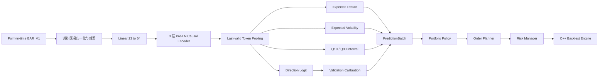

# TemporalTransformer V1.1 引入方案

> 文档日期：2026-07-27  
> 决策状态：Phase A-D 已实施，下一步进入 Phase E 模型晋级评审
> 适用项目：`quant-backtester-cpp`（C++ 引擎）与 `PythonProject`（训练和业务编排）  
> 前置基础：`BAR_V1`、`NEXT_OPEN`、模型制品协议、Mock 推理、可选 ONNX Runtime、C++ 模型回测入口已经存在  
> 本版范围：历史 Bar 模型训练、ONNX 制品、C++ 推理与回测闭环  
> 非本版范围：纯 Python demo 回测引擎、在线训练、实盘自动下单、横截面全连接注意力

## 1. 结论

下一版应发布为 `TemporalTransformerV1.1`，暂不直接引入
`TemporalCrossSectionTransformerV2`。

V1.1 保持现有 C++ 张量和预测协议不变，优先解决以下问题：

1. 当前 quantile 和 confidence 输出头没有进入训练损失。
2. 当前 `realized_volatility` 实际是未来总收益绝对值，不是持有期波动率。
3. confidence 已用于组合筛选，但尚无明确校准语义。
4. 已完成小型真实模型的 PyTorch、ONNX Runtime Python、ONNX Runtime C++ 六输出、
   非近似并列 top-3 排序和固定策略目标仓位 golden parity。
5. C++ ONNX 加载已校验名称、shape、dtype、动态 batch 和六输出语义。
6. 缺失 Bar、停牌、退市和窗口 reset 已按 frequency/calendar 制品语义冻结。
7. 模型预测、目标仓位、风控、订单和成交已由 decision ID 形成规范化 Replay 链。

直接增加股票间注意力会同时放大模型语义、数据 mask、动态股票池和 `O(N^2)` 性能风险，
不利于判断收益来自正确建模还是实现偏差。

## 2. 本版目标

### 2.1 软件目标

- 形成可复现的 `数据集 -> 训练 -> 校准 -> ONNX -> C++ 回测` 闭环。
- 所有模型输出具有明确标签、单位、持有期和校准方法。
- 模型制品损坏、schema 不匹配、非有限输出和过期结果全部失败关闭。
- 固定数据、模型和配置下，预测、目标仓位、订单、成交和权益完全可复现。
- `QBT_ENABLE_ML=OFF` 时不增加 ONNX Runtime 依赖，不影响默认 C++ 构建。

### 2.2 模型目标

- 使用小型单标的时间 Transformer 建立可信基线。
- 在统一数据、成本和组合规则下，与 Ridge、MLP、TCN/GRU 和简单规则比较。
- 使用 walk-forward test，而不是一次随机或单窗口切分。
- 模型质量与软件正确性分开验收。

## 3. 目标架构



V1.1 中 `N` 仍表示同一时点的动态股票数量，但每只股票只执行时间维编码，股票之间不做
注意力交互。模型输出继续使用现有六字段协议，因此 C++ 组合、订单和撮合主体不需要因模型
结构升级而改变。

## 4. V1.1 模型设计

### 4.1 输入

```text
features:   float32 [N, T, F]
valid_mask: uint8   [N, T]
```

建议默认值：

| 参数 | 默认值 | 说明 |
|---|---:|---|
| `T` | 64 | 固定 lookback，由制品声明 |
| `F` | 23 | 冻结当前 `BAR_V1` |
| `d_model` | 64 | 控制 CPU 推理成本 |
| `nhead` | 4 | `d_model` 可整除 |
| `num_layers` | 3 | 保持小模型 |
| `dim_feedforward` | 128 或 256 | 通过验证集确定 |
| `dropout` | 0.1 | 仅训练阶段生效 |

### 4.2 归一化

- 归一化参数只能使用训练区间拟合。
- 推荐按特征使用 mean/std 或 median/IQR，并记录最终选择。
- 归一化后执行固定裁剪，例如 `[-8, 8]`。
- 参数以模型 buffer 保存并固化进 ONNX 图。
- `feature_schema.json` 保留参数摘要和训练区间哈希用于审计。
- mask 为 0 的位置在投影前清零，模型不得把填充值解释为真实行情。

### 4.3 时间编码器

```text
Normalized Features
  -> Linear(F, 64)
  -> Learned Absolute Position Encoding
  -> 3 x Pre-LN Causal Transformer Encoder
  -> Last Valid Token Pooling
  -> Shared LayerNorm + Linear + GELU
```

V1.1 继续使用绝对位置编码，避免在首个可信版本中引入相对位置算子和额外 ONNX 兼容风险。

### 4.4 输出头

| 输出 | 实现 | 语义 |
|---|---|---|
| `expected_return` | 线性头 | LabelSpec 持有期对数收益 |
| `expected_volatility` | `softplus(raw_sigma)` | 持有区间逐 Bar 收益标准差 |
| `direction_probability` | 校准后的 sigmoid | 持有期收益大于 0 的概率 |
| `lower_quantile` | `mu - softplus(delta_low)` | q10 收益分位数 |
| `upper_quantile` | `mu + softplus(delta_high)` | q90 收益分位数 |
| `confidence` | `max(p_up, 1-p_up)` | 模型对预测方向的校准概率 |

不保留无监督的独立 confidence head。若未来需要更复杂的置信度，应单独定义标签或使用验证集
上的 conformal/calibration 方法，不能让随机输出影响下单门槛。

### 4.5 Attention Analysis（可选研究项）

Attention Analysis 不属于 V1.1 核心发布门槛。在真实模型、标签、多任务损失和三方一致性
已经完成后，如排期允许，再增加离线时间维注意力分析，用于回答：

- 一次预测主要关注过去哪些交易日；
- 不同 layer/head 是否学习到短期、波段或长期模式；
- 注意力是否集中在停牌、异常波动或无效 padding 上；
- 不同 walk-forward 窗口和随机种子下，关注模式是否稳定；
- 高注意力日期被移除后，预测是否真的发生显著变化。

#### 实现边界

Attention Analysis 只存在于 Python 训练与研究路径：

```text
TemporalTransformerV1.1 shared weights
├── Production forward
│   └── 六个预测输出 -> ONNX -> C++
└── Analysis forward
    └── predictions + attention [L,N,H,T,T]
```

- 生产 ONNX 图继续只导出六个预测输出。
- 不修改 C++ `PredictionBatch`，不把 attention 矩阵放入回测热路径。
- 分析 forward 与生产 forward 共享完全相同的模型权重。
- `valid_mask` 和 causal mask 必须在返回的 attention 中继续生效。
- 分析代码不得改变 dropout、归一化、pooling 或预测结果。

PyTorch 默认 `TransformerEncoder` 不直接返回各 head 权重，因此 V1.1 使用可检查的 Encoder
Layer 包装 `MultiheadAttention`，在 `return_attention=true` 时设置：

```text
need_weights = true
average_attn_weights = false
```

生产和 ONNX 导出时使用 `return_attention=false`，避免额外内存和计算开销。

#### 分析内容

1. **Layer/Head 热力图**  
   输出每层、每个 head 的 `[query_lag, key_lag]` 热力图，并同时展示 valid mask。

2. **Last-token Attention**  
   提取最终有效 token 对过去 `T` 个时间位置的权重，报告最受关注的交易日和 lag。

3. **Attention Rollout**  
   加入残差连接后逐层相乘，得到从输出 token 回溯到输入时间位置的累计关注分布。

4. **Head 统计**  
   记录每个 head 的熵、最大权重、有效关注跨度、近期/中期/长期权重占比。

5. **稳定性分析**  
   比较不同随机种子、walk-forward 窗口和相似市场状态下的 attention 分布相关性。

6. **事件分组分析**  
   按高波动、涨跌停、停牌恢复、成交量异常、趋势和反转样本聚合 attention。

7. **忠实度验证**  
   对 top-attention 日期执行 mask/occlusion，比较预测变化；同时随机遮盖相同数量日期作为对照。

#### Attention 不等于完整解释

Attention 只说明模型内部信息路由，不能单独证明某个日期对预测具有因果贡献。V1.1 同时执行：

- input gradient 或 Integrated Gradients；
- 时间位置 occlusion；
- 特征组 occlusion；
- attention 与梯度/occlusion 排名的一致性比较。

时间 attention 解释“关注哪些交易日”，特征 attribution 解释“这些交易日中的哪些特征重要”。
两类结果分开命名和展示，不能把时间权重误标为特征重要性。

#### 输出文件

```text
analysis/<run-id>/attention/
├── summary.json
├── head_metrics.parquet
├── sample_top_lags.parquet
├── rollout.parquet
├── faithfulness.json
├── stability.json
└── figures/
    ├── attention_heatmap_<sample>.png
    ├── rollout_<sample>.png
    └── head_span_summary.png
```

建议新增命令：

```bash
python -m python.qbt_ml.cli analyze-attention \
  --run runs/<run-id> \
  --dataset data/dataset.npz \
  --split test \
  --max-samples 1024 \
  --output analysis/<run-id>/attention
```

完整 `[L,N,H,T,T]` 矩阵体积较大，默认只对具有代表性的 test 样本保存原始矩阵，其他样本
流式聚合为 head/lag 统计。样本选择固定随机种子，并覆盖高置信、低置信、正确、错误、高波动
和普通市场状态，避免只展示模型表现好的案例。

## 5. 标签与损失

### 5.1 标签协议

收益标签继续与 `NEXT_OPEN` 对齐：

```text
signal_asof = bar[t]
entry       = raw_open[t + 1]
exit        = LabelSpec 规定的未来 raw price
return      = log(exit / entry)
```

波动率必须根据持有区间内逐 Bar log return 计算标准差，不能继续使用 `abs(total_return)` 冒充
波动率。具体 exit 下标和持有 Bar 数在编码前由用户确认，并写入 LabelSpec。

### 5.2 多任务损失

```text
L = w_return * Huber(expected_return)
  + w_direction * BCEWithLogits(direction)
  + w_volatility * Huber(expected_volatility)
  + w_quantile * Pinball(q10, q90)
  + w_rank * CrossSectionRankLoss
```

实施要求：

- loss 权重只能在 validation 窗口选择。
- CrossSectionRankLoss 必须以完整 timestamp 截面为 batch 单位。
- 训练日志分别保存每个子损失，不能只保存总 loss。
- confidence 校准只使用 validation，test 不参与拟合。

## 6. 数据与训练改造

### 6.1 数据集

- 冻结 `BAR_V1` 列顺序，不在 V1.1 中随意增加特征。
- 明确缺失 Bar 是否占据时间槽，并保证 Python/C++ 一致。
- 测试停牌、未上市、退市、复牌、交易日切换和历史不足。
- 股票代码保持稳定字符串，不使用运行时 `SymbolId` 作为训练主键。
- 所有股票池、行业、复权和交易状态必须 point-in-time。

### 6.2 训练 sampler

新增 `CrossSectionBatchSampler`：

- 一个 batch 包含一个或多个完整 timestamp 截面。
- 不允许把同一 timestamp 拆到不同数据集或丢失部分股票。
- 大截面可按多个完整 timestamp 累积梯度，不按股票随机切碎排名目标。

### 6.3 Walk-forward Pipeline

Walk-forward 是 V1.1 的正式样本外评估方式，不再把单次 train/validation/test 切分作为模型
晋级依据。默认采用 expanding train：训练区间逐步扩展，validation 和 test 始终位于训练区间
之后。

```text
Window 1: Train A ------> Purge -> Validation B -> Embargo -> Test C
Window 2: Train A+B ----> Purge -> Validation C -> Embargo -> Test D
Window 3: Train A+B+C --> Purge -> Validation D -> Embargo -> Test E
```

若历史长度允许，日频全 A 默认使用：

| 项目 | 默认值 |
|---|---|
| 最小训练区间 | 5 个交易年 |
| Validation | 1 个交易年 |
| Test | 1 个交易年 |
| Step | 1 个交易年 |
| 最少 test 窗口 | 3 |
| Purge | 至少 5 个交易日，并覆盖完整标签持有期 |
| Embargo | 5 个交易日 |

历史不足时允许缩短窗口，但必须在运行前冻结配置，且至少保留 3 个互不重叠 test 窗口。

#### 每个窗口的执行顺序

```text
1. Freeze point-in-time universe and lineage
2. Build feature/label/provenance
3. Run Leakage Detection
4. Fit train-only normalizer
5. Train models with fixed seeds
6. Select hyperparameters on validation only
7. Fit probability calibration on validation only
8. Freeze model and policy config
9. Evaluate test once
10. Run C++ artifact backtest with identical costs
```

每个窗口独立保存 normalizer、calibrator、checkpoint、manifest、leakage report 和测试结果。
禁止用后续窗口的超参数、归一化统计或股票池修正前一窗口结果。

#### Walk-forward 输出

```text
runs/<experiment-id>/walk-forward/
├── experiment_manifest.json
├── window_001/
│   ├── split.json
│   ├── leakage_report.json
│   ├── model_artifact/
│   └── metrics.json
├── window_002/
├── window_003/
└── aggregate/
    ├── prediction_metrics.parquet
    ├── portfolio_metrics.parquet
    ├── paired_model_deltas.parquet
    └── summary.json
```

建议命令：

```bash
python -m python.qbt_ml.cli walk-forward \
  --config configs/ml/walk_forward_v1_1.json \
  --output runs/<experiment-id>/walk-forward
```

分别记录各窗口和聚合结果：

- Huber/BCE/Pinball loss；
- IC、RankIC；
- Brier score、AUC、ECE；
- q10/q90 区间覆盖率；
- 扣费收益、Sharpe、最大回撤、换手；
- 股票和行业收益集中度；
- 不同模型的同窗口配对差值和稳定性。

### 6.4 Benchmark Suite

Benchmark 分为模型质量和工程性能两层。模型质量决定是否晋级；工程性能决定模型是否能以当前
硬件和 cadence 运行。两者不能混成一个总分。

#### 模型质量 Benchmark

Transformer 必须与以下模型使用相同数据、标签、walk-forward 窗口和回测配置：

| 类别 | Benchmark |
|---|---|
| 无模型规则 | 动量、反转、等权持有、全现金 |
| 线性模型 | Ridge / Logistic Regression |
| 非线性浅层 | MLP |
| 时序模型 | TCN、GRU |
| Transformer | 当前 V1、V1.1 |

公平比较规则：

- 所有模型使用相同 FeatureSchema 和 LabelSpec；
- 所有模型使用相同 point-in-time 股票池和 leakage PASS 数据；
- 所有模型使用相同 policy、风险、佣金、滑点和成交量参与率；
- 深度模型使用相同随机种子清单和近似训练预算；
- 每个指标以同一 test window 的配对差值比较，不只比较全时期平均值；
- 超参数只使用 validation 选择，test 结果不参与模型选择。

模型 Benchmark 报告所有多任务指标，并以扣费后组合结果作为最终业务比较。单项预测 loss 更低
但扣费后收益或稳定性更差时，不视为整体胜出。

#### 工程性能 Benchmark

在 M1 Pro CPU 上建立首个兼容基线：

| 阶段 | 主要指标 |
|---|---|
| 数据集构建 | rows/s、峰值 RSS、输出字节数 |
| FeatureWindow | rows/s、p50/p99、稳态分配次数 |
| ORT 推理 | batch=1/64/512/全 A 的 p50/p99、RSS |
| Policy/Risk | p50/p99、订单数量、拒绝原因 |
| 端到端回测 | rows/s、总耗时、订单/成交/权益一致性 |
| ML OFF 回归 | 原核心基准中位数回退不超过 2% |

RTX 4090 到位后增加独立 CUDA 报告，不能用 GPU 结果覆盖 CPU 基线。CPU 和 CUDA 分别记录
Execution Provider、线程数、batch、硬件、驱动和运行时版本。

#### Benchmark 产物

```text
benchmarks/ml/<experiment-id>/
├── benchmark_manifest.json
├── model_quality.parquet
├── paired_window_deltas.parquet
├── cpu_runtime.json
├── cuda_runtime.json
├── end_to_end.json
└── summary.md
```

建议命令：

```bash
python -m python.qbt_ml.cli benchmark-models \
  --walk-forward runs/<experiment-id>/walk-forward \
  --config configs/ml/model_benchmark_v1_1.json

python tools/run_ml_runtime_benchmarks.py \
  --artifact models/<model-id> \
  --output benchmarks/ml/<experiment-id>/cpu_runtime.json
```

Benchmark 配置、模型版本、数据 fingerprint 和代码 revision 必须进入 manifest，保证后续版本可以
做自动回归比较。

### 6.5 Feature Ablation Pipeline

Feature Ablation Pipeline 纳入 V1.1 的离线模型晋级评估，但不进入 ONNX 或 C++ 推理热路径。
它用于回答“哪些特征组真正提供了样本外增益”，避免模型依赖无效、重复或不稳定特征。

#### 特征分组

当前 `BAR_V1` 的 23 个特征按语义分组：

| 分组 | 代表特征 |
|---|---|
| `returns` | 1/5/10/20 期 log return |
| `bar_structure` | 振幅、close/open、overnight gap |
| `volume` | log volume、volume z-score |
| `volatility` | 5/10/20/60 期波动率 |
| `trend_position` | 均线偏离、价格位置、突破强度 |
| `cross_section` | 截面收益 rank |
| `trade_state` | 停牌、上市、ST、可交易标志 |

FeatureSchema 保存稳定的 feature-to-group 映射，ablation 配置使用组名，不使用易错的列下标。

#### 三种实验模式

1. **Group-drop retrain**  
   删除一个特征组，重新拟合归一化参数并完整训练。它是判断特征真实增量价值的主结果。

2. **Inference occlusion**  
   不重新训练，只在 test 上 mask 一个特征组，用于压力测试和定位模型依赖；不能把它当作
   特征因果贡献。

3. **Time-safe permutation**  
   在不跨越时间窗口和股票池边界的前提下置换特征组，衡量预测退化。禁止全时期随机置换，
   避免破坏时间结构后得到夸大的重要性。

V1.1 的正式晋级结论以 group-drop retrain 为准，occlusion 和 permutation 作为辅助诊断。

#### 多任务评估

每次 ablation 必须分别评估所有核心任务：

| 任务 | 类型 | 主要指标 |
|---|---|---|
| 收益预测 | 回归 | MAE、Huber、IC、RankIC、扣费收益 |
| 波动率预测 | 非负回归 | MAE、RMSE、校准分桶 |
| 涨跌方向 | 二分类 | LogLoss、Brier、AUC、ECE |
| 收益区间 | 分位数回归 | Pinball loss、q10/q90 覆盖率 |

本版分类任务固定为“未来 5 个交易日收益是否大于 0”的二分类。牛熊/高低波动等多分类属于
未来候选，不在没有明确业务用途时增加输出头。

#### 公平比较规则

- 使用与完整模型完全相同的 walk-forward 窗口、随机种子和训练预算；
- 每个实验重新拟合训练区间归一化，禁止复用含被删除特征的统计量；
- 至少运行 3 个固定种子，报告均值和离散程度；
- 使用相同组合、交易成本、换手限制和回测执行规则；
- 同时报告预测指标和扣费后组合指标；
- 不因某个 test 窗口结果不理想而事后改变特征分组。

#### 建议命令与产物

```bash
python -m python.qbt_ml.cli ablate-features \
  --config configs/ml/feature_ablation_v1_1.json \
  --dataset data/dataset.npz \
  --baseline-run runs/<full-model-run> \
  --output analysis/<run-id>/feature-ablation
```

```text
analysis/<run-id>/feature-ablation/
├── experiment_manifest.json
├── group_metrics.parquet
├── task_delta.parquet
├── portfolio_delta.parquet
├── stability.json
└── figures/
    ├── rankic_delta.png
    ├── task_metric_delta.png
    └── net_sharpe_delta.png
```

M1 Pro 阶段先执行分组级 ablation；RTX 4090 可用后再执行逐特征和更多随机种子的完整重训练，
避免当前硬件上为了穷举实验拖延核心模型闭环。

### 6.6 Leakage Detection（P0 强制门禁）

Leakage Detection 属于 V1.1 核心正确性能力。任何数据集在进入训练、Feature Ablation、
Attention Analysis 或模型评估前都必须通过泄漏检查。Critical/High 级问题直接终止流水线，
不能通过配置降级为警告。

#### 需要检测的泄漏类型

| 类型 | 典型问题 | 强制规则 |
|---|---|---|
| 特征时间前视 | bar[t] 特征使用 t 之后的数据 | `max_feature_time <= signal_asof` |
| 标签重叠 | train 样本标签区间延伸到 validation/test | split 之间按 label end 执行 purge/embargo |
| 归一化泄漏 | 用全时期 mean/std 处理训练数据 | scaler 只能在当前 train 窗口拟合 |
| 股票池泄漏 | 用今天仍上市的股票反推历史股票池 | universe 必须 point-in-time |
| 参考数据泄漏 | 使用未来行业、ST、上市状态或公司行动 | 每个值带 `effective_from/known_at` |
| 复权泄漏 | 使用当时尚不可知的未来复权信息 | 信号价格只能使用 as-of 可用因子 |
| 截面泄漏 | 当前 rank 使用未来股票或未来时点 | 只使用同一 as-of 可见截面 |
| 样本重复 | 同一 `(timestamp,symbol)` 进入多个 split | 跨 split 主键集合必须互斥 |
| 缓存污染 | 复用其他日历、股票池或时间范围的特征缓存 | cache key 绑定完整 lineage |
| 人工调参泄漏 | 反复查看 test 后改模型或门槛 | test 只在冻结配置后运行一次 |

#### 样本 provenance

数据集为每个样本或分区保存以下审计字段：

```text
signal_asof
feature_source_max_timestamp
label_entry_timestamp
label_exit_timestamp
universe_asof
reference_data_known_at_max
normalizer_fit_start / normalizer_fit_end
dataset_fingerprint
feature_code_hash
calendar_id / universe_id
```

最小不变量：

```text
feature_source_max_timestamp <= signal_asof
reference_data_known_at_max <= signal_asof
label_entry_timestamp > signal_asof
normalizer_fit_end <= train_end
train_label_exit < validation_feature_start
validation_label_exit < test_feature_start
```

#### 自动检测方法

1. **Future Mutation Test**  
   修改 cutoff 之后的行情、股票池和参考数据，cutoff 之前所有特征、mask 和样本数量必须完全不变。

2. **Prefix Invariance Test**  
   分别用完整数据和截至时间 t 的数据构建数据集，两者在 t 之前的输出必须一致。

3. **Label Interval Audit**  
   根据每个样本的 entry/exit 区间检查 purge/embargo，不只检查样本行号。

4. **Split Key Audit**  
   比较 train/validation/test 的 `(timestamp,symbol)`、原始行指纹和标签区间，拒绝重复或交叉。

5. **Fit-scope Audit**  
   normalizer、calibrator、特征选择和超参数搜索分别记录 fit 范围，禁止 validation/test 统计进入训练。

6. **Point-in-time Reference Audit**  
   对上市、退市、ST、行业、板块、公司行动和复权因子检查 `known_at <= signal_asof`。

7. **Cache Lineage Audit**  
   校验数据内容、schema、代码、日历、股票池、复权口径和查询范围的联合 fingerprint。

8. **Leakage Canary**  
   运行标签时间错位、未来列扫描和异常高相关检查，作为诊断信号；canary 不能替代上述确定性不变量。

#### 流水线位置

```text
Raw/PIT Data
  -> Feature + Label Build
  -> Provenance Attach
  -> Leakage Detection
  -> PASS: Dataset Freeze + Fingerprint
  -> Train / Ablation / Attention / Export
```

建议命令：

```bash
python -m python.qbt_ml.cli detect-leakage \
  --config configs/ml/leakage_detection_v1_1.json \
  --dataset data/dataset.npz \
  --output analysis/<run-id>/leakage
```

输出：

```text
analysis/<run-id>/leakage/
├── leakage_report.json
├── split_intervals.parquet
├── provenance_violations.parquet
├── future_mutation.json
├── prefix_invariance.json
├── reference_data_audit.json
└── cache_lineage.json
```

`leakage_report.json` 保存检测器版本、配置、数据 fingerprint、检查数量、失败样本和严重级别。
模型制品记录该报告的 SHA-256；没有 PASS 报告的训练运行不得导出为可回测制品。

## 7. 模型制品 V2

建议新增 `ModelManifest schema_version=2`，同时让 C++ loader 保持读取旧 V1 制品的能力。

新增或强化字段：

```text
model_family
architecture_version
label_spec
normalization_method
normalization_sha256
calibration_method
calibration_sha256
training_dataset_fingerprint
leakage_report_sha256
minimum_valid_tokens
dynamic_batch
output units / horizon / quantiles
```

制品目录：

```text
models/<model-id>/
├── model.onnx
├── manifest.json
├── feature_schema.json
├── label_spec.json
├── normalization.json
├── calibration.json
├── leakage_report.json
├── metrics.json
└── golden/
    ├── input.npz
    ├── pytorch_output.npz
    ├── onnx_output.npz
    └── expected_decisions.json
```

Attention Analysis 是训练运行的派生分析结果，不放入生产模型制品，也不参与制品 hash。
制品的 `metrics.json` 只保存 attention 分析报告的版本、配置和摘要哈希，保证结果可追溯。

## 8. C++ 运行时改造

### 8.1 原生 ArtifactLoader

把制品解析和哈希校验从 pybind 绑定下沉到 `ml_runtime`：

```text
ml_runtime/
├── include/ml_runtime/artifact_loader.h
└── src/artifact_loader.cpp
```

它负责：

- manifest/schema/label/calibration 文件存在性；
- SHA-256；
- manifest V1/V2 兼容；
- feature profile、执行对齐和输出单位；
- runtime 最低版本；
- 模型文件路径和 provider。

pybind 只负责把 Python 路径和配置交给 C++ loader，不再依赖 Python `hashlib/json` 完成核心校验。

### 8.2 ONNX 图签名校验

模型加载阶段校验：

- 输入和输出名称；
- 输入 dtype；
- 输入 rank；
- `N` 是否为允许的动态维；
- `T/F/S` 是否与 manifest 完全一致；
- 六个输出是否为 `float32 [N]`；
- provider 是否与制品要求兼容。

任何错误在策略启动阶段拒绝，不能等到首个交易 batch 才发现。

### 8.3 窗口时间语义

`FeatureWindowStore` 必须按模型 cadence 维护时间槽：

- 缺失 Bar 写入 mask=0 的槽位；
- 停牌 Bar 的特征和可交易 mask 分离；
- 数据 gap、Replay seek、交易日切换和模型切换有明确 reset 规则；
- feature pipeline reset 时同步 reset 对应窗口；
- manifest 声明 `frequency` 和 `calendar_id`，分钟 cadence 由交易日历定义；
- manifest 声明 `minimum_valid_tokens`。

### 8.4 推理执行器

增加 `InferenceExecutor` 或等价边界：

- warmup 后预分配输入、输出和临时容器；
- 支持确定性分块，避免截面超过 max batch 后整体失败；
- 记录 feature、queue、infer、policy、risk 延迟；
- 超时结果不得进入组合和订单规划；
- 第一版保持同步 INLINE，异步线程留到实盘阶段。

### 8.5 策略拆分

把当前编排进一步拆分为：

```text
IFeaturePipeline
IInferenceBackend
IPredictionValidator
IPortfolioPolicy
IOrderPlanner
IRiskManager
IStrategyRuntime
```

V1.1 至少补齐：

- 预测时间戳、模型版本和有限值校验；
- 目标换手约束；
- 活动订单后的 projected position；
- gross/net exposure；
- 现金、可卖数量和订单频率；
- 明确的 RiskRejectReason。

## 9. Replay 与审计

每次模型决策应形成可追踪链：

```text
MarketBatch
  -> FeatureBatch hash
  -> Model version
  -> PredictionBatch
  -> TargetPositionBatch
  -> OrderIntentBatch
  -> RiskDecision
  -> Order / Fill / Execution
```

至少记录：

- as-of timestamp；
- feature schema hash；
- model version hash；
- request/decision ID；
- 数据质量和 mask 摘要；
- 预测、目标、风险拒绝和订单 ID；
- 推理耗时与结果是否过期。

## 10. 测试范围

### 10.1 Python 侧

只测试训练和制品业务，不测试纯 Python demo 回测引擎：

- 标签与 NEXT_OPEN 对齐；
- 波动率标签；
- Future Mutation 和 Prefix Invariance；
- 标签区间 purge/embargo 与跨 split 主键互斥；
- normalizer/calibrator fit scope；
- point-in-time 股票池、参考数据、复权和缓存 lineage；
- 截面 sampler；
- purge/embargo；
- 所有损失头都有梯度；
- 概率校准；
- PyTorch/ORT Python parity；
- manifest 和 golden fixture。
- production forward 与 analysis forward 的六输出完全一致；
- causal mask 上三角 attention 严格为 0；
- padding 和无效 token 不获得注意力权重；
- 每个有效 query/head 的 attention 和为 1；
- attention rollout、熵和跨度统计有确定性测试；
- top-attention occlusion 与随机 occlusion 的忠实度报告可复现。

### 10.2 C++ 侧

- ArtifactLoader 正确和失败路径；
- ONNX dtype/shape/name 校验；
- BAR 窗口、mask、reset 和缺失 Bar；
- ORT C++ golden parity；
- prediction -> target -> order -> fill；
- 部分成交不重复下单；
- hash、NaN、超 batch、超时全部失败关闭；
- ML OFF 默认构建无回退。
- C++ BAR 特征在相同 cutoff 下满足 Python prefix parity。

## 11. 施工阶段

### Phase A：冻结语义

交付物：

- LabelSpec；
- Leakage Detection 契约、provenance 字段和严重级别；
- confidence 定义；
- 波动率定义；
- 缺失 Bar 时间槽规则；
- Manifest V2 草案。

退出条件：Python 和 C++ 对每个字段、mask、单位和时点没有歧义，泄漏门禁契约冻结。

### Phase B：训练 V1.1

交付物：

- V1.1 模型；
- PASS 的 Leakage Detection 报告；
- 完整多任务损失；
- 截面 sampler；
- 至少 3 个窗口的 Walk-forward Pipeline；
- 模型质量 Benchmark、M1 Pro CPU 工程性能基线与校准报告；
- Feature Ablation Pipeline 及多任务、组合指标对照报告。
- 可选：Attention Analysis 命令、热力图、rollout、稳定性与忠实度报告。

退出条件：所有输出被监督或校准，Walk-forward、Benchmark 和 Feature Ablation 可复现。
Attention Analysis 不作为退出条件。

### Phase C：制品与三方一致性

交付物：

- 真实小型 ONNX 制品；
- Manifest V2；
- PyTorch、ORT Python、ORT C++ golden 结果。

退出条件：六输出和 top-k 决策满足容差。

### Phase D：C++ 回测接入强化

实施状态（2026-07-29）：**已完成**。

交付物：

- 原生 ArtifactLoader；
- ONNX 图签名校验；
- 窗口时间语义；
- 策略组件拆分；
- Replay 决策链；
- 性能基线。

退出条件：固定制品回测可复现，所有失败路径不产生订单。

验收记录：Mock 与真实 ORT CTest 均通过；hash/schema、超 batch、deadline、NaN、stale、
风险拒绝和输出溢出均失败关闭；固定模型回测两次结果一致。M4 Pro Release/LTO/ORT CPU
单线程 100 次基线见 `cpp_engine/benchmarks/reports/ml-runtime-m4-pro-phase-d.json`，batch=4096
端到端 p50/p99 为 14.41/14.84 ms，峰值 RSS 84.23 MiB。该报告使用小型测试制品，不能
替代 Phase E 的生产候选模型质量或最终分钟模型性能评审。

### Phase E：模型晋级评审

实施状态（2026-07-29）：**进行中**。已实现三态晋级评审、软件/质量独立门槛、
多窗口稳定性与收益集中度汇总、0/5/10 bp C++ 扣费回测输入合同，并补齐 Transformer
walk-forward 窗口的生产制品导出元数据。正式全 A 训练、完整深度基线、C++ 组合回测与
生产候选性能实测尚未运行，因此当前不能给出模型晋级结论。

深度基线训练入口已补齐 MLP、因果 TCN 和 GRU，三者复用相同多任务头、窗口、种子和训练
预算。仓库历史不存在可复现的 Transformer V1 实现或冻结制品，因此不在看到 V1.1 结果后
事后构造；Benchmark 会把它记录为不可用 legacy model，而不是伪造比较结果。

C++ 多窗口组合 Benchmark 已实现预计算预测运行时：所有模型的冻结预测进入同一
`LongOnlyTopKPolicy -> OrderPlanner -> RiskManager -> C++ execution` 路径，固定运行
0/5/10 bp。正式输入强制区分原始成交价与 PIT 复权信号价，并要求状态、行业 known-at、
历史费率和企业行动。三个种子、全部特征组、全窗口和三档滑点的 C++ 组合消融生成器也已
接入晋级门禁；当前尚未在真实全 A 数据上执行。

交付物：

- 多窗口净收益与风险报告；
- 基线比较；
- 收益集中度和稳定性分析；
- 推理性能报告。

退出条件：软件门槛和模型质量门槛分别通过。

## 12. V1.1 验收标准

### 12.1 软件正确性

- PyTorch、ORT Python、ORT C++：`atol <= 1e-5`、`rtol <= 1e-4`。
- 非近似并列样本的 top-k 股票和目标仓位一致。
- 固定输入下 prediction、target、order、fill、cash、equity 可复现。
- 制品缺失、hash 错误、shape 错误、NaN、Inf 和超时不得产生订单。
- Leakage Detection 存在 Critical/High 问题时禁止训练或导出制品。
- Future Mutation、Prefix Invariance、split interval、PIT reference 和 fit scope 全部通过。
- 缺失、停牌、退市、复牌和窗口重置有黄金测试。
- ML OFF 构建不查找 ONNX Runtime。
- analysis forward 不改变生产预测，且不会进入 ONNX/C++ 热路径。
- attention 严格满足 causal/valid mask，并可由固定样本复现。

### 12.2 模型质量

- 至少 3 个 purged/embargoed walk-forward test 窗口。
- 扣除佣金、滑点和换手后优于最强非 Transformer 基线。
- RankIC、净 Sharpe、最大回撤和尾部风险达到确认后的业务门槛。
- 收益不依赖单一时期、少数股票或单一行业。
- 方向概率校准和区间覆盖率在 test 上没有明显失真。

### 12.3 性能

- 推理 p99 不超过策略 cadence 的 10%。
- warmup 后稳态推理无非必要堆分配。
- 分别记录 CPU、RSS、batch size、线程数和 Execution Provider。
- 绝对 p99 数值必须在目标硬件确认后写入验收配置。

## 13. V2 横截面 Transformer 的进入条件

只有同时满足以下条件才进入 V2：

1. V1.1 软件与模型质量门槛均通过。
2. 加入简单市场、行业和截面聚合特征后，消融实验仍显示稳定剩余增益。
3. 最大股票池下的横截面注意力延迟和内存满足预算。
4. 股票排序、mask 和稳定行业映射已经冻结。

V2 推荐结构：

```text
Per-symbol Temporal Encoder [N,T,F] -> [N,D]
  -> 1~2 层行业分组或稀疏 Cross-Section Encoder
  -> 原六输出协议
```

约束：

- 对股票输入顺序保持 permutation-equivariant；
- 不使用运行时 `SymbolId` embedding；
- 行业/证券 embedding 必须使用制品携带的稳定映射和 OOV 策略；
- 优先行业分组、低秩或稀疏注意力，不默认执行全市场 `O(N^2)` 注意力；
- C++ `PredictionBatch`、组合、订单和风控接口继续保持不变。

## 14. 用户决策与待确认项

### 14.1 已确认

| 项目 | 决策 | 对架构的影响 |
|---|---|---|
| 当前数据频率 | 日频 Bar | V1.1 使用日频 LabelSpec 和日频特征统计 |
| 后续数据频率 | 将增加分钟 Bar | 分钟模型使用独立 schema、独立训练和独立制品，不复用日频权重 |
| 股票池 | 全 A | 数据集和回测必须使用 point-in-time 全 A 股票池，不能使用当前成分反推历史 |
| 当前硬件 | Apple M1 Pro | 首版训练可使用 CPU/MPS，正式 C++ 验收使用 ONNX Runtime CPU |
| 后续硬件 | RTX 4090 | 后续可用于训练和 CUDA 推理实验，但 CPU 制品仍是首个兼容基线 |

全 A 的 `N` 会随上市、退市、停牌和数据质量动态变化。实现时不写死股票数量，manifest
声明 max batch，C++ 对超大截面执行确定性分块。

### 14.2 已确认的业务默认值

#### A. 预测持有期

“预测 5 个 Bar”在日频数据中表示预测未来 5 个交易日的收益。例如：

```text
周一收盘后产生信号
周二开盘买入，即 entry = open[t+1]
周二、周三、周四、周五、下周一共 5 个交易 Bar
下周一收盘价作为标签 exit = close[t+5]
```

V1.1 固定为：

```text
horizon = 5 个交易日
entry   = raw_open[t+1]
exit    = raw_close[t+5]
```

以后可以增加 1 日和 20 日模型，但每种 horizon 必须是独立模型版本，不能混用输出含义。

#### B. 组合方向

`long-only` 表示模型只能决定“买入、继续持有、减仓或保持现金”，不通过融券做空股票。
`long-short` 表示可以买入看涨股票，同时做空看跌股票，对券源、保证金和风控要求明显更高。

V1.1 使用 `long-only top-k`，原因是当前项目的 A 股现金、T+1、涨跌停和 lot 规则已经
支持这条路径，而融券数据和做空规则尚未形成可信闭环。

#### C. 交易成本

交易成本用于避免模型通过频繁换股得到不现实的回测收益：

- 佣金、最低佣金、印花税、过户费：继续使用引擎已有的历史费率表；
- 滑点：成交价相对理论价格的不利偏移；
- 成交量参与率：模型订单最多占当日成交量的比例；
- 换手上限：每次调仓最多改变多少组合资金。

首版配置固定为：

| 项目 | 推荐值 |
|---|---|
| 佣金/印花税/过户费 | 使用现有 point-in-time 历史费率 |
| 单边滑点 | 5 bp，即 0.05% |
| 最大成交量参与率 | 10% |
| 单次调仓换手上限 | 20% |
| T+1、涨跌停、停牌、lot | 全部启用 |

最终报告同时输出 0 bp、5 bp 和 10 bp 三档滑点敏感性，避免模型只在单一成本假设下有效。

#### D. 模型晋级门槛

“晋级门槛”不是承诺收益，而是决定模型是否有资格从实验进入正式回测或影子运行。首版固定为：

| 指标 | 推荐门槛 |
|---|---|
| Walk-forward | 至少 3 个互不重叠测试窗口 |
| RankIC | 中位数大于 0.02，且多数窗口为正 |
| 扣费后 Sharpe | 大于 1.0，且比最强非 Transformer 基线高至少 10% |
| 最大回撤 | 不高于 20% |
| 稳定性 | 至少 2/3 测试窗口优于基线 |
| 集中度 | 收益不能主要来自少数股票、单一行业或单一时期 |

2026-07-29 在首次正式冻结 test 前确认补充门槛：95% CVaR 不低于 -3%；单一窗口、
单股票 Top-1、单股票 Top-5、单行业的正收益贡献占比分别不超过 50%、10%、30%、30%；
日频全 A、CPU、batch=4096 的生产候选端到端 p99 不超过 50 ms。上述数值只适用于日频
V1.1，分钟模型使用独立配置和性能门槛。

若真实数据表明这些数字不适合，可在首次基线报告后调整一次；不能查看最终 test 结果后反复
修改门槛。

### 14.3 已确认的技术默认值

以下项目采用本方案默认值：

| 项目 | 默认值 |
|---|---|
| 模型版本 | `TemporalTransformerV1.1` |
| Profile | `BAR_V1` |
| 执行对齐 | `NEXT_OPEN` |
| lookback | 64 |
| 模型宽度 | 64 |
| Encoder | 3 层、4 heads |
| ONNX opset | 17（PyTorch 2.2 传统导出器兼容基线） |
| 推理后端 | ONNX Runtime CPU |
| 回测模式 | INLINE |
| 组合 | long-only top-k |
| confidence | 校准后的方向正确概率 |
| Manifest | V2，同时兼容读取 V1 |
| Python demo 引擎 | 不纳入验收 |
| Feature Ablation | V1.1 离线晋级评估，分组重训练为主 |
| Leakage Detection | V1.1 P0 强制门禁，Critical/High 零容忍 |
| Walk-forward | Expanding train，至少 3 个独立 test 窗口 |
| 模型 Benchmark | 规则、Ridge/Logistic、MLP、TCN、GRU、V1/V1.1 |
| 性能 Benchmark | M1 Pro CPU 为首个基线，4090/CUDA 单独报告 |
| 核心预测任务 | 收益回归、波动率回归、涨跌二分类、收益分位数 |
| Attention Analysis | 可选，仅在核心闭环完成后用于 Python 离线分析 |
| Attention 原始矩阵 | 最多保存 1024 个代表性 test 样本，其余流式聚合 |
| Attention 忠实度 | 必须包含 top-attention 与随机 occlusion 对照 |
| 横截面 V2 | V1.1 晋级后再实施 |
