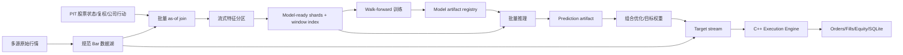

# Transformer 全市场建模与回测引擎嵌入方案

## 1. 文档状态

| 项目 | 内容 |
|---|---|
| 状态 | 施工方案，待分阶段实施 |
| 版本 | 1.0 |
| 日期 | 2026-07-23 |
| 适用工程 | Python 研究与业务层、C++ `cpp_engine` 执行核心 |
| 第一目标 | A 股日线全市场相对收益建模 |
| 后续目标 | 5/15 分钟建模；验证收益后再评估 1 分钟 |

本文将“关注全局变化”定义为：模型同时观察单只股票历史、同一时点的全市场横截面、
行业联动和市场状态，预测个股未来相对收益、风险及可交易性。本文暂不包含海外市场、
期货、宏观、新闻和大语言模型；这些数据以后可以作为额外全局 token 接入。

## 2. 结论与核心决策

Transformer 可以接入当前系统，但不能直接嵌入 C++ 撮合核心。推荐边界如下：

1. Python/PyTorch 负责特征、窗口、训练、批量推理和模型版本管理。
2. 第一版模型只依赖行情和 point-in-time 参考数据，不依赖回测中的现金、持仓或成交状态。
3. 每个 walk-forward fold 先批量生成不可变预测产物。
4. 组合层把预测分数转换为目标权重。
5. C++ 引擎根据真实现金、持仓和可卖数量把目标权重转换为订单，并负责 T+1、整手、
   涨跌停、停牌、成交量约束、费用、部分成交和拒单。
6. 只有模型必须读取实时组合状态时，才增加逐 timestamp 的在线 Tensor 推理接口。
7. 只有 profiling 证明 Python 推理边界占端到端时间 15%-20% 以上，才评估 ONNX Runtime
   或 LibTorch C++ 推理插件。

该边界保证模型研究可以快速演进，同时保持执行账本确定、可审计、可做 Python/C++ parity。

## 3. 目标与非目标

### 3.1 第一版目标

- 使用日线数据预测未来 1-5 个交易日的横截面相对收益。
- 能感知市场、行业和个股三层状态。
- 支持包含历史退市股票的 point-in-time 股票池。
- 使用严格 walk-forward 样本外预测，不允许随机拆分股票行。
- 将预测固化为带模型、数据和特征指纹的 Parquet artifact。
- 在现有 C++ 执行规则下完成 long-only 组合回测。
- 相同输入重复运行时，预测、目标仓位、订单和现金账本可以复现。

### 3.2 暂不做

- 不让 Transformer 直接产生未经约束的 BUY/SELL 指令。
- 不把 PyTorch 链接进 `BacktestEngine`。
- 不在第一版训练全市场 20 年 1 分钟数据。
- 不采用 `股票数 × 时间长度` 的完整二维全注意力。
- 不使用今天的股票列表、行业或复权因子回填历史。
- 不以单次全样本回测收益作为模型有效性的证据。
- 不建设分布式训练、在线特征平台或微服务。

## 4. 总体架构



### 4.1 责任边界

| 层 | 负责 | 不负责 |
|---|---|---|
| 数据湖 | 原始数据、schema、分区、快照、lineage | 训练切分和模型 |
| PIT 富化 | 历史时点状态、复权信号价、行业、风格、可用时间 | 成交判断 |
| ML 数据集 | 特征、标签、mask、窗口、fold、scaler | 订单和现金 |
| Transformer | score、预期收益、风险、可交易概率 | T+1、费用、撮合 |
| 组合层 | 候选过滤、目标权重、暴露和换手约束 | 假定订单已成交 |
| C++ 引擎 | 真实持仓差额、订单、成交、费用、权益 | 模型训练和 attention |

## 5. 当前系统基础与缺口

### 5.1 可复用能力

- `MinuteBarDataLake` 已支持 CSV/Parquet 分批导入、校验、不可变 fragment 和 catalog。
- `ArrowDatasetScanner` 与 `PartitionAwareIterator` 已支持流式读取、过滤下推和完整截面回放。
- Arrow C Stream 可以避免逐 Bar Python 对象构造。
- `MaterializedFeatureCache` 已具备特征 definition、code hash、数据 lineage、股票池和复权口径。
- `BacktestRunner`、`RunSpec`、SQLite 审计和 Python/C++ parity 已具备基本闭环。
- C++ 已负责 A 股交易约束，适合作为模型之外的唯一执行真相源。

### 5.2 必须补齐的缺口

1. 数据湖没有正式的 `frequency=1d/1m/...` 元数据和日线校验模式。
2. 当前项目数据湖尚无全市场训练数据，单只股票样本不能训练全局模型。
3. `MaterializedFeatureCache.materialize()` 接受完整 Arrow Table 并全表排序，不能处理亿级特征。
4. 特征缓存绑定整个 dataset fingerprint，新增未来 fragment 会使历史缓存整体失效。
5. 缺少标签定义、walk-forward fold、purge/embargo、训练期 scaler 和窗口索引。
6. 缺少 PyTorch、基线模型、checkpoint、预测 artifact 和模型 registry。
7. `MarketReferenceData.enrich_batch()` 仍包含 `to_pylist()` 和逐行 Python lookup，正式特征生产
   需要改为 Arrow/DuckDB as-of join 或预物化日级状态。
8. C++ `MarketBatchView` 只有逐索引 OHLCV getter，不适合构造 `[L,N,F]` Tensor。
9. `RunSpec` 尚未记录模型、scaler、特征顺序、universe mapping 和推理 runtime。

## 6. 时间与因果契约

模型、标签和执行必须共享同一时间语义。

### 6.1 日线

| 事件 | 约定 |
|---|---|
| Bar timestamp | 上海时间交易日 15:00 对应的 UTC epoch ns |
| 决策时间 | 日线 Bar 完成且当日允许使用的数据均已发布后 |
| 特征截止 | `d` 日收盘 |
| 最早成交 | `d+1` 日开盘，使用 `NEXT_OPEN` |
| 推荐标签 | `open(d+1) -> open(d+H+1)` 的总收益或残差收益 |
| MVP horizon | `H=5`，同时保留 `H=1` 辅助头 |

使用收盘价、当日最高最低、成交量等完整日线特征时，绝不能在同一日收盘价假设成交。

### 6.2 分钟线

| 事件 | 约定 |
|---|---|
| 决策时间 | 分钟 `t` 完整结束后 |
| 最早成交 | 下一根有效 Bar 的 open |
| 标签 | `open(t+1) -> open(t+h+1)` |
| 默认边界 | MVP 标签不跨午休和隔夜，除非显式选择隔夜任务 |

### 6.3 强制机器校验

- 每个特征记录 `available_at`，必须满足 `available_at <= decision_at`。
- fold 的训练截止必须早于验证开始至少 `label_horizon + execution_latency`。
- 修改 `t` 之后任何数据，不得改变 `<=t` 的特征、预测和订单。
- 同一 timestamp 的完整横截面只能属于一个 fold。

## 7. 数据建设方案

### 7.1 原始数据

第一版至少需要：

```text
timestamp, symbol, open, high, low, close, volume
```

推荐增加独立数据集，不直接污染原始 Bar：

```text
security_state:
  symbol,effective_from,effective_to,is_listed,is_st,is_suspended,
  board,industry,lot_size,min_buy_quantity,float_market_cap

adjustment_factor:
  symbol,effective_from,effective_to,factor,available_at

corporate_action:
  symbol,timestamp,available_at,cash_dividend_per_share,
  share_multiplier,description

trading_calendar:
  date,is_open
```

所有时态区间使用 `[effective_from, effective_to)`。历史股票池必须包含后来退市的股票。

### 7.2 多数据源合并

爬虫输出按 provider 隔离，不能直接把多个来源的相同主键混入数据湖。需要新增 consolidation：

1. 为每个 provider 保存原始文件 hash 和拉取时间。
2. 配置明确的 provider priority，不在运行时随机切源。
3. 对重叠数据比较 OHLCV 差异并生成质量报告。
4. 只有通过容差和完整性检查的 source snapshot 才发布为训练数据集。
5. 数据修订必须生成新 dataset generation，不覆盖旧 fragment。

### 7.3 日线 MVP 股票池

- 初期使用按 `d` 日以前 60 日成交额计算的动态高流动性 300-500 只股票。
- 排序特征只能使用 `d` 日及以前数据。
- IPO 股票保留 `listing_age`，历史不足 60 日时使用 mask，不用未来数据回填。
- 停牌股票保留在时间网格中并设置 `observed_mask=0`、`tradable_mask=0`。
- 不因 `d+1` 停牌或涨跌停而提前从 `d` 日候选池删除。
- 实际能否成交由 C++ 在 `d+1` 决定。

### 7.4 复权和退市

- 成交永远使用未复权原始 OHLC。
- 模型使用的价格尺度通过当时已生效的 adjustment factor 计算。
- 不直接使用以今天为基准计算的前复权绝对价格。
- 标签可以包含持有期内实际发生的公司行动，但未来公司行动不能进入特征。
- 退市必须定义最后可交易价、官方结算价或保守减记政策，禁止永久使用最后价。

## 8. 特征契约

### 8.1 MVP 数值特征

| 类别 | 示例 |
|---|---|
| 收益 | `log_return_1/5/20`、隔夜收益、日内收益 |
| 波动 | 振幅、真实波幅、滚动波动率、下行波动 |
| 量价 | 成交量变化、成交额、量价相关、换手率 |
| 趋势 | 均线距离、动量、短长周期差 |
| 横截面 | 当日收益 rank、波动 rank、流动性 rank |
| 市场 | 上涨比例、涨停/跌停数量、市场成交额、指数收益 |
| 状态 | ST、停牌、板块、上市天数、可交易 mask |

第一版建议 24-48 个 float32 数值特征，避免先堆叠数百个弱定义因子。

### 8.2 归一化

- 收益和比例优先使用有明确经济含义的变换。
- 横截面 rank/z-score 只能使用同一决策时点可见股票。
- 时间序列 scaler 只在训练 fold 拟合，并固化为 artifact。
- 验证和测试不能重新拟合均值、标准差、分位点、PCA 或缺失统计。
- 极值截断阈值同样只能来自训练期。

### 8.3 Tensor schema

```text
features:       float32 [B, N, L, F]
observed_mask:  bool    [B, N, L]
tradable_mask:  bool    [B, N]
listed_mask:    bool    [B, N]
industry_id:    int32   [B, N]
symbol_index:   int32   [B, N]
market_features float32 [B, L, G]
label_return:   float32 [B, N]
label_mask:     bool    [B, N]
```

- `B`：决策日期 batch。
- `N`：该 fold 的最大 universe 槽位，动态股票通过 mask 表示。
- `L`：lookback，日线 MVP 为 60。
- `F`：个股特征数，MVP 建议 32 左右。
- `G`：市场级特征数。

模型的 `symbol_index` 必须来自外部固定 universe mapping。不能使用 C++ `SymbolRegistry`
首次见到股票时生成的内部 ID 作为 embedding ID。mapping 必须保存 hash。

## 9. Model-ready 数据集

### 9.1 不物化重叠窗口

不能为每个样本重复保存 60 日窗口。正确布局是：

```text
model_dataset/<dataset_id>/
├── manifest.json
├── splits.json
├── scalers/<fold_id>.json
├── universe/<fold_id>.parquet
├── shards/
│   └── year=YYYY/month=MM/part-*.arrow
└── window_index/
    └── fold=<fold_id>/part-*.parquet
```

shard 保存连续数组，window index 只保存窗口起止位置、decision timestamp、fold 和 label mask。
DataLoader 读取有限 shard 后用 Tensor view 生成窗口，内存不随完整历史长度增长。

### 9.2 两种物理排序

- 回测布局：`timestamp,symbol`，便于完整横截面回放。
- 训练布局：月度 shard 内按 `symbol,timestamp` 连续，便于读取个股时间窗口。

不要在每个训练 epoch 对原始回测 Parquet 做全局转置和排序。model-ready shard 是派生 artifact，
必须绑定原始 dataset lineage。

### 9.3 `TrainingDatasetSpec`

建议新增强类型配置：

```python
@dataclass(frozen=True)
class TrainingDatasetSpec:
    frequency: str
    start: str
    end: str
    universe_rule: dict
    feature_schema: tuple[str, ...]
    feature_versions: dict[str, str]
    lookback: int
    label_name: str
    label_horizon: int
    execution_latency: int
    adjustment_mode: str
    missing_policy: str
    split_policy: dict
    source_lineage: dict
```

manifest 还必须记录 dtype、schema hash、文件 checksum、calendar、PIT reference、scaler、
窗口规则和生成代码 hash。

## 10. 模型架构

### 10.1 推荐的 Factorized Transformer

输入为 `[B,N,L,F]`，分两阶段处理：

1. **时间编码器**：将输入 reshape 为 `[B*N,L,F]`，所有股票共享权重，使用 causal attention，
   取最后一个有效 token 得到 `[B,N,D]`。
2. **横截面编码器**：同一决策时点在股票表示之间建模行业和市场联动。
3. **全局 token**：加入市场 token、行业 token 或 `K=16-32` latent tokens。
4. **多任务 head**：输出 alpha score、未来波动和可交易概率。

对于 `N<=500`，MVP 可以先使用标准横截面 attention。扩展到 1,000-5,000 股票时改为：

- 行业内 attention + 行业/市场 token；或
- 股票到 latent token、latent token 到股票的低秩 cross-attention；或
- top-liquidity 分层建模。

禁止把 `L*N` 展平成完整 token 序列做平方级 attention。

### 10.2 MVP 参数

| 参数 | 起始值 |
|---|---:|
| universe | 动态 300-500 股票 |
| lookback | 60 日 |
| features | 24-48 |
| `d_model` | 64 或 128 |
| temporal layers | 2 |
| cross-sectional layers | 2 |
| heads | 4 |
| dropout | 0.1 |
| primary horizon | 5 日 |
| precision | FP32 基线，稳定后评估 mixed precision |

日线只有约 5,000 个独立交易时点，同日股票高度相关，不能把股票行数当作完全独立样本。
因此模型应小型化，优先控制过拟合。

### 10.3 输出与损失

模型不直接输出订单，建议输出：

```text
alpha_score
expected_residual_return
expected_volatility
tradable_probability
confidence
```

推荐组合损失的起始设计：

- 横截面 pairwise/ranking loss：主损失。
- Huber residual return loss：保持收益量纲。
- volatility loss：为组合风险预算服务。
- tradability classification loss：识别不可成交风险，但特征仍只能使用当时信息。

具体权重通过训练 fold 固定，不允许根据最终测试回测反复调整。

### 10.4 必须比较的基线

- 市场均值和行业均值。
- 经典动量、反转和低波动因子。
- Ridge/ElasticNet。
- LightGBM。
- 相同特征的普通 MLP 或 TCN。

Transformer 连续三个 OOS fold 不能在扣费后超过最佳非神经基线时，停止扩大模型。

## 11. 训练与验证

### 11.1 Walk-forward

禁止随机拆分股票行。建议从以下策略开始：

```text
train: 6 年
validation: 1 年
test: 1 年
step: 1 年
purge: label_horizon + execution_latency
final untouched period: 最近 2-3 年
```

实际年份由可用数据覆盖决定。最终 untouched period 在模型结构、特征和风险门槛冻结前不得使用。

### 11.2 训练过程

1. 固定原始 catalog snapshot 和 PIT reference snapshot。
2. 生成 fold-specific universe、scaler 和 window index。
3. 训练所有非神经基线。
4. 训练小型 Transformer，以 validation RankIC/损失早停。
5. 每个 fold 只保存一个被选中的 checkpoint。
6. 使用 checkpoint 对该 fold 的测试期批量推理。
7. 测试预测只追加到 prediction artifact，不回流训练。

### 11.3 确定性

- 保存 Python、NumPy、Torch CPU/CUDA/MPS seed。
- `model.eval()` 并关闭 dropout。
- 记录 deterministic algorithm 设置。
- 记录 device、precision、PyTorch/CUDA/MPS 版本。
- 对允许存在数值差异的设备，规定 FP32 预测误差容差；订单和账本仍应确定。

## 12. 模型与预测 Artifact

### 12.1 Model artifact

```text
models/<model_id>/
├── manifest.json
├── model.safetensors
├── model_spec.json
├── dataset_spec.json
├── feature_schema.json
├── scaler.json
├── universe_mapping.parquet
├── training_metrics.json
└── checksums.json
```

`model_id` 由以下内容共同生成 SHA-256：

- 模型代码和结构参数；
- checkpoint 内容；
- TrainingDatasetSpec；
- feature schema/order/version；
- scaler；
- universe mapping；
- 训练数据 lineage；
- seed 和关键 runtime 设置。

### 12.2 Prediction artifact

行级 schema：

```text
timestamp:int64
symbol:string
score:float32
expected_return:float32
expected_volatility:float32
tradable_probability:float32
confidence:float32
valid:bool
```

manifest 保存：

```text
prediction_id
model_id
fold_id
train_end
prediction_start/end
feature_lineage
universe_fingerprint
inference_code_hash
runtime/device/precision
row_count/files/checksums
```

同一 prediction artifact 内不得出现多个 fold 对同一 `(timestamp,symbol)` 的预测。

## 13. 从 Score 到订单

### 13.1 组合流程

1. 读取决策时点完整 score 横截面。
2. 使用当时已知的上市、ST、流动性和股票池状态过滤候选。
3. 将 score 校准为预期 alpha。
4. 只有 `alpha > 预估成本 + 安全边际` 时允许新增交易。
5. 组合优化器生成 long-only 目标权重。
6. 约束单票权重、行业偏离、换手率、现金比例和成交量参与率。
7. C++ 使用真实组合状态计算目标差额，转为整手数量。
8. 订单在下一根 Bar 执行；拒单、部分成交后以真实持仓重新计算下一次调仓。

### 13.2 MVP 组合约束

绝对值需要根据资金规模和风险偏好配置，框架至少支持：

```text
max_position_weight
max_industry_weight
max_active_industry_deviation
max_turnover_per_rebalance
max_volume_participation
cash_buffer
min_alpha_after_cost
top_k / bottom_threshold
rebalance_frequency
```

策略状态只能根据 `on_fill/on_order_update` 或引擎账本更新，不能在提交订单时假定成交。

## 14. 回测嵌入路线

### 14.1 P1 推荐路线：预计算预测

```text
Market Arrow stream
        +
Prediction Arrow stream
        |
        v
sorted merge on (timestamp,symbol)
        |
        v
market + target_weight + valid_mask
        |
        v
C++ target consumer -> orders -> fills
```

优点：

- 每个模型 fold 只推理一次，多次费用/组合参数回测可复用预测。
- 不需要在策略回调里构造 Tensor。
- 不受 GIL 和 GPU同步影响。
- 训练、预测和执行的 lineage 可以分别审计。
- 可以用固定 prediction artifact 做 Python/C++ parity。

### 14.2 C++ 第一阶段接口

建议新增与 Transformer 无关的通用接口：

```cpp
struct TargetInstruction {
    SymbolId symbol_id;
    double target_weight;
    float confidence;
    bool valid;
};

void process_market_target_batch(
    std::span<const MarketSnapshot> market,
    std::span<const TargetInstruction> targets);
```

固定顺序：

1. 执行上一个时点遗留订单。
2. 应用公司行动和参考状态。
3. 更新完整市场截面和权益。
4. 消费当前 target weight。
5. 根据真实持仓、可卖数量、现金、整手和最新信号价格生成差额订单。
6. 新订单最早在下一 Bar 成交。

C++ 不知道模型、fold、attention 或 GPU，只消费经过验证的目标。

### 14.3 第二阶段：在线 Python 推理

仅当模型需要读取 cash、position、sellable、reserved 或成交状态时实施：

- `TensorBatchView`：连续 `features[N,F]`、外部 symbol mapping、valid/tradable mask。
- `PortfolioStateView`：与 symbol 对齐的 position、sellable、reserved、price，加 cash/equity。
- `TargetBatch`：连续 symbol id、target weight/quantity、confidence、valid。
- 使用 NumPy buffer protocol 或 DLPack，不允许 `N*F` 次 pybind getter。
- view 必须拥有明确生命周期；当前栈上 `span` 不能交给异步 GPU worker。
- 每个 timestamp 最多一次模型调用、一次输入传输和一次输出传输。
- 禁止逐标的 `.item()` 或 `.cpu()` 导致 GPU 同步。

### 14.4 第三阶段：C++ 原生推理

只有同时满足以下条件才评估：

- 模型结构和算子已经稳定。
- Python 在线方案数值和业务正确性已通过。
- profiling 证明边界/适配占总推理 15%-20% 以上。
- ONNX/LibTorch 输出与 Python FP32 预测误差满足约定。
- 端到端回测吞吐至少提升 20%。

原生推理应实现独立 `ISignalProvider` 插件，不能把 runtime 依赖写入撮合核心。

## 15. Python 模块施工布局

建议新增：

```text
python/ml/
├── specs.py                  # TrainingDatasetSpec/ModelSpec/PredictionSpec
├── feature_pipeline.py       # 流式特征和 PIT join
├── labels.py                 # 因果标签
├── splits.py                 # purged walk-forward
├── shards.py                 # model-ready shard 和窗口索引
├── dataset.py                # IterableDataset/DataLoader
├── normalization.py          # fold-specific scaler
├── baselines.py              # Ridge/LightGBM/MLP
├── models/
│   └── factorized_transformer.py
├── train.py
├── infer.py
├── artifacts.py              # model/prediction registry
├── portfolio.py              # score -> target weights
└── strategy.py               # prediction artifact 回测适配

python/tests/ml/
├── test_causality.py
├── test_splits.py
├── test_feature_lineage.py
├── test_window_dataset.py
├── test_prediction_artifact.py
├── test_model_determinism.py
└── test_engine_signal_parity.py
```

建议把 ML 依赖做成可选 extra，普通回测不应强制安装 PyTorch/LightGBM：

```toml
[project.optional-dependencies]
ml = [
  "torch",
  "scikit-learn",
  "lightgbm",
  "safetensors",
]
```

正式版本应在 lock 文件固定具体版本，而不是长期使用无上限依赖。

## 16. RunSpec 与存储扩展

`RunSpec` 建议升级版本并增加：

```text
model:
  model_id
  artifact_sha256
  architecture
  train_end
  feature_schema_hash
  scaler_hash
  universe_mapping_hash
  runtime
  device
  precision

prediction:
  prediction_id
  artifact_sha256
  fold_ids
  start/end
  row_count

portfolio_policy:
  optimizer
  constraints
  rebalance_rule
  cost_threshold
```

SQLite 只保存 artifact 元数据、路径和 hash，不保存模型二进制或全量预测行。

## 17. 分阶段施工清单

### P0：数据与契约门禁

- [ ] 为数据集增加 frequency metadata 和日线模式。
- [ ] 将爬虫数据经 consolidation 导入正式数据湖。
- [ ] 建立包含退市股票的 PIT universe。
- [ ] 固化日线 `d close -> d+1 open` 时序。
- [ ] 定义复权、公司行动、停牌、退市和缺失政策。
- [ ] 实现未来数据扰动测试。
- [ ] 生成数据质量报告：覆盖率、重复、缺口、异常价量、source 差异。

完成条件：任意特征可以证明其 `available_at`，历史股票池不使用当前列表回填。

### P1：流式训练数据层

- [ ] 新增 `TrainingDatasetSpec`。
- [ ] 将 feature cache 改为 RecordBatch 输入、分区提交和增量复用。
- [ ] PIT reference 改为批量 as-of join。
- [ ] 建 model-ready shard 和 window index。
- [ ] 实现训练 fold scaler、purge 和 embargo。
- [ ] DataLoader 使用 bounded shard buffer 和预取，不物化重叠窗口。
- [ ] 增加 128-512 MB compaction 目标。

完成条件：完整训练扫描内存有上限，重复运行 artifact hash 一致。

### P2：基线与 Transformer MVP

- [ ] 实现动量/反转、Ridge、LightGBM 和 MLP 基线。
- [ ] 实现 temporal encoder。
- [ ] 实现横截面 attention、market/industry token 和 mask。
- [ ] 实现多任务 head 和训练指标。
- [ ] 完成至少三个 OOS fold。
- [ ] 输出 model artifacts 和 prediction artifacts。

完成条件：无泄漏测试通过，并形成相对基线的样本外报告。

### P3：预测回测闭环

- [ ] 实现 market/prediction sorted merge。
- [ ] 实现 score 校准和 long-only 目标权重。
- [ ] 增加 C++ `TargetBatch`/target consumer。
- [ ] 将模型与预测身份写入 RunSpec 和 SQLite。
- [ ] 完成 Python/C++ 相同 target 的订单与账本 parity。
- [ ] 在 Dashboard 展示 model id、fold、预测覆盖和目标/实际仓位偏差。

完成条件：预测 artifact 可被多次回测复用，C++ 执行不依赖 PyTorch。

### P4：扩容与分钟线

- [ ] universe 从 500 扩展到 1,000，再评估全市场。
- [ ] 替换全截面平方 attention 为 latent/行业分层 attention。
- [ ] 先做 5/15 分钟，验证数据完整性与成本模型。
- [ ] 建分钟 session/午休/隔夜 mask。
- [ ] 扩充到 1 分钟前评估磁盘、GPU 和训练时长。

完成条件：模型增量在扣费后稳定，且数据准备和推理不会成为回测瓶颈。

### P5：可选在线与原生推理

- [ ] 证明模型确实需要组合状态。
- [ ] 实现 Tensor/Portfolio/Target 连续 buffer ABI。
- [ ] 跨独立 run 做 GPU request batching。
- [ ] profiling 后决定是否实现 C++ ONNX/LibTorch provider。

## 18. 测试矩阵

### 18.1 数据与泄漏

- 未来行情扰动不改变历史特征和预测。
- 未来退市、停牌和涨跌停不能改变此前候选池。
- 当前股票列表不能删除历史已退市股票。
- 复权因子只能从 effective/available time 生效。
- 同一 timestamp 不得跨 fold。
- scaler、winsorize、PCA 和行业中性参数只来自训练期。
- 重叠标签边界必须 purge。

### 18.2 Artifact

- model、scaler、universe、feature order 任一变化必须改变 model id。
- prediction 文件缺失、checksum 错误、timestamp 重复时拒绝回测。
- fold 预测区间重叠时拒绝发布。
- NaN、Inf、symbol mapping 不一致和 stale prediction 必须 fail closed。

### 18.3 模型

- 固定 seed、数据和设备重复训练的指标在容差内。
- `eval()` 预测重复运行一致。
- 全 mask、新股、长停牌、单行业和动态股票数不崩溃。
- symbol embedding 做消融，并验证 OOV/新股。

### 18.4 执行

- 相同 target 输入下 Python/C++ 订单、成交、现金和持仓一致。
- `NEXT_OPEN` 不允许同 Bar 成交。
- 覆盖 T+1、整手、最低佣金、涨跌停、停牌、部分成交和拒单。
- 模型目标和实际持仓偏差可以解释。
- 缺少当前时点预测时，研究回测默认直接失败；未来实盘模式才允许配置 HOLD。

## 19. 验收指标

### 19.1 正确性

- 100% 特征满足 `available_at <= decision_at`。
- 修改未来数据时，所有较早 prediction/order hash 完全不变。
- 相同数据快照、模型、配置和 seed 重跑，prediction artifact hash 一致。
- 离线预测与在线 Python FP32 输出 `max_abs/max_rel <= 1e-5`。

### 19.2 研究有效性

- 至少三个独立 walk-forward OOS fold，加一个 untouched period。
- OOS RankIC 的日期 block-bootstrap 95% 下界大于 0。
- 扣除真实费用和滑点后，多数 fold 为正。
- 双倍交易成本压力下策略不能完全失效。
- Transformer 相对最佳基线净 Sharpe 增益门槛预先冻结，建议至少 `+0.2`。
- 最大回撤、单票/行业暴露、换手和容量满足预设风险预算。

### 19.3 性能

- 预计算信号回放保持无模型 C Stream 吞吐的至少 90%。
- 在线方案达到 standalone 模型 token/s 的至少 80%。
- tensorize、边界和 target parse 合计不超过在线推理时间 10%-15%。
- 每个 timestamp 最多一次模型调用、一次输入传输、一次输出传输。
- warmup 后 RSS/显存不随回放历史长度持续增长。
- 推理 p95 小于决策周期的 20%；历史回测同时记录总 token/s。

## 20. 容量与硬件预算

### 20.1 日线 MVP

`N=500,L=60,F=32,float32` 的单决策日原始输入约：

```text
500 * 60 * 32 * 4 bytes = 3.84 MB
```

适合在 Apple Silicon MPS 或单张 12-24 GB GPU 上原型验证。建议 32-64 GB RAM、100 GB
以上可用 NVMe，以容纳原始数据、多个特征版本、训练 shard、checkpoint 和预测 artifact。

### 20.2 全市场分钟线

按 5,000 股票、240 分钟、250 日、10 年估算约 30 亿 Bar。仅 32 个 float32 特征的逻辑量
约 384 GB，加入原始数据、标签、shard、预测、多个版本和 compaction 临时空间后建议
1-2 TB NVMe。第一版不应直接进入这个规模。

全市场 5,000-token 标准横截面 attention 单层显存成本过高，必须使用行业分组、latent token、
稀疏或低秩 attention。

## 21. Benchmark 设计

新增独立阶段：

```text
source_scan
pit_join
feature_compute
shard_decode
window_assembly
host_to_device
model_forward
device_to_host
prediction_write
prediction_join
target_parse
cpp_execution
result_persist
```

每阶段记录 rows/s、tokens/s、p50/p95/p99、RSS、显存、GPU data-wait、cache state 和 artifact id。
正式 benchmark 使用独立进程、warmup、至少 5 次重复和 median/p95，不能只测一次首轮初始化。

## 22. 风险与应对

| 风险 | 表现 | 应对 |
|---|---|---|
| 前视偏差 | 样本外收益异常高 | available_at、未来扰动测试、NEXT_OPEN |
| 幸存者偏差 | 历史只剩当前股票 | PIT universe、退市股票和状态历史 |
| 日线样本少 | 训练好、测试差 | 小模型、强基线、walk-forward、正则化 |
| 数据源修订 | 重跑结果漂移 | provider snapshot、checksum、新 generation |
| 复权错误 | 价格和收益异常 | raw execution、PIT factor、公司行动账本 |
| 全注意力 OOM | N 扩大后崩溃 | factorized/latent/industry attention |
| GPU 等数据 | 利用率低 | model-ready shard、prefetch、批量 PIT join |
| Python 边界慢 | 每股票 getter | 预计算预测；后续 Tensor buffer ABI |
| 目标无法成交 | 理论收益与账本偏离 | C++真实约束、目标/实际偏差审计 |
| 模型不可复现 | 同配置输出变化 | artifact hash、seed、runtime、determinism |

## 23. 建议的首个里程碑

首个里程碑不训练 Transformer，而是交付“可信日线 ML 数据集 + 基线闭环”：

1. 完成全市场日线下载与 provider consolidation。
2. 导入正式数据湖并增加 `frequency=1d`。
3. 建 PIT 股票池、交易日历、复权因子和退市处理。
4. 生成 24-48 个基础特征和 1/5 日标签。
5. 完成未来扰动、fold、scaler 和 lineage 测试。
6. 训练 Ridge/LightGBM/MLP 并输出 fold-specific prediction artifact。
7. 用 prediction artifact 接通现有 C++ `NEXT_OPEN` 回测。

该里程碑通过后，再实现 Factorized Transformer。这样若后续模型结果不理想，数据集、
预测缓存、目标仓位接口和回测审计仍然是可复用资产。

## 24. 最终 Go/No-Go 门禁

进入下一阶段前逐项判断：

| 门禁 | Go 条件 | No-Go 动作 |
|---|---|---|
| 数据 | PIT/退市/复权/缺失测试全通过 | 停止模型开发，修数据 |
| 标签 | 基线在多个 OOS fold 有稳定信号 | 重定义标签或停止 |
| Transformer | 显著超过最佳基线 | 不扩模，保留简单模型 |
| 执行 | 扣费后仍有增量，订单可解释 | 调整组合和成本模型 |
| 扩容 | 内存/吞吐达标 | 缩小 universe/lookback |
| C++ 推理 | 相对 Python 在线提升至少 20% | 保留 Python 推理 |

本方案的推荐决策是：**Go，但严格从日线、离线预测、小型模型开始；在数据可信度和非神经
基线通过前，不进入 Transformer 和分钟线扩容。**
